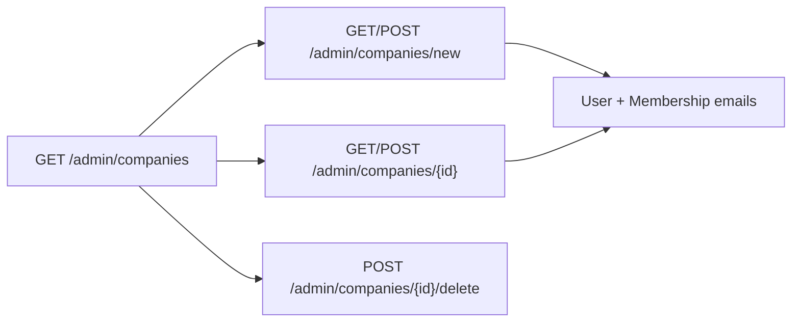

# Admin companies Concept fidelity + configurable seat cap

## Gap analysis (Concept vs VCP today)

| Area | Concept (screenshots / mockup) | Current VCP |
|------|--------------------------------|-------------|
| List CTA | `+ New company` | `+ Onboard company` |
| List lead | Provision up to N accounts | `Tenant directory. Seat limit…` |
| Card | Contact line, ADDRESS/VAT, **USER ACCOUNTS** email pills, count badge, **Edit** + trash | Initials + slug + STATUS + plan; `Accounts · max N`; Edit → `/new` |
| New form | Company fields + **USER ACCOUNTS · max N** + Add account (email rows) | Name/contact/VAT/address only; no accounts |
| Edit | Dedicated edit with prefilled accounts | Missing (Edit is a stub) |
| Delete | Trash + type-`delete` confirm | Missing |
| Passwords | Concept shows password inputs | Will **not** implement — email only (magic links later) |
| Cap | Hardcoded 5 in Concept JS | Rust const `MAX_USERS_PER_COMPANY = 5` — **no TOML** |

Routes today: only [`companies.rs`](src/app/admin/companies.rs) + [`companies/new.rs`](src/app/admin/companies/new.rs).

## Locked product decisions

1. **Config**: `[org] max_accounts_per_org = 5` (serde default 5) in [`config/default.toml`](config/default.toml), [`development.toml`](config/development.toml), [`testing.toml`](config/testing.toml), [`vcp.conf`](config/vcp.conf); mirror `[login]` pattern in [`src/config.rs`](src/config.rs).
2. **Accounts**: email-only rows; on Save create/update `User` + `Membership` under the cap. Store a **random unusable** `password_hash` (login password path fails until magic links). No invite email in this slice.
3. **Magic links**: out of scope (UI + provisioning only).
4. **Delete**: Concept trash + confirm modal pattern already used by docs/releases (`is_delete_confirm`, `ico_trash`, no Unicode icons).
5. **Add account UX**: SSR-friendly — `+ Add account` is `formaction` POST to the same compose handler with `_action=add_row` (preserve fields + one empty email), hide button at cap. No Alpine dependency.

## Implementation

### 1. Config + seats

- Add `OrgConfig { max_accounts_per_org: usize }` on `Config` with `default_max_accounts_per_org() -> 5`.
- Change [`src/seats.rs`](src/seats.rs) to take `max: usize` (or read from a passed cap): `can_add_member(db, org_id, max)`.
- Keep `MAX_USERS_PER_COMPANY` as `pub const` **default** (=5) for docs/tests that need a name, but **runtime UI/handlers use `config(cx).org.max_accounts_per_org`**.
- Config unit tests: assert default 5 for Development / Production / Testing loaders.

### 2. Shared company form helpers

New module e.g. [`src/app/admin/companies/form.rs`](src/app/admin/companies/form.rs) (or `companies_accounts.rs`):

- Parse repeated `email` fields (trim, lowercase, drop empties, dedupe).
- Validate count `<= max_accounts_per_org`.
- `sync_org_accounts(db, org_id, emails, max)`: create missing users (unusable hash + `display_name` from email local-part), ensure `Membership` `org` role; remove memberships for emails dropped from the form (do not delete global User rows used elsewhere — drop membership only; if user has no other memberships and empty portal_role, leave user orphan cleanup for later or delete only if single-membership client user).
- **Concrete sync rule**: for emails removed from the form, delete that org’s `Membership`; if the `User` has `portal_role == ""` and no remaining memberships, delete the `User` (safe for provisioned client accounts).

### 3. List page — Concept cards

Update [`src/app/admin/companies.rs`](src/app/admin/companies.rs):

- Lead: `Onboard a client organization and provision up to {N} user accounts.`
- CTA: `+ New company`
- Per card: name, `technical_contact`, address, VAT, section **USER ACCOUNTS** with email pills (join Membership→User), badge `{n} account(s)`, **Edit** → `/admin/companies/{id}`, trash → `?delete={id}` confirm panel (reuse docs pattern).
- Drop slug/status/plan from the primary card chrome (keep in DB; not Concept card fields).
- Load members in one or two queries (memberships + users), group by `organization_id`.

### 4. New + Edit forms

| Surface | Routes |
|---------|--------|
| New | keep `GET/POST /admin/companies/new` |
| Edit | add `GET/POST /admin/companies/{company_id}` in e.g. [`companies/company_id.rs`](src/app/admin/companies/company_id.rs) |
| Delete | `POST /admin/companies/{company_id}/delete` |

Form fields (Concept labels): Company name *, Contact point, VAT number, Company address; section `USER ACCOUNTS · max {N}` with email inputs + remove (✕) + `+ Add account`; buttons `Create company` / `Save changes` + Cancel.

`_action=add_row` / `_action=remove_row` on POST re-renders form without committing (PRG to GET with flash is heavier — re-render on same POST response is OK for admin compose, or 303 back to GET with query `accounts=N` and sticky fields via… prefer **re-render Result view on add/remove** without DB write).

On final save: upsert org + `sync_org_accounts`. Enforce reserved slug `vauban`. Edit must 404 for reserved org / missing id.

### 5. Styles

Minimal CSS for email pills on cards (`.vb-account-pill` or reuse existing soft badge styles in [`styles.css`](styles.css)) — match Concept density, no new card chrome for the form itself beyond existing `vb-panel` / `vb-form`.

### 6. Test pyramid (`admin_companies`)

| Layer | Work |
|-------|------|
| Unit | `OrgConfig` default; `seats::can_add_member` with injected max; email parse/dedupe helper |
| Invariants | Extend [`scripts/check_admin_companies.sh`](scripts/check_admin_companies.sh) + invariants: no `type="password"` on companies forms; `max_accounts_per_org`; edit/delete routes; USER ACCOUNTS copy; Edit href uses company id |
| Proptest | Cap boundary uses configured max (not hard `5` only); email normalize |
| Battle | Parallel list reads + concurrent create under cap |
| E2E | Create company with 2 emails → list shows pills; edit add/remove email; hit cap blocks add; delete confirm; member 404; config default 5 still enforced when filling max |
| Smoke | Update [`docs/runbooks/admin_companies_smoke_test.md`](docs/runbooks/admin_companies_smoke_test.md) |

Filter: `just test --test integration_tests -- admin_companies`

### 7. Docs / rules touch-ups

- Mention configurable default 5 in [`project-overview.mdc`](.cursor/rules/project-overview.mdc) / casbin note if it still says “max 5” as a hard constant — rephrase to “configurable (`org.max_accounts_per_org`, default 5)”.

## Out of scope

- Sending magic-link emails / token table / login-without-password.
- Client self-serve account management.
- Changing Casbin permission names (`companies_manage` stays).
- Full Helvetia seed (existing ACME seed enough for demos).
