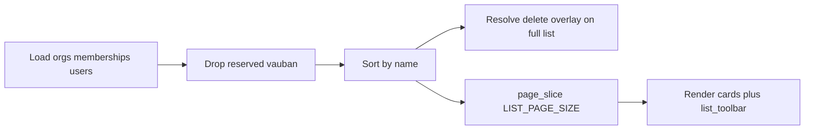

# Admin companies list pagination

## Locked decisions

- **Idiom:** same as admin Docs / Releases — no filter chips → [`list_toolbar`](src/app/_components/pager.rs) + SSR `?page=` (`LIST_PAGE_SIZE = 10`).
- **Slice:** in-memory after existing filter (drop reserved `vauban`) + name sort; resolve delete overlay against the **full** card list before `page_slice` (same order as [`admin/docs.rs`](src/app/admin/docs.rs)).
- **Pager hrefs:** keep only `page` — never sticky `delete` / `err`.
- **Surface name:** extend existing `admin_companies` pyramid (do not invent a parallel harness).
- **Fixtures:** reuse [`create_test_org`](tests/integration_tests/common/mod.rs); count cards via `vb-company-card` (seed `acme-infrastructure` may survive cleanup — assert ≤10 on page 1 and marker presence, not a fragile global total).



## 1. Implementation — [`src/app/admin/companies.rs`](src/app/admin/companies.rs)

Mirror [`src/app/admin/docs.rs`](src/app/admin/docs.rs) (lines ~26–76, `list_toolbar` above results):

1. Extend `AdminCompaniesQuery` with `page: Option<u32>`.
2. Import `list_toolbar` + `list_page::{LIST_PAGE_SIZE, PagerLinks, clamp_page, href_with_query, page_count, page_slice, parse_page, with_page_param}`.
3. After building/sorting `cards`:
   - resolve `delete_target` on full `cards`;
   - `parse_page` / `page_count` / `clamp_page` / `page_slice`;
   - `PagerLinks::from_hrefs` → `/admin/companies` (+ `page=N` when `N > 1`).
4. In `view!`: call `list_toolbar(links: &pager)` between the header CTA and `vb-company-list`; iterate `page_cards` (not full `cards`).
5. Keep delete confirm UX unchanged (`?delete=` without `page`; cancel → `/admin/companies`).

No changes to create/edit/delete routes, seats, or mail validation.

## 2. Pyramid — surface `admin_companies`

| Layer | Deliverable |
|-------|-------------|
| **Unit** | Covered by existing [`src/list_page.rs`](src/list_page.rs) tests + current seat/email units; no new private helpers expected in the page module. |
| **Invariants** | Extend [`scripts/check_admin_companies.sh`](scripts/check_admin_companies.sh) and [`admin_companies_invariants_test.rs`](tests/integration_tests/admin_companies_invariants_test.rs): pin `LIST_PAGE_SIZE`, `list_toolbar`, `page: Option<u32>`, `page_slice`, `vb-list-toolbar` / no client JS pager. |
| **Proptest** | Thin pin in [`admin_companies_proptest.rs`](tests/integration_tests/admin_companies_proptest.rs): `LIST_PAGE_SIZE == 10` (same shape as admin_docs). |
| **Battle** | New test in [`admin_companies_battle_test.rs`](tests/integration_tests/admin_companies_battle_test.rs): seed ≥11 listable orgs with marker; parallel GET `?page=1` / `?page=2` under contention → 200, pager/toolbar, distinct page markers (pattern: [`admin_docs_battle_test.rs`](tests/integration_tests/admin_docs_battle_test.rs) `battle_parallel_admin_docs_page_pagination`). |
| **E2E** | New `e2e_admin_companies_list_pagination` in [`admin_companies_e2e_test.rs`](tests/integration_tests/admin_companies_e2e_test.rs): staff login; `create_test_org` ×11 with shared marker in slug/name; page 1 → ≤10 `vb-company-card`, `vb-pager` + `vb-list-toolbar`, link to `page=2`; page 2 → remainder + marker; assert pager hrefs omit `delete=`. |
| **Smoke** | Add **C -- Pagination** to [`docs/runbooks/admin_companies_smoke_test.md`](docs/runbooks/admin_companies_smoke_test.md) (toolbar, 10 max, overlay params not sticky); bump severity to A–C. |

## 3. Validation

```bash
just fmt
rtk cargo fmt --all -- --check
rtk cargo clippy --all-targets -- -D warnings
bash scripts/check_admin_companies.sh
rtk cargo test --test integration_tests -- admin_companies -- --test-threads=1
```

Prefer `just validate` before hand-off if the change is commit-bound.

## Out of scope

- DB `LIMIT/OFFSET`
- Search chips / live shards on companies
- Capsicum / artifact storage
- Regenerating unrelated plans (optional: mark this plan Done in INDEX after ship via `generate_index.sh`)
