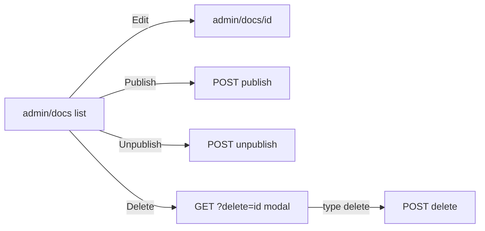

# Admin docs Concept fidelity (list + compose)

## Gaps (Concept vs app)

| Surface | Concept ([`Portail Vauban.dc.html`](.cursor/mockups/Concept/Portail%20client%20Vauban%20%5B%20avec%20administration%20%5D/Portail%20Vauban.dc.html) ~L484–544) | App today |
|---------|--------|-----------|
| List ACTIONS | Edit + Publish/Unpublish + Delete (trash) | Edit link only ([`src/app/org/admin/docs.rs`](src/app/org/admin/docs.rs)) |
| List columns | TITLE (+ excerpt), CATEGORY, VER., STATUS, ACTIONS | Extra UPDATED; title without summary |
| Compose width | Full `vb-screen` (no max-width) | Inline `max-width: 720px` in [`new.rs`](src/app/org/admin/docs/new.rs) / [`doc.rs`](src/app/org/admin/docs/doc.rs) |
| Compose layout | Title; Category \| Excerpt grid; Content ~280px; Publish + Cancel | Vertical stack; narrower textarea |
| Delete | Modal: type `delete` then permanently remove | **Missing** (UI + route) |

Unpublish/Publish POST routes already exist on the edit page (`/{org}/admin/docs/{doc}/unpublish|publish`). Reuse them from the list.

## Locked approach

### 1. List page ([`src/app/org/admin/docs.rs`](src/app/org/admin/docs.rs))

- Lead copy → Concept: *Write, version, publish or hide knowledge-base articles.*
- Drop **UPDATED** column (Concept has none); keep `format_unix_local` elsewhere.
- TITLE cell: bold title + muted one-line `summary` under it.
- ACTIONS (right-aligned flex, Concept button chrome via `vb-btn muted` / outline / danger):
  - **Edit** → `/{org}/admin/docs/{id}`
  - **Unpublish** if `PUBLISHED`, else **Publish** — POST to existing routes (small forms; CSRF via Topcoat OriginLayer)
  - **Delete** → `/{org}/admin/docs?delete={id}` (opens confirm overlay on same page)
- Add `ico_trash` in [`src/app/_components/icons.rs`](src/app/_components/icons.rs) (SVG, no Unicode). Reuse existing danger border colors from Concept (`#b5403a` / `#eccfcc`) as a small `.vb-btn.danger` (or inline once) in [`styles.css`](styles.css).

### 2. Delete confirm + handler

- `#[query_params]` on list: optional `delete: Option<String>` (article id).
- When set and article exists: render a Concept-style confirm dialog (fixed overlay) — title *Delete this article?*, target title, input placeholder `delete`, Cancel (link clears query), Submit **Delete permanently** disabled until client… **server-side**: POST body must equal `delete` (fail closed / redisplay error if wrong). Prefer plain HTML form (no `unsafe-inline`); enable button always and reject bad confirm on server (Concept enables client-side; SSR validates).
- New route `POST /{org}/admin/docs/{doc}/delete` in [`doc.rs`](src/app/org/admin/docs/doc.rs): `docs_write` + org gate; `DocArticle::filter(id).delete().exec`; redirect list. Missing id → 404.

### 3. Compose / edit full width + layout

In [`new.rs`](src/app/org/admin/docs/new.rs) and [`doc.rs`](src/app/org/admin/docs/doc.rs):

- Remove wrapper `style="max-width: 720px;"`.
- Title **Compose article**; back link **Back to articles**.
- Keep published-edit callout (versioning model A already shipped).
- Fields: Title; grid `1fr 1fr` Category (select, same options as new) + Excerpt/Summary; Content textarea `min-height: 280px` + dialect hint line under (Concept formatting line, adapted to VCP dialect).
- CTAs: primary save/publish + Cancel. Drop duplicate Unpublish/Publish block under the edit form (now on list). Keep **Publish new version** label when saving a published row.

### 4. Pyramid / lints (extend admin_docs surface)

- [`scripts/check_admin_docs.sh`](scripts/check_admin_docs.sh): pin list Unpublish/Publish/Delete; pin absence of `max-width: 720px` on compose; pin `/delete` route; pin `?delete=` confirm path.
- Unit: delete rejects wrong confirm text; publish/unpublish still gated.
- Invariants: list ACTIONS strings + trash icon helper; no Unicode trash.
- Proptest / battle: thin extensions (toggle+delete under contention with lock).
- E2E: list HTML contains Unpublish or Publish; delete with confirm removes article from list and client KB if it was published; denial (member 403).
- Runbook [`docs/runbooks/admin_docs_smoke_test.md`](docs/runbooks/admin_docs_smoke_test.md): list actions + full-width compose + type-delete.

Validation: `rtk cargo fmt`, clippy `-D warnings`, `bash scripts/check_admin_docs.sh`, `rtk cargo test --test integration_tests -- admin_docs -- --test-threads=1`.

## Out of scope

- Renaming DRAFT → HIDDEN in the DB (display stays `PUBLISHED` / `DRAFT`).
- Release manager / companies delete modals (same Concept pattern, other surfaces).
- Client-side date formatting (already SSR + `vcp_tz`).
