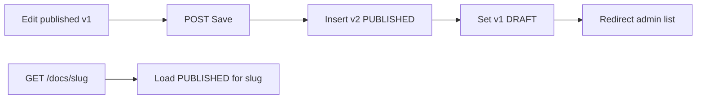

# Admin docs: Save redirect, sort, publish-new-version

## Decisions (locked)

- **A**: Saving a **PUBLISHED** article creates a new row `vN+1` as `PUBLISHED`, sets the previous published row(s) for that **slug** to `DRAFT`, then redirects to the admin list.
- Saving a **DRAFT** updates in place (no version bump), then redirects to the admin list.
- Client URL stays `/{org}/docs/{slug}` and always resolves the single `PUBLISHED` row for that slug.
- Admin edit URLs switch to **id**: `/{org}/admin/docs/{id}` (slug alone is ambiguous once versions share a slug).

## 1. Schema: allow multiple versions per slug

[`src/models/mod.rs`](src/models/mod.rs): remove `#[unique]` from `DocArticle.slug`.

Generate/apply Toasty migration to drop the unique index on `slug` (keep non-unique index if useful). Enforce in app: **at most one `PUBLISHED` per slug** on publish/save-revision.

Add a small helper (e.g. in `src/app/org/admin/docs/` or `src/db.rs`):

- `bump_version("v1") -> "v2"` (parse trailing integer; default `"v1"` → `"v2"`)
- `unpublish_other_published(db, slug, except_id)`

## 2. Save / publish behavior

Rewrite [`src/app/org/admin/docs/doc.rs`](src/app/org/admin/docs/doc.rs):

- Path param: article **id** (`u64`), not slug.
- Load by id (include body).
- **POST Save**:
  - If current `status == PUBLISHED`: insert new `DocArticle` (same slug/title/category/summary/body from form, `version = bump`, `PUBLISHED`, `updated_at = now`); unpublish prior published siblings for that slug; **do not** mutate the old row’s body.
  - If `DRAFT`: update in place as today.
  - Always `see_other(/{org}/admin/docs)` (list), not back to the editor.
- **POST Publish**: set this row `PUBLISHED`, unpublish other published for same slug; redirect list.
- **POST Unpublish**: set `DRAFT`; redirect list.
- UI: Concept-style callout when editing a published article (“publishes a new version and unpublishes the previous one”). Remove free-form version input on edit (show current version as read-only mono text). Primary button label when published: **Publish new version** (still POST Save). Draft keeps **Save**.

Update admin list Edit links in [`src/app/org/admin/docs.rs`](src/app/org/admin/docs.rs) to `/{org}/admin/docs/{id}`.

Create flow in [`new.rs`](src/app/org/admin/docs/new.rs): after create, redirect to **admin list** (same UX as Concept `adminDocView:'list'`). Keep slug uniqueness check among *all* rows for that slug family only when creating a brand-new article (first version); new versions reuse the existing slug.

## 3. Sort + client resolution

- Admin list + client `load_filtered_docs` / any article list: sort by `updated_at` descending (in Rust after fetch if Toasty has no order API).
- Client detail [`src/app/org/docs/doc.rs`](src/app/org/docs/doc.rs): load `slug` **and** `status == PUBLISHED` (404 if none). Prefer the newest published if a bug left two (defensive: max `updated_at`).
- Dashboard / seeds unchanged except they keep working with non-unique slug.

## 4. Tests + lints

Extend [`scripts/check_admin_docs.sh`](scripts/check_admin_docs.sh) + admin_docs pyramid:

- Pin Save redirects to admin list (not edit URL).
- Pin published-save creates new version + unpublish sibling (unit/helper + e2e).
- E2E: edit published → client `/docs/{slug}` shows new body; old version is `DRAFT` and not on client list; admin list sorted with newest first.
- Denial paths unchanged (`docs_write`, org membership).

Validation: `rtk cargo fmt`, clippy `-D warnings`, `bash scripts/check_admin_docs.sh`, `rtk cargo test --test integration_tests -- admin_docs -- --test-threads=1`.

## Key files

- [`src/models/mod.rs`](src/models/mod.rs) + Toasty migration
- [`src/app/org/admin/docs/doc.rs`](src/app/org/admin/docs/doc.rs), [`docs.rs`](src/app/org/admin/docs.rs), [`new.rs`](src/app/org/admin/docs/new.rs)
- [`src/app/org/docs.rs`](src/app/org/docs.rs), [`src/app/org/docs/doc.rs`](src/app/org/docs/doc.rs)
- [`scripts/check_admin_docs.sh`](scripts/check_admin_docs.sh), `tests/integration_tests/admin_docs_*`
