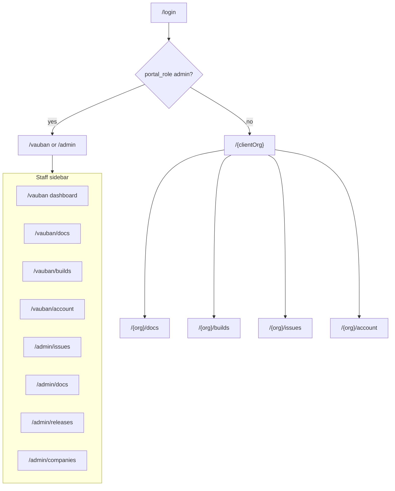

# Admin global + reserved org `vauban` + role:org + builds ciblés

## Semantic model (locked)

| Actor | Casbin | Storage | Surfaces |
|-------|--------|---------|----------|
| Vauban Support | `role:admin` | `User.portal_role = "admin"` + membership `"org"` on reserved org **`vauban`** | Full sidebar: preview `/{vauban}/…` (docs/builds/dashboard/account) **plus** `/admin/*` tools; issues only via `/admin/issues` |
| Client user | `role:org` | `Membership.role = "org"` on client org(s) (max 5 / org) | `/{org}/*` including `/{org}/issues` — **no** `/admin/*` |

Hard rules:

- Client orgs **never** get `role:admin` / admin memberships.
- Slug **`vauban`** is reserved: seed it; reject create/rename in companies UI (case-insensitive).
- Reserved org is **not** a billable client: exclude from companies list (or show as internal read-only); seat cap does not apply to staff memberships on `vauban`.
- Docs/builds under `/vauban` are the same shared/GA catalogue as any client (plus org-private builds targeted at `vauban` if any) — purpose is **preview what a client sees** after publish.
- Issues are **not** previewed under `/vauban/issues`: rail links Issues → `/admin/issues`; direct `/{vauban}/issues*` → redirect to `/admin/issues` (or 404 — **redirect** locked).

## Target route map

| Path | Surface |
|------|---------|
| `/login` | Sign in |
| `/{org}` | Dashboard (clients + staff on `vauban`) |
| `/{org}/docs` | Documentation KB (identical content for all orgs) |
| `/{org}/builds` | Builds (GA + that org's private builds) |
| `/{org}/issues` | Client issue tracker (**not** for slug `vauban`) |
| `/{org}/account` | Account and subscription |
| `/admin` | Admin hub (redirect e.g. `/admin/issues`) |
| `/admin/issues` | Aggregated issues (optional org filter) — **first** in admin rail |
| `/admin/docs` | Documentation editor |
| `/admin/releases` | Release manager |
| `/admin/companies` | Client companies (cannot create `vauban`) |

Remove all `/{org}/admin/*` routes.

---

## 1. Identity, reserved org, Casbin

**Schema (Toasty migration)**

- [`User.portal_role`](src/models/mod.rs): `""` client, `"admin"` Vauban Support.
- [`Membership.role`](src/models/mod.rs): always `"org"` for memberships (clients + staff-on-vauban).
- [`Release.organization_id`](src/models/mod.rs): `u64`, `0` = GA, else target org id.
- Constant e.g. `RESERVED_ORG_SLUG = "vauban"` in models or auth.

**Policy** — [`config/access/vcp_policy.csv`](config/access/vcp_policy.csv):

- `role:member` → `role:org`.
- Keep `role:admin` (+ `admin,view`, issues r/w for aggregate).

**Auth**

- `require_staff`: session + `portal_role == "admin"` (+ Casbin `admin_view`). Anonymous → 404; org user on `/admin` → 403.
- `require_org`: membership `"org"` on slug; for slug `vauban`, also require `portal_role == "admin"` (clients must not join `vauban`).
- Casbin on org pages: use membership role `"org"` for client users; for staff on `/vauban/*` preview, use `portal_role` / `role:admin` grants (docs/builds read already on admin) **or** treat preview as org-shaped with admin's docs/builds read — simplest locked choice: **staff Casbin context = `portal_role` (`admin`)** even on `/vauban` preview pages.
- Login redirect: staff → `/vauban` (preview home); client → first non-reserved membership slug.

**Seed**

- Org `vauban` (name "Vauban", reserved).
- Org `acme-infrastructure` (client).
- `admin@acme.example`: `portal_role=admin`, membership `org` on **vauban** only (rename email later optional; keep email for now).
- `l.martin@acme.example`: membership `org` on Acme only.
- Companies create: reject slug `vauban`.

---

## 2. Chrome and route move

**Admin tools** — move `src/app/org/admin/**` → `src/app/admin/**` (`/admin/...`), layout gated by `require_staff`.

**Staff rail** (single chrome when `portal_role=admin`):

- Preview block (like client): Home/Docs/Builds/Account → `/vauban/...`
- Issues item → **`/admin/issues`** (not `/vauban/issues`)
- Admin block (order locked): Issues → Docs → Releases → Companies  
  (`/admin/issues`, `/admin/docs`, `/admin/releases`, `/admin/companies`)

**Client rail**: Home/Docs/Builds/Issues/Account under `/{org}`; no Admin block.

**Nav** — [`nav.rs`](src/nav.rs): `/admin/*` sections including `AdminIssues`; org sections unchanged; treat `/vauban/issues` as redirect target in routes not nav.

---

## 3. `/admin/issues` + Vauban Support

- Aggregate list/detail/reply under `/admin/issues*`.
- `/vauban/issues` and `/vauban/issues/*` → `see_other("/admin/issues")`.
- Timeline: `author_role == support` → display **Vauban Support**.
- Client `/{org}/issues*` isolation unchanged (never see other orgs; never see `/admin`).

---

## 4. Builds: GA vs org-specific

- Client builds list/detail/download: `organization_id == 0 OR == ctx.org.id`.
- Admin release create: optional target org (empty = GA); cannot confuse reserved org with client targeting (both allowed: GA vs specific client vs `vauban` if useful for staff-only hotfix preview).
- Seed: GA releases + one Acme-private hotfix.

---

## 5. Tests / docs

- README route map + reserved `vauban` note.
- All `/{slug}/admin/...` → `/admin/...`.
- `"member"` → `"org"`; staff fixtures: `portal_role=admin` + vauban membership.
- Pyramids: `auth_tenant` (reserved slug, staff vs org), `admin_*` + `admin_issues`, builds visibility, `portal_issues` (Support label), `portal_shell` (staff rail Issues → `/admin/issues`).

---

## 6. Implementation order

1. Migration + CSV + reserved org seed + companies slug guard
2. Auth (`require_staff`, vauban-only staff membership rules) + login redirect
3. Move `/admin` modules + staff/client rails
4. `/admin/issues` + redirect `/vauban/issues*`
5. Builds targeting
6. Pyramid / runbooks / `just validate`

**Out of scope:** per-org doc copies; staff memberships on client orgs; visual redesign beyond chrome wiring.
