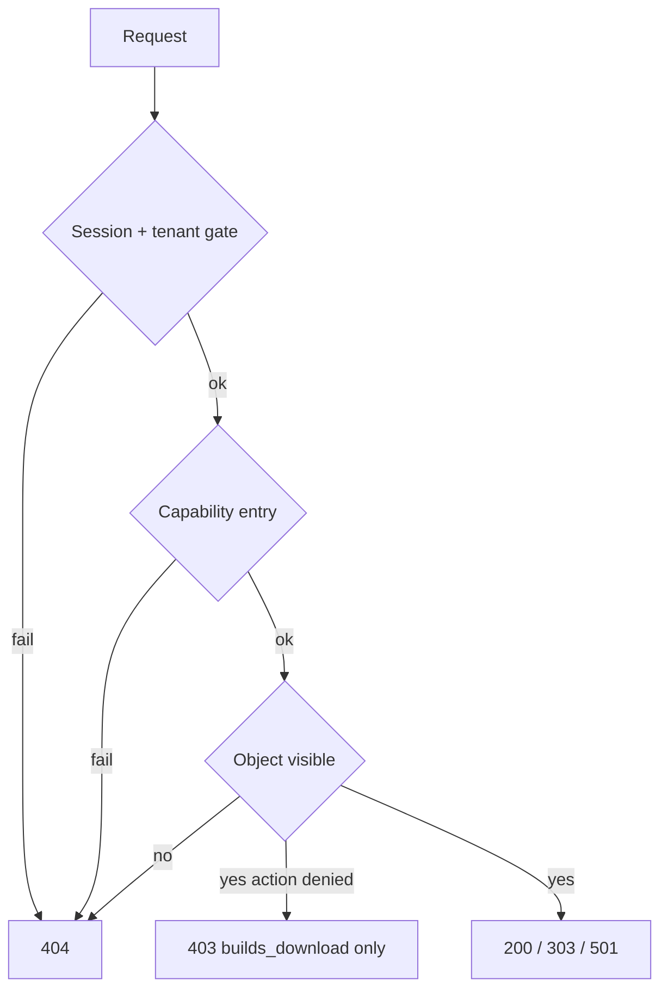

# Anti-enumeration hardening

## Locked rules

| Case | Response |
|------|----------|
| Anonymous / expired / wrong org / unknown slug / `/vauban` for client / `/admin/*` for non-staff | **404** (already mostly done) |
| Capability **entry** after membership (`*_read`, `account_read`, compose `*_write`, admin secondary perms after `require_staff`, shards) | **404** (change from 403) |
| Action on a **visible** resource (`builds_download` when release is already org-visible) | **403** keep (product denial, not existence oracle) |
| Invisible / other-tenant object (issue key, unpublished doc, private release) | **404** (already) |
| Login unknown email / bad password / rate-limited | Same **303** to `/login` + always run Argon2 verify |

Exploratory note (do not follow): treating same-tenant Casbin `*_read` gaps as intentional **403** would leave module-existence oracles. This campaign **intentionally** maps capability **entry** to **404** and rewrites `*_missing_*_is_403` E2E → `_is_404`. Only visible-resource action denial (`builds_download`) stays **403**.



## 1. Shared helpers

In [`src/auth.rs`](src/auth.rs) / small [`src/deny.rs`](src/deny.rs) (prefer keep in `auth` unless file grows):

- `pub fn capability_denied() -> NotFoundError` — thin alias of `not_found()` so call sites and pins share one name.
- Fix dead [`require_org_admin`](src/auth.rs): map `require_org` failure and missing `admin_view` to **404**, never `forbidden()`.
- Document the table above in a short module comment (English).

## 2. Sweep handlers: entry 403 → 404

Replace `forbidden()` with `capability_denied()` / `not_found()` on **module entry** and shards:

**Org:** [`account.rs`](src/app/org/account.rs), [`docs.rs`](src/app/org/docs.rs), [`docs/doc.rs`](src/app/org/docs/doc.rs), [`docs/search_shard.rs`](src/app/org/docs/search_shard.rs), [`builds.rs`](src/app/org/builds.rs), [`builds/release_ver.rs`](src/app/org/builds/release_ver.rs), [`issues.rs`](src/app/org/issues.rs), [`issues/issue_key.rs`](src/app/org/issues/issue_key.rs) (page), [`issues/new.rs`](src/app/org/issues/new.rs), [`issues/search_shard.rs`](src/app/org/issues/search_shard.rs).

**Admin (after `require_staff`):** docs / releases / companies / issues pages + [`admin/issues/search_shard.rs`](src/app/admin/issues/search_shard.rs).

**Keep 403:** [`builds/download.rs`](src/app/org/builds/download.rs) and [`builds/ephemeral.rs`](src/app/org/builds/ephemeral.rs) only when `!builds_download` **and** release already passed `release_visible_to_org` (invisible release stays 404).

**Mutations soft-deny → 404:** [`reply_issue`](src/app/org/issues/issue_key.rs) today redirects to detail when `!issues_write` (leaks key existence). Change to `not_found()` when `!issues_write` or issue missing (same status). Empty body may stay 303 to detail (authz already passed).

## 3. Login hardening

[`src/app/login.rs`](src/app/login.rs) + new [`src/login_limit.rs`](src/login_limit.rs):

1. **Dummy Argon2:** `OnceLock` holding a precomputed hash (`hash_password` of a fixed random secret at first use, or a committed PHC string). Always `verify_password(password, hash)` — real user hash or dummy — before deciding success.
2. **Rate limit:** `Arc<Mutex<LoginRateLimiter>>` in router `app_context` ([`src/app.rs`](src/app.rs)). Key = normalized email. Config under `[login]` in [`config/default.toml`](config/default.toml) (+ testing overrides with high ceilings so normal tests do not trip):

```toml
[login]
max_attempts = 10
window_secs = 300
lockout_secs = 900
```

3. On lockout or failed verify: still `see_other("/login")` (no distinct status/body). Successful login clears the key.
4. Wire `LoginConfig` into [`src/config.rs`](src/config.rs) with the rest of layered TOML.

No new crate dependency (stdlib + `tokio` mutex).

## 4. Pyramid — surface `auth_tenant` (primary)

Extend existing artifacts; do not invent a parallel harness.

| Layer | Deliverable |
|-------|-------------|
| **Unit** | `capability_denied` / dummy-hash always-runs; `LoginRateLimiter` allow/deny/lockout/reset; `require_org_admin` maps to not_found (if kept) |
| **Invariants** | Extend [`scripts/check_auth_tenant.sh`](scripts/check_auth_tenant.sh) + [`auth_tenant_invariants_test.rs`](tests/integration_tests/auth_tenant_invariants_test.rs): pin `capability_denied` or ban entry-gate `forbidden()` outside download/ephemeral; pin login always calls `verify_password`; pin `[login]` config keys; pin reserved-org staff-only in `org_context`; pin `require_org_admin` no longer remaps to `forbidden` |
| **Proptest** | Rate-limit properties (attempts &lt; max ⇒ allow; ≥ max ⇒ lock); dummy path always invokes verify (boolean API); slug/role corpora already present — add property that non-`admin` roles lack `admin_view` remains |
| **Battle** | Parallel wrong-org + `/admin` GETs → all 404; parallel login failures against limiter → consistent redirect + counter integrity |
| **E2E** | `e2e_member_denied_reserved_org_is_404` (`/vauban`); equality anonymous vs member vs unknown path on `/admin/docs` (status); existing-org-without-membership same status as invented slug; login unknown email vs bad password same 303; rate-limit flood still 303 to `/login` (use test config with low `max_attempts` via dedicated `test_config` override helper if needed) |
| **Smoke** | Extend [`docs/runbooks/auth_tenant_smoke_test.md`](docs/runbooks/auth_tenant_smoke_test.md): B = real non-member org vs invented slug; C = POST `/admin/...` 404; new **D** login timing/rate-limit qualitative checklist |

## 5. Collateral test updates (other surfaces)

Rename/assert 404 where E2E currently pins missing-perm **403**:

- [`docs_search_shard_e2e_test.rs`](tests/integration_tests/docs_search_shard_e2e_test.rs) — `*_missing_docs_read_is_403` → `_is_404`
- [`org_issues_search_shard_e2e_test.rs`](tests/integration_tests/org_issues_search_shard_e2e_test.rs) — same for issues_read
- Runbook lines in [`docs_search_shard_smoke_test.md`](docs/runbooks/docs_search_shard_smoke_test.md), [`org_issues_search_shard_smoke_test.md`](docs/runbooks/org_issues_search_shard_smoke_test.md)
- Keep builds download **403** assertions in [`builds_entitlement_e2e_test.rs`](tests/integration_tests/builds_entitlement_e2e_test.rs) for missing `builds_download`
- Update QA scaffold line already pointing at `/admin` 404; add one line on capability-entry 404 vs download 403 in [`quality-assurance/SKILL.md`](.cursor/skills/quality-assurance/SKILL.md)

Do **not** rewrite stale `.cursor/plans/*` history unless touched for other reasons.

## 6. Validation gate

```text
just fmt-check
rtk cargo clippy --all-targets -- -D warnings
bash scripts/check_auth_tenant.sh
just test auth_tenant_
just test docs_search_shard_
just test org_issues_search_shard_
just test builds_entitlement_
just test e2e_member_denied_admin_
```

## Out of scope

- Password-reset / magic-link flows (not in tree)
- Distributed/Redis rate limit
- Changing CLF / observability beyond existing redaction rules
- Softening UX of staff tools once `require_staff` succeeded and capability granted
