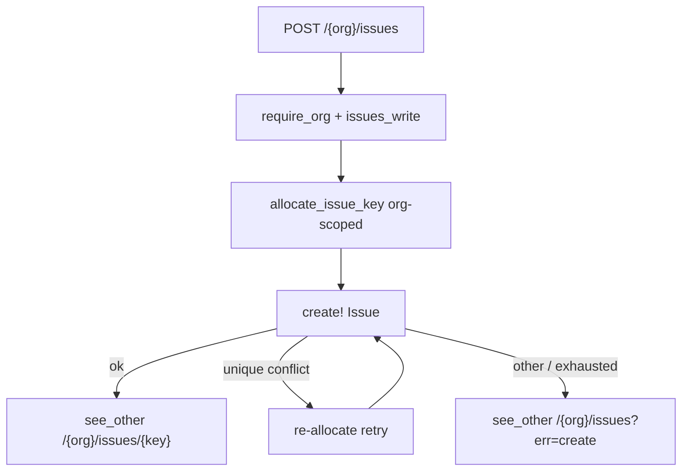

# Architecture audit remainder (Toasty)

## Scope (locked)

From [`.cursor/audits/vcp_architecture_toasty_query_debt_2026-08-02.md`](.cursor/audits/vcp_architecture_toasty_query_debt_2026-08-02.md):

| Wave | Item | Severity | Action |
|------|------|----------|--------|
| **A** | §3.10 issue key + swallowed `create!` | Medium | Implement now |
| **B** | #6 shard debounce / rate limit | Low | Implement after A |
| — | Login rate limiter store, magic links, `unwrap` triage | — | **Deferred** (out of Toasty scope; product/ops) |

Do **not** edit the attached semver plan file.

---

## Wave A — Safe issue keys (§3.10)

### Problem

[`report_issue`](src/app/org/issues.rs) loads all org issues, uses `len() + 200`, and ignores `create!` errors. Races forge duplicate `VBN-{n}` keys; `Issue.key` is not unique in schema today ([`0000_initial.sql`](toasty/migrations/0000_initial.sql)).

### Locked design

1. **Unique constraint** `(organization_id, key)` via migration `0009_issue_org_key_unique.sql` (+ snapshot / [`toasty/history.toml`](toasty/history.toml)).
2. **Allocator** in a small helper (e.g. `src/issue_key.rs` or next to issues module):
   - Load org issue `key`s (org-scoped filter only — not global `Issue::all()`).
   - Parse `VBN-{n}` numeric suffixes; `next = max(199, max_seen).saturating_add(1)` (preserves “start at 200” product convention when empty).
   - Return `VBN-{next}`.
3. **Create with retry** (max 3–5 attempts): on unique violation, re-allocate and retry; other errors fail closed.
4. **Honor `create!`**: on final failure, `see_other("/{org}/issues?err=create")` (or equivalent) + optional form flash; **never** redirect to a detail URL for a key that was not inserted. Log with `tracing::warn!` (no sensitive body).
5. Empty title path unchanged (redirect list without create).

### Files

- [`src/app/org/issues.rs`](src/app/org/issues.rs) — `report_issue`
- New helper module + unit tests for parse/allocate
- Migration `0009_*`
- Extend [`scripts/check_*.sh`](scripts/) if an issues lint exists; else pin in `portal_issues` invariants
- Update audit §3.10 → remediated
- Touch [`docs/runbooks/portal_issues_smoke_test.md`](docs/runbooks/portal_issues_smoke_test.md)

### Pyramid (mandatory — `portal_issues` filter)

| Layer | Deliverable |
|-------|-------------|
| **Unit** | Parse `VBN-n`; empty org → `VBN-200`; max suffix +1; ignore non-matching keys |
| **Invariants** | No `existing.len() + 200`; no `let _ = create!(Issue`; unique migration in history; allocator helper named |
| **Proptest** | Random key sets → next suffix is strictly greater than max `VBN-n` present |
| **Battle** | Parallel `POST /{org}/issues` from same org → distinct keys, all rows exist, no redirect to missing detail |
| **E2E** | Happy create lands on detail 200; failed create (if injectable) does not 303 to ghost key; wrong org / anon still 404; `issues_write` deny path unchanged |
| **Smoke runbook** | Concurrent-ish double submit note + Pass/Fail: no lost ticket / no 404 after “success” |

Denial paths: keep existing `portal_issues` tenant / capability cases green.

---

## Wave B — Search shard debounce (#6)

### Problem

Each keystroke/search interaction hits SQL (now bounded). Residual UX/load: no client debounce / frequency limit.

### Locked design

- Prefer **Topcoat signal debounce** on query inputs that drive shards (org/admin issues + docs + companies search), using the framework’s existing signal/shard wiring — not a second JS stack.
- Target debounce ~**250–300 ms** (single constant, shared if practical).
- No server-side rate limiter in this wave (would be a separate auth-adjacent design); debounce alone closes audit #6 residual.

### Pyramid (thinner but required)

| Layer | Deliverable |
|-------|-------------|
| **Unit / invariants** | Shared debounce constant / wiring pin in `check_*` or `include_str` on search pages |
| **Proptest** | Debounce delay in agreed range (if exposed as const) |
| **Battle** | Optional: parallel shard POSTs still 200 (existing battle OK) |
| **E2E** | Search still returns matches after settle (existing search e2e; extend if bind changes) |
| **Runbook** | One line: typing does not flood; results update after pause |

Surfaces: admin/org issues search, docs search, admin companies search (same pattern).

---

## Validation gate (each wave)

`just fmt` → fmt-check → clippy `-D warnings` → relevant `scripts/check_*.sh` →  
`just test --test integration_tests -- portal_issues` (wave A) / search filters (wave B) with `--test-threads=1`.

Update audit status table when each wave lands.

---

## Explicitly deferred (not in this plan’s implementation todos)

- §3.6 shared login rate-limit store (multi-instance)
- §3.8 real mail + magic links
- §3.9 `unwrap()` triage (`clippy::unwrap_used`)

Track only as backlog notes in the audit “Out of Toasty scope” section when touching the audit file after wave A/B.
