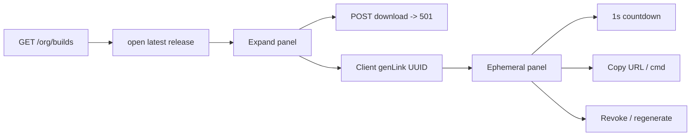

# Align Builds UI to Concept mockup

## Source of truth

Concept: [`.cursor/mockups/Concept/Portail client Vauban [ avec administration ]/Portail Vauban.dc.html`](.cursor/mockups/Concept/Portail%20client%20Vauban%20%5B%20avec%20administration%20%5D/Portail%20Vauban.dc.html) (`isBuilds` ~213–288 + JS ~946–1282).

Live: [`src/app/org/builds.rs`](src/app/org/builds.rs), [`release_ver.rs`](src/app/org/builds/release_ver.rs), [`download.rs`](src/app/org/builds/download.rs), [`styles.css`](styles.css).

## Gap summary (locked product choices)

| Gap | Live today | Target (Concept) |
|-----|------------|------------------|
| Default open | List opens nothing | Latest published build expanded on `/{org}/builds` |
| Action row | Download + Gen + **Collapse** + Verify | **3 buttons**: Download, 5-min link / Regenerate, Verify |
| Gen link | GET `?link=1` + stub `t=demo` | Client UUID, 5 min TTL, regenerateable |
| Ephemeral panel | Static "04:58", tabs URL/cURL (wrong), no Copy/Revoke | Header + live countdown + Revoke; URL bar + Copy; segmented **fetch** / **cURL**; dark cmd + copy; expired state |
| Download POST | Keep 501 stub | Keep for entitlement (Concept Download is decorative; we keep POST → 501) |
| Tokens DB | N/A | **Out of scope** this slice — client-only fidelity (no artifact CDN yet) |

## 1. Default-open latest

In [`builds_page`](src/app/org/builds.rs): after `load_releases_for_org`, pick latest by `released_on` then version string, pass `open_version: Some(latest)` into `render_builds` (instead of `None`).

Keep expand/collapse via existing detail URLs (`/{org}/builds/{ver}` ↔ list). Clicking the already-open row still collapses to the list (Concept `openBuild = '__none__'`).

Preserve `?channel=` on all row hrefs (already mostly done; fix `gen_href` / any missing channel).

## 2. Action buttons (remove Collapse)

In the open panel action row:

1. **Download (`size`)** — primary accent (`vb-btn` / mono), keep POST form to download route (501).
2. **5-minute download link** / **Regenerate link** — outline accent + hourglass icon; `@click` client gen (not `?link=1` navigation). Label flips when a live link exists for that version.
3. **Verify signature** — muted outline only (inert, as Concept).

Remove the Collapse `<button>` and the `panel_open` signal used only for that hide.

## 3. Ephemeral panel (client-side Concept parity)

Replace `?link=1` / `show_link` SSR stub with Topcoat signals + a small first-party script (same pattern as [`assets/vcp_tz.js`](assets/vcp_tz.js)):

- State per open version: `{ token, expiresAt }` or null; `dlTool` = `fetch` | `curl`; copy feedback flags.
- `genLink`: `crypto.randomUUID()` (fallback), `expiresAt = now + 5*60*1000`, show panel.
- URL shape (Concept): `https://customer.vauban.sh/releases/{token}/vauban-{ver}[+LTS].pkg` (display-only; not a real download).
- Commands: `fetch {url}` / `curl -fLO {url}` (default tab **fetch**).
- UI blocks:
  - Bar: `EPHEMERAL DOWNLOAD LINK` + live `expires in M:SS` (warn color &lt; 60s) + **Revoke**
  - URL row + **Copy** / ✓ Copied
  - Segmented fetch | cURL + dark `$` terminal + copy icon
  - Footer help text (Concept wording)
  - Expired: message + **Generate new link**
- Countdown: 1s tick in `assets/vcp_builds_eph.js` (or equivalent) updating countdown label / expired transition; wire from root layout like `vcp_tz` if needed, or panel-local init.

Deprecate `BuildsQuery.link` / `show_link` path once unused (or ignore `link=1` for backward compat without depending on it).

## 4. CSS / chrome

Tighten [`styles.css`](styles.css):

- Action buttons: JetBrains Mono sizing / outline accent / muted verify to match Concept padding.
- `.vb-ephemeral` header `#f1f7f5`, border `#d7e3df`, segmented tool switcher, dark cmd block, copy affordances.
- Ensure `button.vb-chip` (or new class for fetch/cURL segment) styles active state (today chips CSS targets `a`/`span` only).

## 5. Tests / docs

- Update builds entitlement / portal invariants if they pin old strings (`Generate ephemeral`, `?link=1`, `t=demo`, `04:58`).
- E2E: list page HTML includes latest version panel open; after (or within) client affordances, structural pins for ephemeral labels / fetch+cURL.
- Runbook [`docs/runbooks/builds_entitlement_smoke_test.md`](docs/runbooks/builds_entitlement_smoke_test.md): note Concept ephemeral is client stub; Download still 501.
- Keep POST download 501 pyramid green.

## Out of scope

- Real artifact storage / signed CDN tokens
- Server-persisted ephemeral tokens
- Making Verify signature functional
- Visual redesign beyond Concept Builds panel/row actions
