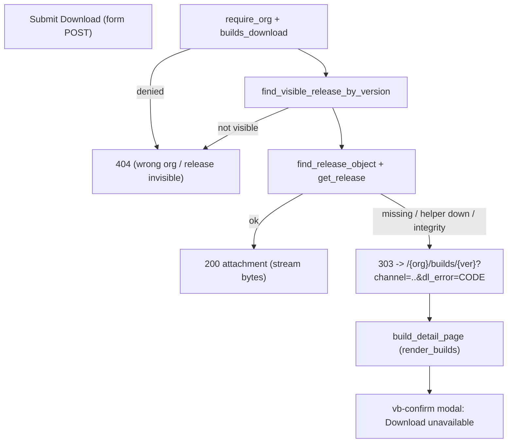

# Modale d'erreur de download sur `/{org}/builds`

## Comportement cible

Le POST session `/{org}/builds/{ver}/download` ne rend plus jamais une page de texte brut : en cas d'echec il repond **303 See Other** vers la liste Builds avec la ligne ouverte et un code d'erreur, et la page rouvre une modale Concept.



Codes d'erreur (enum, jamais de texte brut reinjecte dans le HTML) :

- `missing` - release visible mais aucun `storage_objects` / blob attache
- `unavailable` - helper indisponible ou lecture impossible
- `integrity` - digest miroir / SoT / disque divergent

Inchange : `404` pour org inconnue, non-membre, version non visible (anti-enumeration) ; `403` sans `builds_download` ; le GET public `/releases/{token}/{pkg}` de [`src/app/org/builds/ephemeral.rs`](src/app/org/builds/ephemeral.rs) garde son corps texte `503` (surface machine / cURL).

## 1. Redirection cote handler

[`src/app/org/builds/download.rs`](src/app/org/builds/download.rs) : conserver `DOWNLOAD_UNAVAILABLE` / `INTEGRITY_MISMATCH` (pins `check_storage.sh`, proptest) comme source des libelles, et ajouter :

- `pub(super) enum DlError { Missing, Unavailable, Integrity }` avec `as_code()` / `from_code()` / `title()` / `message()`
- `pub(super) fn download_error_href(org, ver, channel, err) -> String` -> `/{org}/builds/{ver}?channel=Stable&dl_error=unavailable` (canal omis si vide, un seul `?`)
- lecture du champ `channel` du formulaire (`Form<DlRedirectForm>`, meme forme que `EphRedirectForm`)
- remplacer les trois sorties `Response::builder().status(...).body(Body::from(...))` d'echec par :

```rust
Ok(Response::builder()
    .status(StatusCode::SEE_OTHER)
    .header(header::LOCATION, download_error_href(org_slug, ver, channel, err))
    .body(Body::empty())?)
```

Le cas `find_release_object` = `None` passe de `not_found()` a `DlError::Missing` (la release est deja prouvee visible juste avant).

## 2. Formulaire + modale Concept

[`src/app/org/builds.rs`](src/app/org/builds.rs) :

- `BuildsQuery` : ajouter `pub dl_error: Option<String>`
- `build_download_actions` : ajouter l'input cache `channel` au formulaire de download (comme le formulaire ephemeral) pour que la redirection conserve le filtre
- remplacer les 10 arguments de `render_builds` (+ le nouveau `dl_error`) par une struct `BuildsRender { org_slug, channel, releases, open_version, can_download, user_id, org_id, page, page_count, dl_error }` et supprimer `#[allow(clippy::too_many_arguments)]` ; mettre a jour les deux appelants `builds_page` et [`src/app/org/builds/release_ver.rs`](src/app/org/builds/release_ver.rs)
- nouveau composant `download_error_modal` rendu apres `vb-table-wrap`, fidele au dialog de suppression de [`src/app/admin/docs.rs`](src/app/admin/docs.rs) (classes `.vb-confirm-root` / `.vb-confirm` / `.vb-confirm-actions` deja definies dans [`styles.css`](styles.css), aucun CSS nouveau) :

```rust
view! {
    cx =>
    signal open = true;
    <div class="vb-confirm-root" role="dialog" aria-modal="true"
         aria-label="Download unavailable"
         :style=$(if open.get() { "" } else { "display: none" })>
        <div class="vb-confirm">
            <h2>(title)</h2>
            <p>(message)</p>
            <div class="vb-confirm-actions">
                <a class="vb-btn muted compact" href=(close_href)
                   @click=$(|e: Event| { e.prevent_default(); open.set(false); })>"Close"</a>
            </div>
        </div>
    </div>
}
```

`close_href` = meme URL sans `dl_error` (fallback sans JS) ; un `dl_error` inconnu n'affiche rien. Pas d'icone Unicode (`check_no_unicode_icons.sh`).

## 3. Lints structurels

[`scripts/check_builds_entitlement.sh`](scripts/check_builds_entitlement.sh) : pins ajoutes

- `download.rs` doit contenir `SEE_OTHER` + `download_error_href` + `dl_error`
- `download.rs` ne doit plus renvoyer `text/plain` sur le POST session
- `builds.rs` doit contenir `dl_error`, `vb-confirm-root`, `download_error_modal`
- `ephemeral.rs` doit garder `text/plain` (GET public inchange)

[`scripts/check_storage.sh`](scripts/check_storage.sh) : les pins `DOWNLOAD_UNAVAILABLE` / `INTEGRITY_MISMATCH` restent valides (constantes conservees) ; ajuster seulement le commentaire de contexte si necessaire.

## 4. Pyramide de tests

- **Unit** (`#[cfg(test)]` dans `download.rs`) : `download_error_href` (canal vide / rempli, un seul `?`), `DlError::as_code` / `from_code` aller-retour, libelles non vides et ASCII.
- **Invariants** ([`tests/integration_tests/builds_entitlement_invariants_test.rs`](tests/integration_tests/builds_entitlement_invariants_test.rs)) : executer le script + pins `include_str!` sur `download.rs` (`SEE_OTHER`, `dl_error`, pas de `Body::from(DOWNLOAD_UNAVAILABLE)` sur le POST), sur `builds.rs` (`vb-confirm-root`, `dl_error`) et sur `ephemeral.rs` (texte `503` conserve).
- **Proptest** ([`tests/integration_tests/builds_entitlement_proptest.rs`](tests/integration_tests/builds_entitlement_proptest.rs)) : pour tout (slug, version, canal, code) l'URL commence par `/{org}/builds/{ver}`, contient exactement un `dl_error=`, ne contient `channel=` que si non vide, et `from_code(as_code(x)) == x` ; conserver le pin existant `MSG == "download unavailable"`.
- **Battle** ([`tests/integration_tests/builds_entitlement_battle_test.rs`](tests/integration_tests/builds_entitlement_battle_test.rs)) : vague parallele (Barrier) de POST download sur une release sans blob -> toutes les reponses sont `303` avec le meme `Location`, aucun corps partiel, aucun panic.
- **E2E** : dans [`tests/integration_tests/builds_entitlement_e2e_test.rs`](tests/integration_tests/builds_entitlement_e2e_test.rs) transformer `e2e_download_without_storage_row_is_404` en `..._redirects_to_builds_with_modal` (`303` + `Location` contient `dl_error=missing`), puis GET de la cible -> HTML contient `vb-confirm-root` et le libelle ; ajouter le cas URL propre -> pas de modale ; conserver `200` + octets sur le chemin nominal et `404` pour mauvais org / anonyme. Dans [`tests/integration_tests/storage_e2e_test.rs`](tests/integration_tests/storage_e2e_test.rs), `e2e_release_mirror_digest_mismatch_is_503` devient `..._redirects_with_integrity_modal` (`303` + `dl_error=integrity`) ; le GET public `/releases/{token}/{pkg}` garde une assertion `503` + `integrity mismatch`.
- **Smoke runbook** : mettre a jour l'etape 7 de [`docs/runbooks/builds_entitlement_smoke_test.md`](docs/runbooks/builds_entitlement_smoke_test.md) (echec -> reste sur Builds + modale, plus de page texte) et la section C de [`docs/runbooks/storage_helper_smoke_test.md`](docs/runbooks/storage_helper_smoke_test.md) (portail -> modale ; cURL sur `/releases/...` -> `503`), avec criteres Pass / Fail.

## 5. Validation

`just fmt` puis `cargo fmt --all -- --check`, `cargo clippy --all-targets -- -D warnings`, `bash scripts/check_builds_entitlement.sh`, `bash scripts/check_storage.sh`, `cargo test --test integration_tests -- builds_entitlement -- --test-threads=1`, `cargo test --test integration_tests -- storage_ -- --test-threads=1`.

## Hors perimetre

- Aucun asset JS first-party (Topcoat signals uniquement) et aucun nouveau CSS.
- Le GET public ephemere reste une surface machine (`503` / `404` texte).
- Pas de file d'attente de retry ni de toast global.