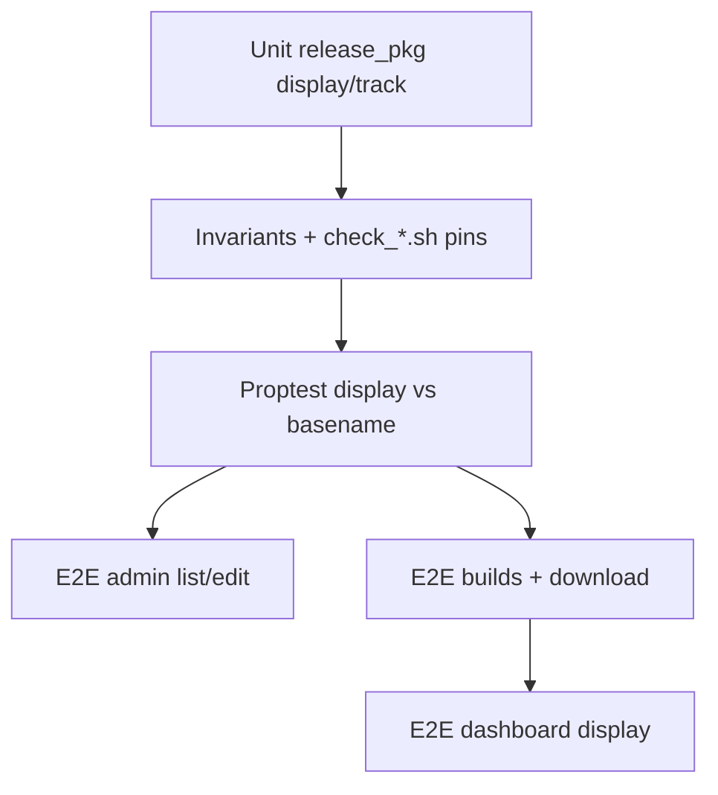

# Cleanup Builds / Releases + tests renforcés

## Contexte

Après derive manifeste + edit channel-only + `version_for_display`, il reste du texte produit mort, des pins de lint imprécis, une incohérence d’affichage sur le dashboard org, et des trous de tests sur les nouveaux contrats.

Périmètre : [`src/app/admin/releases*`](src/app/admin/releases.rs), [`src/app/org/builds*`](src/app/org/builds.rs), [`src/app/org.rs`](src/app/org.rs) (même bug `+LTS`), [`src/release_pkg.rs`](src/release_pkg.rs), scripts/check_*, tests `admin_releases_*` / `builds_entitlement_*`, runbooks associés.

Hors scope (dette plus large, pas ce lot) : fusion SQL ORDER BY builds/admin, `load_releases_for_org` full-table pour le dashboard, alignement couleurs `parse_notes` vs `note_tag_color`, durcissement du segment `eph_pkg`.

---

## 1. Nettoyage code / docs

**Admin releases**
- Supprimer le footer mort dans [`src/app/admin/releases.rs`](src/app/admin/releases.rs) (~L288–290) : *"Upload and signing workflow ships in a later slice."*
- Simplifier [`release_id.rs`](src/app/admin/releases/release_id.rs) : `track` de `channel_track` est déjà `"LTS"|"Stable"` — drop le `if track == "LTS" { … }` redondant.
- Afficher `err=webauthn` dans l’overlay delete (aujourd’hui seul `err=confirm` est lu ; le redirect `?err=webauthn` est silencieux).
- Corriger [`scripts/check_admin_releases.sh`](scripts/check_admin_releases.sh) : le pin `INSPECT_LINE` (`head -1`) tombe sur validate-pkg, pas sur create — cibler l’inspect *dans* `admin_releases_create` (comme les invariants Rust).
- Pin structurel : list + overlay utilisent `version_for_display` (pas `rel.version` brut comme label).

**release_pkg**
- Faire dériver `version_for_display` de `has_lts_marker` (une seule règle de strip `+LTS`, leading `v` conservé).

**Builds / dashboard**
- Dans [`src/app/org.rs`](src/app/org.rs), `build_version` via `version_for_display` (CURRENT BUILD, carte Builds, activity, latest).
- Pin `version_for_display` dans [`scripts/check_builds_entitlement.sh`](scripts/check_builds_entitlement.sh) pour `builds.rs` **et** `org.rs`.

**Docs**
- [`docs/runbooks/admin_releases_smoke_test.md`](docs/runbooks/admin_releases_smoke_test.md) : retirer la mention SIGNATURE (colonne absente).
- [`docs/runbooks/builds_entitlement_smoke_test.md`](docs/runbooks/builds_entitlement_smoke_test.md) : Pass/Fail — colonne VERSION / dashboard sans `+LTS` ; basename / verify / download **avec** `+LTS` pour track LTS.

DRY léger si ça tient en &lt;15 lignes : helper partagé load orgs non-reserved + parse `organization_id` → GA entre `new.rs` et `release_id.rs`. Sinon laisser en double.

---

## 2. Tests à renforcer (pyramide)



| Layer | Ajouts concrets |
|-------|-----------------|
| **Unit** | `version_for_display` edge cases déjà présents — garder ; ajouter assert helper unifié si refactor strip |
| **Invariants** | Pins `version_for_display` list admin + builds + org dashboard ; edit sans `id="version"\|id="date"` (déjà) ; inspect-before-STAGING sur create dans le script |
| **Proptest** | Remplacer la tautologie `prop_channel_is_known` par : pour corpus `(version, channel)`, `version_for_display` n’a jamais de suffixe `+LTS` ; si track LTS alors `package_file_name` se termine par `+LTS.pkg` |
| **E2E admin** | (1) Seed `vX+LTS` → list HTML contient `vX`, **pas** `vX+LTS` en cellule VERSION / overlay delete. (2) POST edit `channel=Stable` sur release LTS → row inchangée (rejet). (3) Optionnel : craft pkg Version vide / `+LTS` seul → `?err=identity` |
| **E2E builds** | Seed LTS `v98.1.0+LTS` : labels sans `+LTS` ; panel notes sans marqueur ; verify/ephemeral URL / download `Content-Disposition` = `vauban-98.1.0+LTS.pkg`. Cas EOL + version `…+LTS` idem pour le basename |
| **E2E dashboard** | Même fixture : `/{org}` n’affiche pas `+LTS` sur CURRENT BUILD / latest |
| **Battle** | Pas de nouveau battle sauf si un E2E contention manque — les battles channel/list existants restent |
| **Runbook** | Critères Pass/Fail ci-dessus |

---

## 3. Validation

```text
just fmt && just fmt-check
bash scripts/check_admin_releases.sh
bash scripts/check_builds_entitlement.sh
rtk cargo clippy --all-targets -- -D warnings
just test --test integration_tests -- admin_releases
just test --test integration_tests -- builds_entitlement_
```

(+ filtre dashboard / portal si le test y vit).
