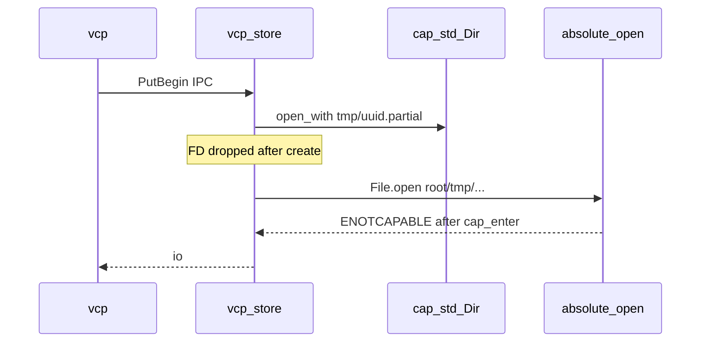

# Capsicum dirfd handoff fix

## Problem

Confirmed on FreeBSD staging:

```text
WARN vcp-store: failed to open path for SCM_RIGHTS handoff
  os_error=Not permitted in capability mode (os error 94)
```

Flow today:



Hot path: [`src/storage/server.rs`](src/storage/server.rs) `open_abs_for_handoff` after [`put_begin`](src/storage/engine.rs) / [`get_verified`](src/storage/engine.rs). Same class of post-`cap_enter` absolute opens: [`audit.rs`](src/storage/audit.rs) append, [`purge_expired_tmp`](src/storage/engine.rs) via `std::fs::metadata(&abs)`.

## Approach (locked)

1. **Engine owns handoff opens** (dir stays private): add
   - `open_partial_for_handoff(upload_id) -> std::fs::File` — relative `tmp/{uuid}.partial` via `dir.open_with`, write-only (match current handoff), then `cap_std::File::into_std()`.
   - `open_object_for_handoff(scope, …) -> std::fs::File` — relative object path via `dir.open`, read-only, `into_std()`.
2. **Server dispatch** uses those methods only; delete `open_abs_for_handoff` from the hot path. Keep `fd_handoff_failed` WARN on reopen failure (path = relative display string).
3. **Audit**: open `audit/webauthn.log` once in `WebauthnAudit::open` (already before `cap_enter`) and keep `Mutex<File>` for append — no absolute reopen after enter.
4. **Tmp purge**: use `DirEntry` / dirfd metadata (`entry.metadata()`), never `std::fs::metadata(&abs)`.
5. **Inline client** ([`client.rs`](src/storage/client.rs) put_begin/get) may keep absolute opens (portal process is not Capsicum); optionally switch to engine handoff helpers for one code path — prefer helpers for consistency in Inline too.
6. Do **not** add FreeBSD CI in this slice; prove Capsicum via staging smoke. Automated suite proves dirfd handoff + spawn IPC on macOS/Linux soft containment.

## Code touch points

| File | Change |
|------|--------|
| [`src/storage/engine.rs`](src/storage/engine.rs) | handoff open APIs; purge via dirfd metadata |
| [`src/storage/server.rs`](src/storage/server.rs) | PutBegin/Get call engine handoff; remove absolute open helper |
| [`src/storage/audit.rs`](src/storage/audit.rs) | held FD append |
| [`src/storage/client.rs`](src/storage/client.rs) | Inline put_begin/get use engine handoff helpers |
| [`src/storage/log.rs`](src/storage/log.rs) | keep WARN helpers; adjust unit messages if path field becomes relative |
| [`scripts/check_storage.sh`](scripts/check_storage.sh) + [`storage_invariants_test.rs`](tests/integration_tests/storage_invariants_test.rs) | ban absolute SCM_RIGHTS open in server; require `open_partial_for_handoff` / `open_object_for_handoff` |
| [`docs/runbooks/storage_helper_smoke_test.md`](docs/runbooks/storage_helper_smoke_test.md) §E/§H + [`storage_helper_ops.md`](docs/runbooks/storage_helper_ops.md) | happy path under `cap_enter`; logging still for real denials |

## Test pyramid (mandatory)

| Layer | Deliverable |
|-------|-------------|
| **Unit** | Engine: after `put_begin`, `open_partial_for_handoff` writes bytes; after commit, `open_object_for_handoff` reads them. Missing id → `Io` + WARN. Audit: append works with held FD (temp dir). Purge: stale partial removed without absolute metadata. |
| **Invariants** | `check_storage.sh` + `include_str`: `server.rs` must not call `File::open(` / `File::options(` for handoff; must call `open_partial_for_handoff` / `open_object_for_handoff`. Keep connect/bind before `cap_enter`. Update `inv_storage_ops_logging_not_silent` (drop requirement for `open_abs_for_handoff`). |
| **Proptest** | Handoff relative paths (`tmp/<uuid>.partial`, `releases/<id>.pkg`, `images/<org>/<uuid>.<ext>`) never absolute, never `..`, never NUL. |
| **Battle** | N threads: `put_begin` → handoff write → `put_commit_image` (or abort) on one engine under tempfile — contention on dirfd reopen + rename. |
| **E2E** | New spawn IPC test: build/locate `vcp-store`, `StorageClient` spawn (or explicit sock + `--spawn-mode`), `put_begin_image` + write via FD + commit + get — exercises real SCM_RIGHTS path (soft Capsicum on CI hosts). Extend or add beside [`storage_e2e_test.rs`](tests/integration_tests/storage_e2e_test.rs). |
| **Smoke** | FreeBSD: after `Capsicum: entered capability mode`, issue screenshot upload + image GET succeed; §H still documents WARN on intentional denials (helper down), not ENOTCAPABLE on happy path. |

## Validation

```bash
just fmt   # or cargo fmt + topcoat fmt once CLI pin OK
rtk cargo clippy -p vcp --all-targets -- -D warnings
bash scripts/check_storage.sh
rtk cargo test -p vcp --lib storage:: -- --test-threads=1
rtk cargo test --test integration_tests -- storage_ -- --test-threads=1
```

Staging FreeBSD (manual): reproduce former failing admin reply with screenshot → comment + image appear; no `ENOTCAPABLE` on `put_begin`.

## Out of scope

- `cap_rights_limit` tightening on handed FDs (architecture nicety; separate slice)
- FreeBSD GitHub Actions runner
- Changing Capsicum enter timing / UID split
