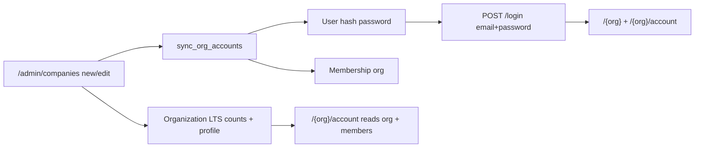

# Companies LTS counters, account parity, bootstrap login

## Locked decisions

- Cap **N** = `[org] max_lts_subscriptions` (serde default **99**), shared by both steppers.
- New users created via company fiche get `hash_password("password")` (replace `unusable_password_hash` for **new** users only; existing hashes untouched on re-sync).
- Counters use the existing **compose POST** pattern (`compose_action` like `add_row` / `remove:N`), not a new shard / JS counter library.
- Route spelling remains `/admin/companies` (product path; not “compagnies”).

## Current gaps

| Surface | Today | Target |
|---------|--------|--------|
| Admin form | No LTS fields; create hardcodes `0`/`0`; edit ignores | Steppers 0..N, persist create+edit |
| Config | Only `max_accounts_per_org` | + `max_lts_subscriptions` (default 99) |
| `/{org}/account` | Partial DB fields; no address/VAT/member list | Same company profile fields as fiche |
| Login after create | `unusable_password_hash()` | New users: `"password"` |

Key files today: [`src/app/admin/companies/form.rs`](src/app/admin/companies/form.rs), [`new.rs`](src/app/admin/companies/new.rs), [`company_id.rs`](src/app/admin/companies/company_id.rs), [`src/companies_accounts.rs`](src/companies_accounts.rs), [`src/app/org/account.rs`](src/app/org/account.rs), [`src/config.rs`](src/config.rs).

## 1. Config

- Extend `OrgConfig` in [`src/config.rs`](src/config.rs): `max_lts_subscriptions: usize` with `default_max_lts_subscriptions() -> 99`.
- Set in [`config/default.toml`](config/default.toml), [`development.toml`](config/development.toml), [`testing.toml`](config/testing.toml), [`config/vcp.conf`](config/vcp.conf).
- Document in [`README.md`](README.md) next to `max_accounts_per_org`.
- Optional named const in [`src/models/mod.rs`](src/models/mod.rs) for the default (mirror `MAX_USERS_PER_COMPANY` style).

## 2. Admin companies — LTS steppers

- Extend `CompanyFormView` + `CompanyComposeForm` (new + edit) with `lts_subscriptions` / `industrial_lts_subscriptions` (parse as `i32`/`usize`, clamp to `0..=max_lts`).
- UI in [`form.rs`](src/app/admin/companies/form.rs): section **SUBSCRIPTION** with two counters:
  - Hidden (or readonly text) value + `−` / `+` submit buttons: `compose_action` = `lts_dec` / `lts_inc` / `ind_dec` / `ind_inc`.
  - Same re-render path as `add_row` (no DB write until `save`).
  - Start at **0** on create; prefills from org on edit.
- On `save` in [`new.rs`](src/app/admin/companies/new.rs) / [`company_id.rs`](src/app/admin/companies/company_id.rs): persist clamped counts (stop hardcoding `0` / skipping on edit).
- List cards ([`search_shard.rs`](src/app/admin/companies/search_shard.rs)): show the two counts in meta (keeps fiche/list/account consistent).
- Reject out-of-range on save with the existing form error path (defense in depth vs tampered POST).

## 3. Bootstrap password for fiche accounts

- In [`src/companies_accounts.rs`](src/companies_accounts.rs): replace `unusable_password_hash()` for **new** `User` rows with `hash_password("password")`.
- Export a small named constant (e.g. `BOOTSTRAP_LOGIN_PASSWORD = "password"`) + short comment: interim until magic links; do not log the secret.
- Update README / admin companies smoke notes that contradict “unusable until magic links”.
- Existing users (seed / re-linked emails): **do not** reset hash on sync.

## 4. `/{org}/account` parity with company fiche

Rewrite [`src/app/org/account.rs`](src/app/org/account.rs) to read only from `Organization` + org memberships (still gated `require_org` + `account_read`):

- Keep: name, plan_label, status, supported_builds, LTS / Industrial LTS counts, technical contact.
- Add: **ADDRESS**, **VAT**, **USER ACCOUNTS** (member emails as pills / list, same data shape as admin cards — reuse load helpers where practical, e.g. memberships + `users_by_ids`).
- Keep signed-in user block + Sign out.
- No password UI.

## 5. Test pyramid (mandatory)

### Surface A — admin LTS counters + bootstrap login

Extend existing `admin_companies_*` + [`scripts/check_admin_companies.sh`](scripts/check_admin_companies.sh):

| Layer | Deliverable |
|-------|-------------|
| Unit | Clamp helper `0..=max_lts`; `BOOTSTRAP_LOGIN_PASSWORD` / hash path |
| Invariants | Form pins `lts_inc`/`lts_dec`/labels; config key; no `unusable_password_hash` for new users; create/edit persist fields |
| Proptest | Parsed/clamped counts stay in `0..=max` for random inputs |
| Battle | Parallel create/edit with counters stay healthy |
| E2E | Create company with LTS=2, Industrial=1 + account email → values on edit + list; **login that email / `password` → GET `/{slug}` 200** and `/{slug}/account` shows counts + address/VAT |
| Runbook | Extend [`docs/runbooks/admin_companies_smoke_test.md`](docs/runbooks/admin_companies_smoke_test.md): steppers, login as fiche user, account page |

Denial: member cannot open `/admin/companies`; reserved `vauban` still blocked; out-of-range counter rejected.

### Surface B — org account page

New filter `org_account` (or fold into portal if thinner — prefer **dedicated** `org_account_*` + `scripts/check_org_account.sh` + smoke runbook):

| Layer | Deliverable |
|-------|-------------|
| Unit | Contact / member-list formatting helpers if extracted |
| Invariants | `account_read` gate; fields from `org.*` + memberships; no hardcoded Acme copy |
| Proptest | Nav/`account` segment stability if needed |
| Battle | Parallel `/{org}/account` GETs |
| E2E | Seed/fixture org fields appear; wrong-org / anon → 404 |
| Runbook | [`docs/runbooks/org_account_smoke_test.md`](docs/runbooks/org_account_smoke_test.md) |

## 6. Validation / docs

- `just fmt` → fmt-check → clippy `-D warnings` → focused `admin_companies` + `org_account` (+ lib unit) with `--test-threads=1`.
- Touch [`.cursor/rules/project-overview.mdc`](.cursor/rules/project-overview.mdc) only if it still claims unusable passwords / omits LTS config.

## Out of scope

- Magic-link auth, password change UI, staff preview of client `/{org}` without membership, editing `plan_label` / `supported_builds` / `status` in admin (keep create defaults unless already present).
