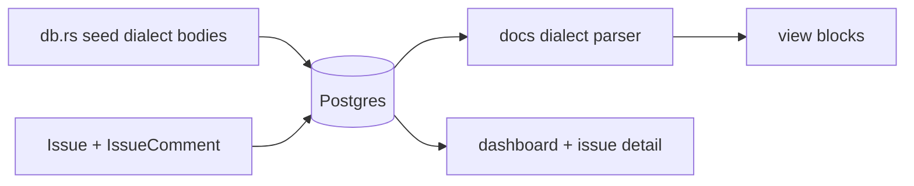

# DB-backed editorial and org data

## Decisions (locked)

- **Scope 1B**: docs from DB + dashboard activity from DB fields + issue metadata + `IssueComment` timeline (seed + read; reply POST wired).
- **Dialecte léger** for `DocArticle.body` (still a `TEXT` string): headings, paragraphs, fenced code, callout fences — server-parsed to existing Concept blocks. No raw HTML storage.
- **No `Activity` table**: dashboard derives the three feed lines from latest `Release` / org `Issue` / published `DocArticle` using real timestamps.
- **Out of scope**: ephemeral download tokens, binary storage, login seed hint (dev OK).



## 1. Docs dialect + remove view bypass

**Parser** (new module, e.g. [`src/docs_body.rs`](src/docs_body.rs)):

| Marker | Renders as |
|--------|------------|
| `# Title` / `## Title` | `<h3>` (Concept uses h3 in modal) |
| blank-line paragraphs | `<p>` |
| ` ``` ` … ` ``` ` | `<pre class="vb-pre">` |
| `::: callout` … `:::` | `.vb-callout` + SVG flag icon |

Fail closed on unknown fence openers (treat as plain paragraph text). Escape HTML in text nodes (`<` → entities) so dialect never becomes XSS.

**View path** — rewrite [`src/app/org/docs/doc.rs`](src/app/org/docs/doc.rs):

- Delete `quick_start_blocks`, `placeholder_blocks`, `is_seed_placeholder_or_outline`, and the slug special-case in `article_body_view`.
- Always: load `body` from DB → parse → render blocks.
- Keep modal chrome / `format_unix_local` for `updated_at`.

**Seed** — [`src/db.rs`](src/db.rs) `seed_doc_body`:

- Persist the current Concept quick-start content as dialect (callouts + fences + headings).
- Replace thin `"Full article body will expand…"` stubs with short real dialect bodies (1–2 sections each) so catalog articles are not placeholders.
- `ensure_demo_catalog`: **update** bodies that still match the old thin/outline detectors (so existing local DBs pick up rich content without wipe).

**Admin** — placeholders in [`admin/docs/new.rs`](src/app/org/admin/docs/new.rs) / edit form mention dialect markers; storage stays `form.body.trim()`.

## 2. Issue model + comments

**Schema** ([`src/models/mod.rs`](src/models/mod.rs) + `just migration-generate` / apply):

- `Issue`: add `opened_by_user_id: u64`, `created_at: i64`, `updated_at: i64`.
- New `IssueComment`: `id`, `issue_id` (index), `author_user_id: u64` (0 = system/support seed without user row if needed — prefer real seed user ids), `author_role: String` (`reporter` / `support` / `system`), `body: String`, `kind: String` (`comment` / `status_change`), `created_at: i64`.

**Write paths**:

- Create issue ([`issues.rs`](src/app/org/issues.rs) POST): set opener = current user, both timestamps = now; persist `details` as today.
- New POST reply on detail (gate `issues_write` + org membership): insert `IssueComment` kind `comment`, bump `issue.updated_at`.
- Close/reopen can wait; status-change rows come from seed for demo. Optional: if status already `In analysis`, seed a `status_change` row.

**Read paths**:

- [`issue_key.rs`](src/app/org/issues/issue_key.rs): meta OPENED BY / CREATED / UPDATED from user join + `format_local` / relative helper; discussion = opening bubble (`details` + reporter) then DB comments ordered by `created_at`; remove hardcodéd support bubble / dividers / `"Customer"` / `"Jun 20"`. Fix SLA `◷` → SVG while touching the page.
- [`issues.rs`](src/app/org/issues.rs) list line: opened by display name + localized `updated_at` (drop `"updated recently"`).

**Seed**: for each demo issue, create opener timestamps, support `IssueComment`, and a `status_change` divider row where status ≠ Open.

## 3. Dashboard activity from DB

Rewrite recent-activity panel in [`src/app/org.rs`](src/app/org.rs):

1. Latest release → version/channel + date from `released_on` (already a calendar string).
2. Latest org issue by `updated_at` → key + status-derived copy + relative/local time.
3. Latest published doc by `updated_at` → title + `format_unix_local`.

No hardcoded `"Jun 23"` / `"3h ago"` / `"Jun 12"`. Shared small helper for relative labels (e.g. in [`src/tz.rs`](src/tz.rs)) used by dashboard + issues.

## 4. Structural lints + pyramid

| Surface | Invariants | Tests |
|---------|------------|--------|
| Docs body | Extend [`scripts/check_admin_docs.sh`](scripts/check_admin_docs.sh): pin absence of `quick_start_blocks` / `is_seed_placeholder_or_outline`; pin `docs_body` parser module | unit parse (happy/sad), inv_, proptest (random corpora stay escaped), battle (parallel parse), e2e article modal shows DB callout/pre for `quick-start`, runbook note in [`docs/runbooks/admin_docs_smoke_test.md`](docs/runbooks/admin_docs_smoke_test.md) |
| Issues | Extend [`scripts/check_portal_issues.sh`](scripts/check_portal_issues.sh): pin `IssueComment`, reply POST, no literal `"Vauban Support"` / `"3h ago"` fixtures | unit create+list comments, inv_, proptest keys/roles, battle concurrent reply, e2e detail shows seed comment + denial wrong org, runbook [`portal_issues_smoke_test.md`](docs/runbooks/portal_issues_smoke_test.md) |
| Dashboard | Pin in portal_shell or issues check: no `"Jun 23"` in `org.rs` | e2e / unit that activity uses `updated_at` / `released_on` |

Validation cycle: `rtk cargo fmt`, clippy `-D warnings`, focused `integration_tests` filters + relevant `check_*.sh`.

## Key files

- [`src/docs_body.rs`](src/docs_body.rs) (new) + wire in `lib.rs`
- [`src/app/org/docs/doc.rs`](src/app/org/docs/doc.rs) — render path only
- [`src/db.rs`](src/db.rs) — dialect seed + body refresh
- [`src/models/mod.rs`](src/models/mod.rs) + Toasty migration
- [`src/app/org/issues/issue_key.rs`](src/app/org/issues/issue_key.rs), [`src/app/org/issues.rs`](src/app/org/issues.rs)
- [`src/app/org.rs`](src/app/org.rs), [`src/tz.rs`](src/tz.rs)
