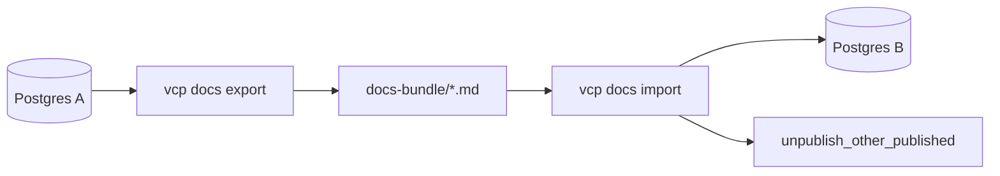

# Docs CLI Markdown export/import

## Goal

Move documentation articles between VCP instances with **no browser editing**:

```bash
vcp docs export ./docs-bundle/
vcp docs import ./docs-bundle/
# local wrappers
just docs-export DIR=./docs-bundle
just docs-import DIR=./docs-bundle
```

Ops tool (like [`seed-data`](src/main.rs)): uses `Config` + Postgres; **no** HTTP / Casbin. Host access to DB is the gate.

## Locked product rules

| Rule | Choice |
|---|---|
| Transport | **Directory of `.md` files** (no zip crate; ops may `tar`/`zip` the folder) |
| Scope | **All** `DocArticle` rows (DRAFT + PUBLISHED), every version |
| Identity | Upsert key **`(slug, version)`** — lossless vs admin version rows |
| Filename | `{slug}__{version}.md` (slug already path-safe from admin slugify) |
| Sync mode | **Additive upsert only** — never delete target articles absent from the bundle |
| Publish exclusivity | On import of a `PUBLISHED` row, call existing [`unpublish_other_published`](src/docs_version.rs) |
| Categories | Reject unknown `category` (must be in `DOC_CATEGORIES`) |
| Frontmatter | Small hand-rolled YAML subset (fixed keys) — **no** new `serde_yaml` dependency |

## File format

```markdown
---
title: Prefer config over workspace
slug: prefer-config-over-workspace
summary: One-line excerpt
category: API
status: PUBLISHED
version: v1
---

Body in the existing VCP docs dialect (`docs_body`).
```

Required keys: `title`, `slug`, `category`, `status`, `version`. `summary` may be empty. Body is everything after the closing `---`. Round-trip must preserve body bytes (trim only trailing whitespace policy documented in module).

## Architecture



New module [`src/docs_bundle.rs`](src/docs_bundle.rs) (pure + DB):

- `ArticleFrontmatter` / `BundledArticle`
- `serialize_markdown` / `parse_markdown`
- `bundle_filename(slug, version)`
- `export_articles_to_dir(db, path) -> Report`
- `import_articles_from_dir(db, path) -> Report` (create or update title/summary/category/status/body/`updated_at`; then exclusivity if PUBLISHED)

Wire in [`src/main.rs`](src/main.rs):

- nested command: first token `docs`, second `export`|`import`, third path
- load config, connect DB (same pattern as `run_seed_data`)
- print counts (exported / created / updated / errors)

Update [`src/cli.rs`](src/cli.rs) `cli_usage` + unit pins for the new commands.

Justfile: `docs-export` / `docs-import` wrapping `cargo run -- docs …` with `VCP_CONFIG_DIR` already exported.

## Implementation notes

- Export query: `DocArticle::all().include(body()).exec` — body is `Deferred`.
- Import update path: Toasty `.update()` on matched `(slug, version)`; create otherwise with `now_unix()` for `updated_at`.
- Do **not** transport `id`.
- Fail closed on: missing path, invalid frontmatter, bad status, unknown category, empty slug/title/version, path escape / non-`.md` ignored with warning count.
- Keep dialect as-is — no Markdown rewrite.

## Test pyramid (mandatory)

| Layer | Deliverable |
|---|---|
| **Unit** | Frontmatter parse table; serialize↔parse round-trip; filename helper; category/status rejects |
| **Invariants** | `scripts/check_docs_bundle.sh` pins CLI strings + `docs_bundle` upsert exclusivity call; `cli_usage` / `main` contain `docs export`/`import`; seed-style help layout still OK |
| **Proptest** | Random title/summary/body/slug/version/status corpora → serialize → parse equals (escape edge cases in YAML values: quotes, colons) |
| **Battle** | Parallel import of disjoint slug sets into shared test DB (no cross-clobber); concurrent export to temp dirs |
| **E2E** | Integration against `vcp_test`: seed N articles (incl. two versions same slug) → export dir → clear docs or fresh org DB path → import → assert fields + only one PUBLISHED per slug; unknown category fails that file without aborting others (or fail-fast — **fail-fast** locked for ops clarity) |
| **Runbook** | [`docs/runbooks/docs_bundle_smoke_test.md`](docs/runbooks/docs_bundle_smoke_test.md): staging A→B export/import Pass/Fail; link from nearest docs/ops note |

Fail-fast import: first bad file aborts with non-zero exit (no partial silent success). Export is all-or-nothing write after load (write into empty/created dir; refuse non-empty dir unless `--force` — **lock: require empty or create dir; refuse non-empty** to avoid mixed bundles).

## Validation gate

`just fmt` → fmt-check → clippy `-D warnings` → `bash scripts/check_docs_bundle.sh` → `just test -- --test integration_tests -- docs_bundle` (+ lib unit filter `docs_bundle`).

## Out of scope

- Admin UI upload/download
- ZIP as first-class format
- Prune/delete on target
- Converting callouts to/from GFM
- Multi-tenant per-org docs (docs remain global as today)
