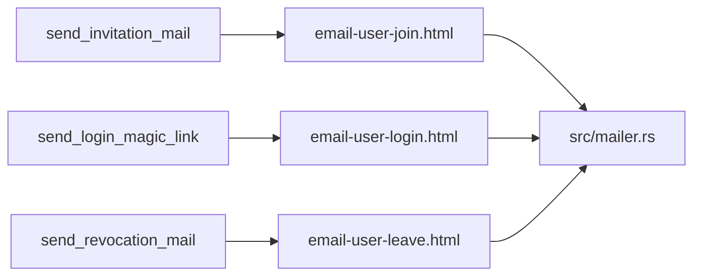

# Emplacement des templates email HTML VCP

## Ce que contient l’archive

Sous `bundle/` dans [`.cursor/mockups/VCP - Join  Login  Leave.zip`](.cursor/mockups/VCP%20-%20Join%20%20Login%20%20Leave.zip) :

| Fichier | Rôle |
|---|---|
| `email-user-join.html` | Invitation (ajout compte compagnie) |
| `email-user-login.html` | Magic link login (membre ou support) |
| `email-user-leave.html` | Révocation d’accès |
| `design-tokens.json` | Tokens DTCG (couleurs, type, spacing, bouton) — source de design, pas runtime |
| `vauban-logo.png` | Logo 384px (rendu 48px) pour CID production |
| `README.md` | Contrats de build email + placeholders |

Points techniques importants du README / HTML :

- Layout tables 600px, styles 100 % inline, pas de JS / CSS externe / webfonts.
- Copie alignée sur les mails texte actuels de [`src/mailer.rs`](src/mailer.rs) (`send_invitation_mail`, `send_login_magic_link`, `send_revocation_mail`).
- Placeholders = **valeurs littérales d’exemple** (pas `{{mustache}}`) : org name (`Scalable Solutions`), URL magic link (bouton + fallback), `no-reply@vauban.sh` en footer.
- Logo en `data:` base64 dans chaque HTML — **Gmail/Outlook ne l’affichent pas** ; prod = `cid:vauban-logo` + pièce jointe inline (`vauban-logo.png`).
- `.cursor/mockups/` est **local / non versionné** (hors `.gitkeep`) : l’archive ne peut pas être la source de vérité runtime.

## Mapping actuel → futurs HTML



Aujourd’hui : `Mail::builder().text(...)` uniquement. Topcoat Mail 0.5 sait déjà faire HTML + `multipart/alternative` (+ `related` pour CID).

## Emplacement recommandé (décision)

**Arbre versionné à la racine du repo : `email/`**

```
email/
  README.md                 # notes du bundle (placeholders, CID, clients)
  design-tokens.json        # tokens design (évolution visuelle)
  vauban-logo.png           # asset CID (pas le pipeline Topcoat web)
  user-join.html
  user-login.html
  user-leave.html
```

Pourquoi ici plutôt qu’ailleurs :

| Candidat | Verdict |
|---|---|
| **`email/` (racine)** | **Retenu** — clair pour designers/ops, hors pipeline Tailwind/Topcoat, versionné avec le code, évolutif (4e mail = un fichier de plus) |
| `assets/` / `target/assets` | Non — réservé au bundle web Topcoat (`share/vcp/assets`) ; HTML email ne doit pas passer par le bundler |
| `config/` | Non — ce n’est pas de la config opérateur (`vcp.conf`) |
| `.cursor/mockups/` | Non — gitignored ; mockups locaux seulement |
| Uniquement `src/mailer.rs` en strings | Non — impraticable pour ~20 Ko HTML + évolutions UI |
| Runtime sous `share/vcp/email/` | Surdimensionné pour VCP : packaging + chemins runtime ; hot-reload ops rarement utile pour du mail transactionnel |

Chargement côté Rust (quand on implémentera) : `include_str!(concat!(env!("CARGO_MANIFEST_DIR"), "/email/user-join.html"))` (+ `include_bytes!` pour le PNG CID). Même pattern déjà accepté pour les inputs de build (pas de découverte runtime `CARGO_MANIFEST_DIR` en prod). Le binaire embarque les templates → le paquet FreeBSD n’a **pas** besoin d’installer un dossier email séparé.

Optionnel plus tard : module mince `src/mail_templates.rs` qui charge / substitue / expose les 3 builders ; [`src/mailer.rs`](src/mailer.rs) reste le point d’envoi SMTP + circuit breaker.

## Ce qu’on ne décide pas encore (hors discussion emplacement)

Hors scope de « où ranger » ; à trancher avant implémentation :

- Syntaxe de substitution (`__ORG_NAME__` stables vs replace ciblés sur les littéraux du mockup).
- Toujours garder une part **text/plain** explicite (copie actuelle) vs laisser Topcoat dériver depuis le HTML.
- CID inline dès le premier cut vs URL `https://` hébergée.
- TTL affiché (« 5 minutes ») : figé dans le HTML ou injecté depuis `magic_links.token_ttl_secs` (le texte actuel est déjà dynamique).

## Suite quand tu voudras coder

1. Extraire le bundle ZIP vers `email/` (renommer en `user-*.html`, retirer le base64 au profit de `cid:vauban-logo`).
2. Brancher multipart HTML+text dans `mailer.rs`.
3. Pyramid tests mail (invariants `include_str` pins, golden/substring sur org/url, E2E Mailpit si déjà en place).
