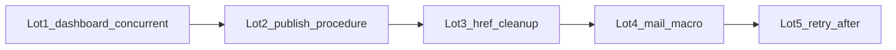

# Exploit Topcoat 0.6.2 (post-upgrade)

Order is fixed: dashboard concurrent I/O → Publish procedure → dead `href_with_query` → `mail!` → machine 503. Do **not** edit [`.cursor/plans/topcoat_0.6.2_upgrade_88699e43.plan.md`](.cursor/plans/topcoat_0.6.2_upgrade_88699e43.plan.md).

**Out of scope (still the right call):** `rewrite()` for `/vauban/issues` (keep visible 307/303), `too_many_requests` on login (anti-enumeration), sitemap, `TowerService` / `topcoat::start`, vendoring `topcoat-ui`, TLS, SQL `list_page` rewrite, per-row blob `#[component]` loops.

**Do not enable:** `websocket` / `sse` / `datastar`.

Every lot: `just fmt` + `rtk cargo fmt --all -- --check` + clippy `-D warnings` + matching `scripts/check_*.sh`. Integration tests only via `just test -- --test integration_tests <filter>` (never a `|` regex through `just test`).

---

## Lot 1 — Concurrent dashboard tiles

**Why:** 0.6 starts sibling `#[component]` in the same tick; async `#[memoize]` **shares one in-flight future** (upstream `memoize.md`). Today [`src/app/org.rs`](src/app/org.rs) `dashboard` loads releases, then issues, then docs count, then latest doc — sequential.

**How (layout-preserving):**

1. Add memoized loaders (keys: `u64` org id, not `&str`) in a new [`src/app/org/dashboard.rs`](src/app/org/dashboard.rs) (or next to [`src/dashboard_stats.rs`](src/dashboard_stats.rs)):
   - one `Issue::all()` + `DASHBOARD_ISSUES_CAP` + `summarize_issue_stats` (do **not** split into per-status `COUNT`)
   - entitled releases (`load_releases_for_org` / empty when not entitled)
   - published docs: `count` + latest row (one memoized pair, or two memoized fns)
2. Split the existing `view!` into **sibling** components that only read those loaders and render the same CSS/labels (`OPEN ISSUES`, `IN ANALYSIS`, `vb-stat-value`, `vb-grid-2` / `vb-grid-3`). Page `dashboard` stays a thin composer: `require_org` + hrefs + the sibling calls.
3. Keep `issue_activity_copy` / no wall-clock dates. Components take `org_slug` / ids as args — do **not** `path_param` inside them if that would couple to the page route.

Update pins that today require `Issue::all()` **exactly once in `org.rs`**: [`scripts/check_dashboard_stats.sh`](scripts/check_dashboard_stats.sh) and [`tests/integration_tests/dashboard_stats_invariants_test.rs`](tests/integration_tests/dashboard_stats_invariants_test.rs) — pin the loader file instead, still exactly one `Issue::all()`.

### Pyramid (extend `dashboard_stats_*`)

| Layer | Deliverable |
|-------|-------------|
| Unit | Existing `dashboard_stats` units stay; add a trivial assert that loaders are `#[memoize]` / single issue query (or keep that in invariants only) |
| Invariants | Update `check_dashboard_stats.sh` + `inv_*` for new module path; pin `#[component]` siblings in the dashboard `view!`; still forbid `ISSUE_STATUS_RESOLVED`/`CLOSED` COUNTs and `issue_is_closed` |
| Proptest | Existing [`dashboard_stats_proptest.rs`](tests/integration_tests/dashboard_stats_proptest.rs) — no new corpus unless loader aggregation moves |
| Battle | Existing [`dashboard_stats_battle_test.rs`](tests/integration_tests/dashboard_stats_battle_test.rs) — parallel GETs still match tiles |
| E2E | Existing [`dashboard_stats_e2e_test.rs`](tests/integration_tests/dashboard_stats_e2e_test.rs) `tile_value_after` must stay green (same labels) |
| Runbook | Add a step to [`docs/runbooks/dashboard_stats_smoke_test.md`](docs/runbooks/dashboard_stats_smoke_test.md): tiles + cards still agree after concurrent render; filter unchanged |

Also: short note in [`.cursor/skills/topcoat/references/RUNTIME.md`](.cursor/skills/topcoat/references/RUNTIME.md) (drop the stale “VCP pins 0.5.0” line) that dashboard tiles are the concurrent-component example.

---

## Lot 2 — Publish: `require_active_key` procedure

**Why:** Login already uses `#[procedure]` + `@submit=$(async |e: Event| …)` ([`src/app/login.rs`](src/app/login.rs)). Compose still `fetch('/admin/releases/new/require-active-key')` then a hidden `#vcp-no-key-open` click ([`src/app/admin/releases/new.rs`](src/app/admin/releases/new.rs) ~232).

**How:**

1. Add `#[procedure] async fn require_active_key(cx: &Cx) -> Result<f64>` next to the compose page. Re-run `require_staff` + `releases_manage` (capability deny → 404). Return `1.0` / `0.0` like `LOGIN_LINK_*`. Delete `#[route(GET "/admin/releases/new/require-active-key")]`.
2. Keep **`POST /admin/releases/new/validate-pkg`** (Multipart + `freebsd_pkg::inspect`, 204/422, never stages). Procedures are JSON; a pkg body does not belong there. E2E/battle keep posting that URL.
3. Rewrite `@submit` to `$() async`: `prevent_default`, `require_active_key().await`, `no_key_open.set(true)` on `0.0` (drop the bridge click). POST create + WebAuthn stay native `HTMLFormElement.prototype.submit` after validate-pkg 204.
4. File/`FormData` is not in the `$()` Rust subset. Keep a **short function-form raw fragment** only for validate-pkg + native submit; interpolate `href!(admin_releases_validate_pkg).resolve(cx)` (e.g. `data-validate-pkg`) — **never** hardcode `/admin/releases/new/require-active-key` again.
5. Update [`scripts/check_admin_releases.sh`](scripts/check_admin_releases.sh) and in-module string tests: pin `#[procedure]` + `require_active_key`, drop the GET route pin; keep validate-pkg 204/422 / no `put_begin` pins.

### Pyramid (extend `admin_releases_*`)

| Layer | Deliverable |
|-------|-------------|
| Unit | Existing compose-source tests: `@submit=$(async`, `require_active_key`, no GET path string |
| Invariants | `check_admin_releases.sh` + [`admin_releases_invariants_test.rs`](tests/integration_tests/admin_releases_invariants_test.rs) |
| Proptest | Existing validate-pkg inspect → 422 corpus ([`admin_releases_proptest.rs`](tests/integration_tests/admin_releases_proptest.rs)) |
| Battle | Keep parallel validate-pkg flood; add parallel `require_active_key` procedure posts (staff vs denial) in [`admin_releases_battle_test.rs`](tests/integration_tests/admin_releases_battle_test.rs) |
| E2E | Replace GET `/require-active-key` in [`admin_releases_e2e_test.rs`](tests/integration_tests/admin_releases_e2e_test.rs) with a `call_require_active_key` helper modeled on [`call_request_login_link`](tests/integration_tests/common/mod.rs) (procedure id from compose HTML). Denial: anonymous / client cookie → 404. Create-without-key still `?err=no_active_key`. validate-pkg 204/422 unchanged |
| Runbook | [`docs/runbooks/admin_releases_smoke_test.md`](docs/runbooks/admin_releases_smoke_test.md): Publish with no ACTIVE key opens the signal modal (no WebAuthn); garbage pkg still 422 preflight |

---

## Lot 3 — Dead list query builders

**Why:** Lists already use `href!(…).query(SearchQ|SearchListQ|ChannelPageQ)`. [`src/list_page.rs`](src/list_page.rs) `with_page_param` / `with_named_page_param` / `href_with_query` are test-only. [`scripts/check_admin_companies.sh`](scripts/check_admin_companies.sh) still requires `with_page_param` while [`src/app/admin/companies.rs`](src/app/admin/companies.rs) uses `href!(admin_companies_page).query(SearchQ)`.

**How:** Delete the three helpers + their unit. Keep `parse_page` / `page_count` / `page_offset` / `page_slice` / `PagerLinks`. Retarget the companies lint to `href!` + `SearchQ`. Add a forbid-grep (existing [`scripts/check_topcoat_0_6.sh`](scripts/check_topcoat_0_6.sh) or a tiny `check_list_page.sh`) so `href_with_query` cannot return. Do **not** rewrite historical [`.cursor/plans/admin_companies_pagination_0175e9bd.plan.md`](.cursor/plans/admin_companies_pagination_0175e9bd.plan.md).

### Pyramid (extend existing list surfaces — do not invent a second harness)

| Layer | Deliverable |
|-------|-------------|
| Unit | Remaining `list_page` tests; `PagerLinks::from_hrefs` still omits `page=1` |
| Invariants | Updated `check_admin_companies.sh` + forbid `href_with_query` / `with_page_param` in `src/` |
| Proptest | Existing companies / docs / issues pager proptests (no new crate) |
| Battle | Existing `*_search_shard_battle_test` / companies battle |
| E2E | Existing list e2e (`?page=2` shareable) |
| Runbook | One line on an existing companies or `topcoat_0_6` runbook — no new file |

---

## Lot 4 — `mail!` instead of `Mail::builder` + `Unescaped`

**Why:** Transport is already Topcoat ([`ConfiguredSmtpTransport`](src/mailer.rs)). Bodies still `render_html` + `Unescaped::new_unchecked`. Upstream `mail!` is the DSL ([`crates/topcoat/docs/mail.md`](file:///Users/mnemonic/Code/topcoat/crates/topcoat/docs/mail.md)).

**How:**

1. Replace `Mail::builder()` in `send_branded_mail` with `mail! { from, to, subject, html, text, attachments }` — keep CID logo + optional `reply_to`.
2. Port the four transactional bodies to `view!` helpers (escaped interpolations, `cid:vauban-logo`). Drop `Unescaped` from the send path.
3. Keep [`email/*.html`](email/) as **visual fixtures** (operators / design tokens), not as `include_str` injected into the MIME body. Update [`scripts/check_mail_templates.sh`](scripts/check_mail_templates.sh) + [`mail_templates_invariants_test.rs`](tests/integration_tests/mail_templates_invariants_test.rs): pin `mail!`, forbid `Unescaped` in `mailer.rs`, still pin CID + no `data:image`.
4. Do **not** change anti-enumeration login mail behavior or the circuit breaker.

### Pyramid (extend `mail_templates_*` + magic-mail e2e)

| Layer | Deliverable |
|-------|-------------|
| Unit | Escape / missing-placeholder cases stay on helpers; add `mail!` render smoke if a `Cx::default()` path exists, else keep this in e2e |
| Invariants | Script + `inv_mailer_*` as above |
| Proptest | Existing [`mail_templates_proptest.rs`](tests/integration_tests/mail_templates_proptest.rs) (escape / injection corpus) |
| Battle | Existing [`mail_templates_battle_test.rs`](tests/integration_tests/mail_templates_battle_test.rs) |
| E2E | [`mail_templates_e2e_test.rs`](tests/integration_tests/mail_templates_e2e_test.rs) + [`companies_magic_mail_e2e_test.rs`](tests/integration_tests/companies_magic_mail_e2e_test.rs): Memory transport still has CID, magic `href!(login_magic).absolute()`, escaped org names |
| Runbook | Existing mail / magic-link runbook: one checklist line that HTML still matches brand (logo cid, no raw tokens in logs) |

---

## Lot 5 — Machine 503 + `Retry-After`

**Why:** 0.6 `service_unavailable(secs)` sets 503 + `Retry-After` but **body is always** `"service unavailable"` ([upstream `service_unavailable.rs`](file:///Users/mnemonic/Code/topcoat/crates/topcoat-router/src/error/service_unavailable.rs)). VCP machine surfaces pin exact text (`integrity mismatch`, storage codes) in [`storage_e2e_test.rs`](tests/integration_tests/storage_e2e_test.rs) / ephemeral GET.

**How:**

1. Shared helper (e.g. on [`src/app/org/images.rs`](src/app/org/images.rs) + [`src/app/releases/eph_token/eph_pkg.rs`](src/app/releases/eph_token/eph_pkg.rs)): `service_unavailable(STORE_RETRY_AFTER_SECS).into_response(cx)?` then **replace the body** with the existing machine string. One named const (e.g. 30s) — not login lockout, not mail circuit.
2. Never use this on `request_login_link` / magic-link UX.
3. Pin `Retry-After` + unchanged body in storage / builds-entitlement invariants.

### Pyramid (extend `storage_*` + ephemeral entitlement)

| Layer | Deliverable |
|-------|-------------|
| Unit | Helper: 503 + `Retry-After: <const>` + exact body bytes |
| Invariants | [`storage_invariants_test.rs`](tests/integration_tests/storage_invariants_test.rs) / [`builds_entitlement_invariants_test.rs`](tests/integration_tests/builds_entitlement_invariants_test.rs): pin helper + forbid bare `SERVICE_UNAVAILABLE` without `Retry-After` on those two files |
| Proptest | Existing storage / entitlement proptest (status mapping) |
| Battle | Existing [`storage_battle_test.rs`](tests/integration_tests/storage_battle_test.rs) |
| E2E | Existing 503 text asserts **plus** `Retry-After` header |
| Runbook | [`docs/runbooks/storage_helper_smoke_test.md`](docs/runbooks/storage_helper_smoke_test.md): curl a forced 503 and check `Retry-After` |

---

## Skills (each lot that touches the surface)

- [`.cursor/skills/topcoat/SKILL.md`](.cursor/skills/topcoat/SKILL.md) / `RUNTIME.md`: concurrent dashboard; Publish procedure vs validate-pkg route
- [`.cursor/skills/web-stack/SKILL.md`](.cursor/skills/web-stack/SKILL.md): list hrefs are `href!` only
- Mail / storage one-liners in the same skills if those lots land

Do not bump Topcoat. Do not switch the HTTPS host.
