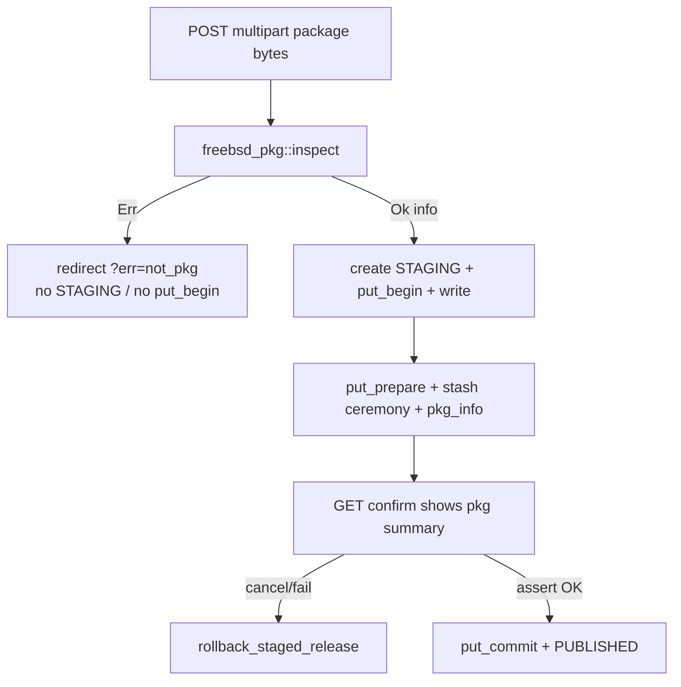

# FreeBSD package validation on release publish

## Goal

On `POST /admin/releases/new`, reject any upload that is not a FreeBSD package **before** creating a `STAGING` row or calling `put_begin`. On the WebAuthn confirm page, show a `pkg info`-style summary of the parsed metadata. Invalid package => error flash + no residual release/blob (same transactional posture as cancel-at-signature).

## Format contract (from FreeBSD pkg + [`../Vauban/pkg`](../Vauban/pkg))

A FreeBSD `.pkg` is:

1. Outer compression: **zstd** (current `pkg create` default), **xz**, **gzip**, **bzip2**, or raw tar.
2. Inner **ustar** archive whose leading members are metadata files named `+…` (no leading `/`).
3. At least one of `+MANIFEST` / `+COMPACT_MANIFEST` before the first non-`+` member.
4. Manifest is UCL/JSON with required fields: `name`, `version`, `origin`, `prefix`, `comment`.

[`Vauban/pkg/+MANIFEST`](../Vauban/pkg/+MANIFEST) is the **source** metadir for `pkg create`; the **packed** `+MANIFEST` inside the `.pkg` is richer (`arch`/`abi`, `flatsize`, `shlibs_required`, `annotations.FreeBSD_version`, …). Validation and UI read the **packed** manifeste only.

**Out of scope for display:** `Installed on` — that timestamp comes from the local pkg DB after install, not from the archive. Omit the line.

## Architecture



**Hook (fail-closed):** in [`src/app/admin/releases/new.rs`](src/app/admin/releases/new.rs) `admin_releases_create`, immediately after `let Some(package) = form.package`, **before** `sweep_staged_releases` / `toasty::create!(… STAGING)` / `put_begin_release`.

```rust
let info = match freebsd_pkg::inspect(&package) {
    Ok(info) => info,
    Err(_) => return Ok(see_other("/admin/releases/new?err=not_pkg")),
};
```

Then stash `info` into `PendingReleaseCeremony` for the confirm page. No second parse at confirm time (bytes are no longer in portal RAM; only `tmp/{upload_id}.partial` on the helper).

## New module: [`src/freebsd_pkg.rs`](src/freebsd_pkg.rs)

Pure, sync, no I/O beyond the byte slice.

### Public API

```rust
pub struct FreeBsdPkgInfo {
    pub name: String,
    pub version: String,
    pub origin: String,
    pub architecture: String,   // abi preferred ("FreeBSD:15:amd64"), else arch
    pub prefix: String,
    pub categories: Vec<String>,
    pub licenses: Vec<String>,
    pub maintainer: String,
    pub www: String,
    pub comment: String,
    pub shlibs_required: Vec<String>,
    pub freebsd_version: Option<String>, // annotations.FreeBSD_version
    pub flatsize_bytes: Option<u64>,
}

pub enum FreeBsdPkgError { /* TooLarge, BadCompression, NotTar, NoManifest, BadManifest, … */ }

pub fn inspect(bytes: &[u8]) -> Result<FreeBsdPkgInfo, FreeBsdPkgError>;
pub fn format_pkg_info(info: &FreeBsdPkgInfo) -> String; // pkg-info style text for <pre>
```

### Parsing pipeline (streaming, budgeted)

1. **Sniff** magic: zstd `28 B5 2F FD`, xz `FD 37 7A 58 5A 00`, gzip `1F 8B`, bzip2 `BZh`, else try raw ustar.
2. **Decompress streaming** into a tar reader (`tar` + `zstd` / `xz2` / `flate2` / `bzip2`). Caps:
   - compressed size already bounded by multipart / `max_artifact_bytes`
   - **decompressed budget** while scanning metadata prefix (e.g. 8 MiB cumulative) — stop after first non-`+` member
   - **single `+MANIFEST` / `+COMPACT_MANIFEST` max** e.g. 1 MiB
   - reject ratio bombs via the decompressed budget
3. **Tar rules** (fail closed): reject absolute paths, `..`, backslashes; only read members whose names start with `+` and contain no `/` (or only allowlist `+MANIFEST`, `+COMPACT_MANIFEST`); ignore/refuse symlink/hardlink for those members.
4. Prefer full `+MANIFEST`; fall back to `+COMPACT_MANIFEST`.
5. **Parse manifeste:** `serde_json` first (packed manifests from `pkg create` are JSON-compatible). If that fails, a **minimal UCL object reader** for the scalar/array/object fields we need (no heredoc/`<<EOD` required for packed form; no shell-out to `pkg`/`pkg-static`).
6. Require `name`, `version`, `origin`, `prefix`, `comment` non-empty. Soft-fill the rest (`architecture` from `abi` then `arch`, etc.).
7. **No** requirement that `name == "vauban"` or that form version matches package version (gate = “is FreeBSD package” only). Form `version` stays the release row’s product version.

### Display helper

`format_pkg_info` renders the user’s layout (title `name-version`, then labeled rows, shlibs list, annotations, flat size as human MiB). Used only on the confirm page `<pre>` (plenty of room next to the WebAuthn summary).

## Wire-up

| File | Change |
|---|---|
| [`Cargo.toml`](Cargo.toml) | Add `tar`, `zstd`, `xz2`, `flate2`, `bzip2` (versions pinned) |
| [`src/lib.rs`](src/lib.rs) / [`src/main.rs`](src/main.rs) module tree | `mod freebsd_pkg;` |
| [`src/app/admin/releases/new.rs`](src/app/admin/releases/new.rs) | `inspect` before STAGING; map `err=not_pkg`; pass `pkg_info` into ceremony stash |
| [`src/storage/client.rs`](src/storage/client.rs) | `PendingReleaseCeremony { …, pkg_info: FreeBsdPkgInfo }` |
| [`src/app/admin/releases/confirm.rs`](src/app/admin/releases/confirm.rs) | Render `format_pkg_info` in a second `<pre>` (same wrap/`pre-wrap` treatment as summary) |
| Form flash in `new` GET | Message for `err=not_pkg`: e.g. “The uploaded file is not a FreeBSD package.” |
| [`scripts/check_admin_releases.sh`](scripts/check_admin_releases.sh) | Pin: `freebsd_pkg::inspect` called before `RELEASE_STATUS_STAGING` / `put_begin`; confirm contains `format_pkg_info` / pkg fields |

No helper (`vcp-store`) change in this slice: portal owns the product gate while bytes are still in RAM. Defense-in-depth inside the helper can be a later slice.

## Test pyramid (mandatory)

Fixtures: craft **minimal** valid packages in Rust test helpers (JSON `+MANIFEST` + empty payload member, wrap with zstd/xz/gzip) under `tests/fixtures/freebsd_pkg/` or built at runtime in unit tests — no dependency on a real Vauban `.pkg` binary in CI.

| Layer | Deliverable |
|---|---|
| **Unit** | `src/freebsd_pkg.rs` `#[cfg(test)]`: valid zstd/xz/gzip/raw; missing manifeste; garbage; path traversal; oversized manifeste; required-field missing; `format_pkg_info` contains Name/Version/Origin/… |
| **Invariants** | [`admin_releases_invariants_test.rs`](tests/integration_tests/admin_releases_invariants_test.rs) + [`check_admin_releases.sh`](scripts/check_admin_releases.sh): inspect before STAGING; `err=not_pkg`; confirm renders pkg info; crates present |
| **Proptest** | Random byte corpora → always `Err`; random valid field strings round-trip through craft→`inspect` |
| **Battle** | Parallel create with mix of valid/invalid packages: invalid never leave STAGING rows; valid still reach confirm/publish under contention |
| **E2E** | Upload non-pkg → redirect `err=not_pkg`, zero new releases; upload crafted valid pkg + WebAuthn path → confirm HTML contains `Name`, `Version`, `Architecture` (or abi), package title; cancel still rolls back |
| **Runbook** | [`docs/runbooks/admin_releases_smoke_test.md`](docs/runbooks/admin_releases_smoke_test.md): step “upload a random binary / non-pkg → refused”; step “upload real `.pkg` → confirm shows metadata before signing” |

## Security bar

- No `pkg` / `pkg-static` shell-out.
- Streaming only; never unpack full payload into RAM.
- Caps on metadata prefix / manifeste size (zip-bomb / tar-bomb).
- Path / symlink hardening on tar members.
- Fail closed: any parse error → `err=not_pkg`, no STAGING, no helper slot.

## Validation cycle

After implementation: `just fmt` / `fmt-check`, clippy `-D warnings`, `scripts/check_admin_releases.sh`, focused `just test --test integration_tests admin_releases` (+ unit filter on `freebsd_pkg`).
