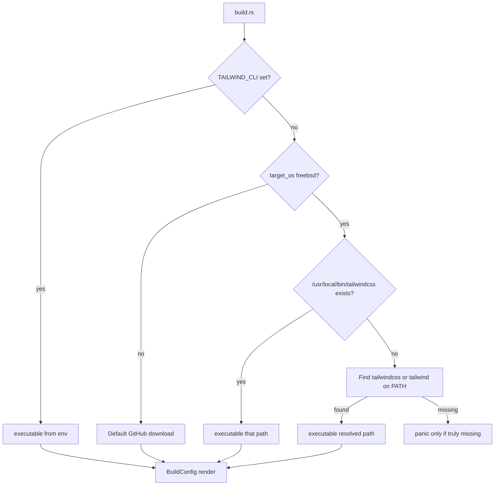

# FreeBSD Tailwind via local CLI

## Problem

[`build.rs`](build.rs) calls Topcoat’s default GitHub download of the **standalone** Tailwind CLI. That release matrix has no FreeBSD asset (`unsupported platform: freebsd-x86_64`), so staging cannot generate `$OUT_DIR/tailwind.css` correctly.

On FreeBSD staging, `pkg install tailwindcss4` already installs the CLI at **`/usr/local/bin/tailwindcss`**. Builds must pick that up automatically — no extra env, no panic when the package is present.

## Approach (chosen)

On FreeBSD (and when `TAILWIND_CLI` is set on any OS), **do not download**. Resolve a local CLI and call `.executable(...)`.

## Implementation

### 1. Rewrite [`build.rs`](build.rs)

- Keep `.input("styles.css")`.
- If `TAILWIND_CLI` is set → `.executable(path)` (any OS).
- Else if FreeBSD, resolve in order:
  1. **`/usr/local/bin/tailwindcss`** if the file exists (standard `tailwindcss4` pkg location) — silent, no questions.
  2. Else `PATH` search for `tailwindcss` then `tailwind`.
  3. Else `panic!` with a short hint: install `pkg install tailwindcss4` (provides `/usr/local/bin/tailwindcss`) or set `TAILWIND_CLI`.
- Else → current GitHub download (macOS/Linux/Windows unchanged).
- **Do not** emit a lone `cargo:rerun-if-env-changed=TAILWIND_CLI` (would replace Cargo’s default package scan).

Zero-config staging: with `tailwindcss4` already installed, `cargo build` just works.

### 2. Docs

- Brief note in [`README.md`](README.md): FreeBSD needs `pkg install tailwindcss4` (binary at `/usr/local/bin/tailwindcss`).
- One line in [`.cursor/skills/web-stack/SKILL.md`](.cursor/skills/web-stack/SKILL.md) under Tailwind/assets.

### 3. Validation

- Local macOS: fmt-check + clippy (GitHub path unchanged).
- Staging: after pull, with package present, `cargo build` has no Tailwind skip/unsupported warning.

## Out of scope

- Vendored FreeBSD binary in-repo.
- Topcoat upstream FreeBSD GitHub assets.
- Prebuilt asset deploy pipeline.
