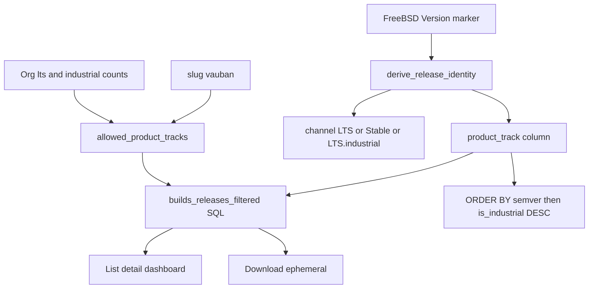

# Industrial LTS builds entitlement

## Locked product rules

| Subscriptions | Visible / downloadable tracks |
|---|---|
| LTS=0, Industrial=0 | nothing |
| LTS≥1, Industrial=0 | `Stable` + `LTS` (not industrial) |
| LTS=0, Industrial≥1 | `LTS.industrial` only |
| LTS≥1 and Industrial≥1 | all tracks; same X.Y.Z → **industrial above** LTS |
| slug `vauban` | all published (ignore counters) |

Lifecycle `EOL` stays an overlay: row `channel = "EOL"`, immutable **product track** keeps the package family (`Stable` / `LTS` / `LTS.industrial`).

Package examples: `vauban-0.9.35.pkg`, `vauban-1.0.0+LTS.pkg`, `vauban-1.0.0+LTS.industrial.pkg`.

## Architecture



Two existing layers stay; add a third:

1. Casbin `builds_read` / `builds_download`
2. Tenant GA / org-private / `vauban` (already in [`src/app/org/builds.rs`](src/app/org/builds.rs))
3. **Product-track entitlement** from `Organization.lts_subscriptions` / `industrial_lts_subscriptions`

Same pure helper on every seam (list, detail, dashboard, download, ephemeral) so URL guessing cannot bypass the matrix.

## 1. Package identity (`release_pkg`)

Extend [`src/release_pkg.rs`](src/release_pkg.rs):

- Parse markers **longest-first**: `+LTS.industrial` then `+LTS`.
- `derive_release_identity` → channel/track `LTS.industrial` | `LTS` | `Stable`.
- `version_for_display` / strip helpers strip both markers.
- `package_file_name` → `…+LTS.industrial.pkg` | `…+LTS.pkg` | `….pkg` (EOL keeps track basename via marker or `product_track`).
- `channel_track` / `apply_edit_channel`: third track; transitions only `track ↔ EOL` (no LTS ↔ industrial ↔ Stable).
- Sort helpers: strip industrial marker before semver parse; `cmp_version_desc` gains industrial-above-LTS at equal numeric/suffix keys (mirror SQL).

Mirror the marker rules in [`scripts/import_pkgs/import_pkgs_dev.py`](scripts/import_pkgs/import_pkgs_dev.py).

## 2. Persist track + sort key (Toasty)

Add on `Release` (migration + model + backfill like `0008_release_version_sort`):

- `product_track: String` — `Stable` | `LTS` | `LTS.industrial` (set at create/edit; stable under EOL)
- `is_industrial: i64` — `1` / `0` for SQL tie-break

Wire write paths: admin create ([`src/app/admin/releases/new.rs`](src/app/admin/releases/new.rs)), edit ([`release_id.rs`](src/app/admin/releases/release_id.rs)), seed / `resync_release_sort_keys` in [`src/db.rs`](src/db.rs). Seed at least one GA industrial fixture alongside existing LTS/Stable.

## 3. Entitlement helper + SQL filter

New small module or functions next to builds loaders (e.g. in `builds.rs` or `release_pkg.rs`):

```rust
fn allowed_product_tracks(org_slug: &str, lts: i32, industrial: i32) -> Option<Vec<&'static str>>
// None => vauban / unrestricted
// Some([]) => deny all
// Some(list) => product_track.in_list(list)
```

Update `builds_releases_filtered!` / `find_visible_release_by_version` / index helpers in [`src/app/org/builds.rs`](src/app/org/builds.rs) and [`release_ver.rs`](src/app/org/builds/release_ver.rs) to:

- load org counters (already on `Organization`)
- apply `product_track` filter when not `vauban`
- empty allow-list → empty page / missing release (same denial UX as today: 404 or download redirect)

`ORDER BY`: existing semver columns then `is_industrial().desc()` then client-suffix keys.

Download / ephemeral ([`download.rs`](src/app/org/builds/download.rs), [`ephemeral.rs`](src/app/org/builds/ephemeral.rs)): after tenant visibility, require `product_track` ∈ allowed (or `vauban`). Fail closed.

Dashboard ([`src/app/org.rs`](src/app/org.rs)): uses `load_releases_for_org` — inherits filter + sort automatically.

## 4. UI

- Builds chips: `All | LTS | LTS.industrial | Stable | EOL` in [`builds.rs`](src/app/org/builds.rs) (and admin `CHANNEL_CHIPS` in [`admin/releases.rs`](src/app/admin/releases.rs)).
- Badge: [`channel_badge_class`](src/ui.rs) + CSS `chan-lts-industrial` for `LTS.industrial`.
- Admin edit select: industrial track + EOL only (same pattern as LTS).
- Account / companies forms unchanged (counters already exist).

## 5. Structural lints

Extend [`scripts/check_builds_entitlement.sh`](scripts/check_builds_entitlement.sh) and [`scripts/check_admin_releases.sh`](scripts/check_admin_releases.sh):

- pins for `product_track` / `allowed_product_tracks` / industrial marker / download re-check
- chips include `LTS.industrial`
- `is_industrial().desc()` in builds order
- create still derives identity (no free-typed channel)

## 6. Test pyramid — “feu de Dieu”

Deliver **every** layer for this surface (extend existing `builds_entitlement_*` + `admin_releases_*` + focused `release_pkg` units; no parallel harness).

| Layer | Deliverables |
|---|---|
| **Unit** | Marker parse table (industrial before LTS); `package_file_name`; `version_for_display`; `apply_edit_channel` industrial↔EOL rejects cross-track; `allowed_product_tracks` matrix (4 subscription combos + `vauban`); `cmp_version_desc` industrial above same X.Y.Z LTS |
| **Invariants** | Script greps above; source pins that download/ephemeral call track check; loaders use `product_track.in_list` (not Rust-only filter after `all()`) |
| **Proptest** | Random version cores × marker ∈ {none, +LTS, +LTS.industrial} → identity/basename/display round-trip; subscription counts × track → allow/deny closed under reordering; sort comparator vs SQL field order including `is_industrial` |
| **Battle** | Parallel list+download for LTS-only org vs industrial-only org against shared GA catalog (no cross-leak); concurrent ephemeral generate under deny org stays denied |
| **E2E** | Four orgs (0/0, LTS-only, Ind-only, both) + staff `/vauban`: HTML list presence/absence of Stable / `+LTS` / `+LTS.industrial`; download 200 vs deny; both-org list order industrial row above LTS twin; dashboard latest respects entitlement; EOL industrial still industrial-only |
| **Runbook** | Expand [`docs/runbooks/builds_entitlement_smoke_test.md`](docs/runbooks/builds_entitlement_smoke_test.md) with staging matrix A–D (subscription combos), E (`vauban` all), F (sort twin versions), Pass/Fail |

Denial paths mandatory: wrong org private build, 0/0 empty, Ind-only cannot GET/POST LTS/Stable artifact, LTS-only cannot touch industrial, anonymous unchanged.

## 7. Validation gate

After implementation: `just fmt` → fmt-check → clippy `-D warnings` → both check scripts → `rtk cargo test --test integration_tests -- builds_entitlement -- admin_releases -- --test-threads=1` plus lib unit filters for `release_pkg` / track helpers.

## Out of scope

- Changing companies/account LTS steppers (already shipped)
- Seat consumption / assignment of specific LTS seats to hosts
- Billing / PSP
- Bastion package build pipeline (only portal recognition of markers)