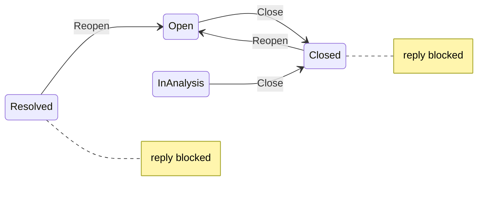

# Issue close / reopen

## Product decisions (locked)

- **Close** sets `status` to `"Closed"` (from Open or In analysis).
- **Reopen** sets `status` to `"Open"` (from Closed **or** Resolved — matches today’s closed panel).
- **Comments** stay blocked when status is `Closed` **or** `Resolved` (existing UI + reply guards); only reopen restores the reply form.
- **Who**: anyone with `issues_write` on the org surface (member/reporter or staff-in-org) and staff with `issues_write` on `/admin/issues/...`. No new Casbin permission.
- **Timeline**: insert `IssueComment` with `kind = status_change`, `author_role = system`, `author_user_id = 0`, body `"Closed"` / `"Reopened"` (same divider style as seed `"Moved to analysis"`).
- **Idempotence**: close on already-closed → 303 to detail, no duplicate row; reopen on already-open → 303, no row.



## Implementation

### 1. Shared helpers + constants

In [`src/models/mod.rs`](src/models/mod.rs) (next to existing `ISSUE_COMMENT_KIND_*`):

- `ISSUE_STATUS_OPEN`, `ISSUE_STATUS_CLOSED` (and keep matching string literals used by chips).
- Prefer a small shared helper module used by both detail pages, e.g. [`src/issues.rs`](src/issues.rs) **or** extend [`src/issues_search.rs`](src/issues_search.rs) only if it stays search-focused — better a thin `src/issue_status.rs`:

```rust
pub fn issue_is_closed(status: &str) -> bool { /* Closed | Resolved, case-insensitive */ }
```

Unit-test the helper in-file. Replace duplicated `closed = …` checks in:

- [`src/app/org/issues/issue_key.rs`](src/app/org/issues/issue_key.rs)
- [`src/app/admin/issues/issue_key.rs`](src/app/admin/issues/issue_key.rs)

### 2. Org mutations

In [`src/app/org/issues/issue_key.rs`](src/app/org/issues/issue_key.rs):

| Route | Handler |
|-------|---------|
| `POST /{org}/issues/{issue_key}/close` | `close_issue` |
| `POST /{org}/issues/{issue_key}/reopen` | `reopen_issue` |

Mirror reply gates: reserved `vauban` → redirect admin; `require_org` + `issues_write`; missing issue → `capability_denied` (anti-enum, same as reply). On success: `issue.update().status(...).updated_at(now)`, create `status_change` comment, `see_other` detail.

UI:

- Replace Close `<span>` with `<form method="POST" action=(close_action)>` + submit button (outside the reply form or as a sibling form — **not** nested).
- Replace Reopen `<span>` with POST form to `reopen_action`.
- Keep Attach screenshot stub.

Reserved aliases (303/redirect), same spirit as reply:

- `POST /vauban/issues/{issue_key}/close` → admin close target
- `POST /vauban/issues/{issue_key}/reopen` → admin reopen target

### 3. Admin mutations

In [`src/app/admin/issues/issue_key.rs`](src/app/admin/issues/issue_key.rs):

| Route | Handler |
|-------|---------|
| `POST /admin/issues/{issue_key}/close` | `admin_close_issue` |
| `POST /admin/issues/{issue_key}/reopen` | `admin_reopen_issue` |

Gates: `require_staff` + `issues_write`; resolve issue via existing `pick_issue_by_key` + `?org=` hint; preserve soft `see_other` denial style used by admin reply (not `capability_denied`). Redirect back to detail with org query when needed so key collisions stay unambiguous.

Wire Close/Reopen buttons to those forms (same Concept chrome).

### 4. Shared mutation core (avoid drift)

Extract a private async helper (same file or `issue_status.rs`) roughly:

```text
apply_issue_status(db, issue, new_status, timeline_body) -> ()
```

Org and admin handlers only do authz + load + call helper + redirect.

## Test pyramid (`portal_issues`)

Follow [`quality-assurance`](.cursor/skills/quality-assurance/SKILL.md) and the releases toggle pattern.

| Layer | Work |
|-------|------|
| **Unit** | `issue_is_closed` matrix; status constants |
| **Invariants** | Extend [`scripts/check_portal_issues.sh`](scripts/check_portal_issues.sh) + [`portal_issues_invariants_test.rs`](tests/integration_tests/portal_issues_invariants_test.rs): grep POST `/close` `/reopen` on org + admin; `ISSUE_COMMENT_KIND_STATUS`; forms not stub spans for Close/Reopen; `issue_is_closed` / constants present |
| **Proptest** | Extend [`portal_issues_proptest.rs`](tests/integration_tests/portal_issues_proptest.rs): closed catalogue; reopen target is Open |
| **Battle** | Extend [`portal_issues_battle_test.rs`](tests/integration_tests/portal_issues_battle_test.rs): parallel close/reopen + detail GET; one issue row; final status in `{Open, Closed}` |
| **E2E** | Extend [`portal_issues_e2e_test.rs`](tests/integration_tests/portal_issues_e2e_test.rs): (1) member close → status Closed + timeline Closed + POST reply does not insert; (2) reopen → reply OK; (3) staff admin close/reopen; (4) member `/admin/.../close` → 404; (5) wrong-org close → denial |
| **Smoke** | Extend [`docs/runbooks/portal_issues_smoke_test.md`](docs/runbooks/portal_issues_smoke_test.md) with Close/Reopen + blocked reply checklist |

Search-shard pyramids: **no change** unless filters break (Closed chip already exists).

## Validation (before done)

```text
bash scripts/check_portal_issues.sh
just test portal_issues
```

Then full fmt / clippy / check cycle per `dev-validation-cycle` + `quality-assurance`.

## Out of scope

- New status workflow UI for “In analysis” / “Resolved” transitions (keep seed-only / future).
- Attach screenshot, Capsicum storage, new Casbin perms.
- Changing Resolved → Closed automatically on close from Resolved (Reopen is enough).
