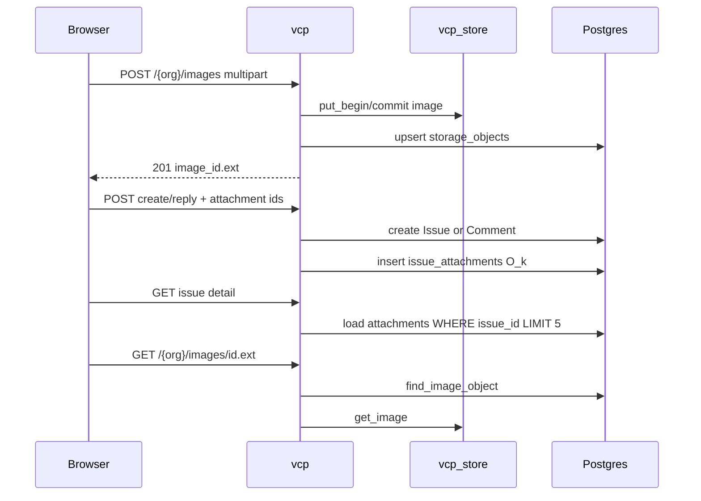

# Issue image attachments (v1)

## Decisions (fixed)

- **Link model:** Postgres `issue_attachments` (not markdown URLs in `details`).
- **Max:** 5 images per issue (`MAX_ISSUE_ATTACHMENTS = 5`).
- **Surfaces:** create (`/{org}/issues/new`), reply on open issues, gallery on org + admin detail.
- **Blob lifecycle:** deleting an issue or unlinking an attachment removes the **liaison only**; blobs stay under org quota (no helper delete in v1).
- **Serve path:** unchanged [`GET /{org}/images/{id}.{ext}`](src/app/org/images.rs) — detail pages only emit ``.

## Data flow

## Schema + model

- Migration [`toasty/migrations/0014_issue_attachments.sql`](toasty/migrations/0014_issue_attachments.sql) + history entry:
  - Columns: `id`, `issue_id`, `organization_id`, `image_id`, `ext`, `uploaded_by_user_id`, `created_at`, `sort_order`
  - `UNIQUE (issue_id, image_id)`
  - Index `(issue_id, sort_order)` for list — **O(k), k≤5**
  - Index `(organization_id, image_id)` optional for validate-by-org lookups
- Toasty model `IssueAttachment` in [`src/models/mod.rs`](src/models/mod.rs).
- Helper module e.g. [`src/issue_attachments.rs`](src/issue_attachments.rs):
  - `parse_attachment_token("uuid.ext")` / normalize
  - `list_for_issue(db, org_id, issue_id) -> Vec` with `.filter().order_by(sort_order).limit(5)` — never load all org images
  - `attach_many(db, org_id, issue_id, user_id, tokens)` — validate each token against `storage_objects` for **this** org (`find_image_object`), reject unknown/cross-tenant, cap at 5, insert — **O(k)** point lookups
  - `unlink_one(...)` — delete liaison row only (Casbin `issues_write` + org match)

## Portal wiring

| Surface | Work |
|---------|------|
| Upload JS | Small first-party asset e.g. `assets/vcp_issue_images.js` (like `vcp_webauthn.js`): bind `.vb-drop` / attach control → `FormData` POST `/{org}/images` → append hidden `attachments` / preview thumbs; enforce max 5 client-side (server re-checks). CSP: hashed/external asset, no inline script. |
| Create UI | [`src/app/org/issues/new.rs`](src/app/org/issues/new.rs) — wire dropzone + hidden fields; register asset in [`src/app.rs`](src/app.rs) catalog like other JS. |
| Create POST | [`src/app/org/issues.rs`](src/app/org/issues.rs) — after successful `create!(Issue)`, call `attach_many`; fail closed if tokens invalid (redirect with err, or create issue then attach best-effort only if we document it — **prefer fail-closed before commit** when possible: validate tokens **before** create, then create + attach in sequence; orphan issue on attach DB failure is rare — retry attach or surface err). |
| Detail org | [`src/app/org/issues/issue_key.rs`](src/app/org/issues/issue_key.rs) — load attachments; gallery under opening bubble; wire reply attach (same hidden fields + JS). |
| Detail admin | [`src/app/admin/issues/issue_key.rs`](src/app/admin/issues/issue_key.rs) — same gallery (read-only attach for staff unless they have write — use existing staff/issue perms; attach/remove only if `issues_write`). |
| Optional remove | `POST /{org}/issues/{key}/attachments/remove` with `image_id` — unlink liaison; 404 cross-org. |

## Complexity / performance gates

- No `StorageObject::all()` / no full-org image scan for an issue page.
- Attachment list: indexed `issue_id` + `limit(5)`.
- Validate attach: per-id `find_image_object` (existing path) — O(k).
- Browser loads images via parallel GETs; each GET stays digest-checked helper path (existing).

## AuthZ / security

- Reuse image route gates (`issues_read` / `issues_write` + `require_org`).
- Attach/unlink: `issues_write` + issue belongs to path org.
- Never trust client ext/id without `storage_objects` row for that `organization_id`.
- Gallery `src` only `/{org}/images/...` (first-party).

## Pyramid (mandatory)

| Layer | Deliverable |
|-------|-------------|
| Unit | `parse_attachment_token`, cap-5, reject bad ext / non-uuid |
| Invariants | `scripts/check_portal_issues.sh` (+ image asset pins); migration/history; dropzone wired; `attach_many` / `list_for_issue` use limit/filter |
| Proptest | tokens round-trip; over-cap lists truncated/rejected; random garbage rejected |
| Battle | parallel attach validate + concurrent create with attachments under `db_lock` |
| E2E | extend [`tests/integration_tests/portal_issues_e2e_test.rs`](tests/integration_tests/portal_issues_e2e_test.rs): upload image → create issue with token → detail HTML contains `/images/{id}.`; deny wrong org; over-cap rejected |
| Smoke | [`docs/runbooks/portal_issues_smoke_test.md`](docs/runbooks/portal_issues_smoke_test.md) + link from storage image smoke |

## Out of scope (v1)

- Helper/WebAuthn for images, server-side thumbnails, attachments on comments as separate entities, GC job for orphan blobs, markdown-inline images.