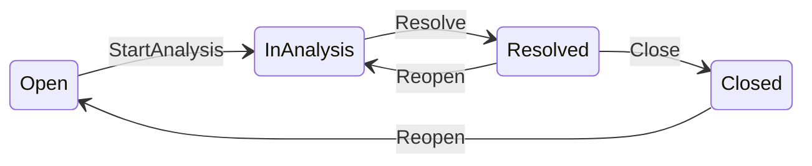

# Issue lifecycle FSM implementation

**SoT:** [docs/technical/VCP_Issue_Lifecycle_FSM_Architecture_EN(1.0).md](docs/technical/VCP_Issue_Lifecycle_FSM_Architecture_EN(1.0).md), [ADR 005](docs/adr/005-issue-fsm-authz-boundary.md), [ADR 006](docs/adr/006-issue-status-optimistic-locking.md).

**Locked product rules:** Close only from `Resolved`; Reopen `Resolved` → `In analysis`, `Closed` → `Open`; `StartAnalysis` / `Resolve` admin-only; FSM capability-blind; optimistic `version` CAS; timeline bodies frozen in arch §8.



## 1. Pure FSM module

Add [`src/issue_fsm.rs`](src/issue_fsm.rs) (wire in `lib`/`main` module tree like `issue_status`):

- `IssueState` / `IssueEvent` / `TransitionError::InvalidTransition` only (no `Forbidden`).
- `IssueState::transition(self, event)` by value; exhaustive `match` per arch §4.5.
- Wire: `Display` → canonical strings; `TryFrom<&str>` case-insensitive for the four labels.
- `next_events(state)` derived by probing every event via `transition` (array of all events; no parallel hand table).
- Timeline body helper mapping event/outcome → `"Moved to analysis"` / `"Resolved"` / `"Closed"` / `"Reopened"`.
- `#![deny(clippy::unwrap_used, clippy::expect_used, clippy::panic)]` on the module (or equivalent file-level allows denied).
- **No** Topcoat / Toasty / HTTP imports.

Unit tests in-module: every legal edge + representative illegal edges; parse round-trip.

## 2. Schema: `issues.version`

- Model: add `pub version: u64` on `Issue` in [`src/models/mod.rs`](src/models/mod.rs).
- Migration via project flow (`just db-migrate-generate` → review → migrate): e.g. `0016_issue_version.sql` — `ALTER TABLE issues ADD COLUMN version BIGINT NOT NULL DEFAULT 1` (backfill existing rows).
- Update all `toasty::create!(Issue { … })` and test `sample_issue` constructors: set `version: 1` ([`src/db.rs`](src/db.rs) seed, [`src/app/org/issues.rs`](src/app/org/issues.rs) create, admin/org test helpers).

## 3. Advance helper + CAS (ADR 006)

Evolve [`src/issue_status.rs`](src/issue_status.rs):

- Keep `issue_is_closed` (= replies blocked: `Resolved` | `Closed`).
- Replace blind `apply_issue_status` / close-reopen shortcuts with:

```text
advance_issue(db, issue, event) -> Result<IssueState, PersistError>
  Fsm | Conflict | Db
```

Algorithm: parse status → `transition` → CAS bump `version` + set `status`/`updated_at` → on success append `status_change` timeline → mutate in-memory `issue`.

**CAS implementation (concrete):** Toasty 0.9 has no filter-on-update in-tree today. Add a **narrow** `sqlx` Postgres escape hatch (rustls), single function used only by the advance helper, URL from the same TOML DB config as Toasty (`web-stack` escape-hatch rule). Document at call site. Prefer:

`UPDATE issues SET status=$1, version=version+1, updated_at=$2 WHERE id=$3 AND version=$4 RETURNING version`

Zero rows → `Conflict`.

- HTTP idempotence mapping (arch §7.3): Close while already `Closed`, Reopen while already `Open`/`InAnalysis` as appropriate → treat as no-op success at handler layer (**not** as `Ok` inside `transition`).
- Conflict UX: **bounded retry (3 attempts)** then `303` detail with `?err=conflict` + `#issue-reply` (preserve `?org=` on admin). Soft banner on org/admin detail when `err=conflict`.

Thin wrappers `close_issue_status` / `reopen_issue_status` may remain as event-specific callers of `advance_issue` for less churn, or handlers call `advance_issue` directly — prefer one public advance API.

## 4. HTTP routes + authZ

**Org** ([`src/app/org/issues/issue_key.rs`](src/app/org/issues/issue_key.rs)): keep `POST …/close` and `…/reopen`; gate `require_org` + `issues_write`; call advance with `Close` / `Reopen`. No org routes for StartAnalysis/Resolve.

**Admin** ([`src/app/admin/issues/issue_key.rs`](src/app/admin/issues/issue_key.rs)): keep close/reopen; add:

- `POST /admin/issues/{issue_key}/start-analysis`
- `POST /admin/issues/{issue_key}/resolve`

Same staff + `issues_write` + `pick_issue_by_key` pattern as close. Soft denial style unchanged.

Reserved `/vauban/issues/...` aliases: extend only if needed for close/reopen parity (not for start/resolve unless already mirroring admin).

## 5. UI: split Resolved vs Closed (required by 1A)

Today Close is shown only when `!issue_is_closed`, so Close never appears on `Resolved`. Change both detail pages:

| Status | Reply | Actions (if `issues_write`) |
|--------|-------|------------------------------|
| Open | yes | Org: none status; Admin: **Start analysis** |
| In analysis | yes | Org: none status; Admin: **Mark resolved** |
| Resolved | no | **Close issue** + **Reopen issue** |
| Closed | no | **Reopen issue** |

- Derive visible events from `next_events(state)` then filter by surface (§5.1).
- Copy: Resolved panel distinct from Closed (e.g. “This issue is resolved…”) vs existing closed copy.
- Soft flash for `?err=conflict`.

## 6. Behavioral pyramid (mandatory)

Extend existing `portal_issues_*` seams; do not invent a parallel harness.

| Layer | Work |
|-------|------|
| **Unit** | FSM edges; wire parse; timeline bodies; persist error mapping; reply-block matrix |
| **Invariants** | [`scripts/check_portal_issues.sh`](scripts/check_portal_issues.sh) + [`portal_issues_invariants_test.rs`](tests/integration_tests/portal_issues_invariants_test.rs): `issue_fsm` isolation (no toasty/topcoat in module); no role param on `transition`; `version` + CAS SQL pin; admin start-analysis/resolve routes; Close UI not shown for Open; reopen target In analysis from Resolved |
| **Proptest** | Independent reference model == `transition`; random sequences never panic; status catalog closed |
| **Battle** | Concurrent identical Close; **Close ∥ Reopen from Resolved** → exactly one CAS winner; final ∈ {`Closed`, `In analysis`}; version monotonic |
| **E2E** | Staff pipeline Open→In analysis→Resolved→Closed; client Close from Resolved; client Reopen Resolved→In analysis; Close from Open fails as no-op/invalid (no status jump); org has no start-analysis route; wrong-org / member denied admin; conflict path if exercisable |
| **Smoke** | Update [`docs/runbooks/portal_issues_smoke_test.md`](docs/runbooks/portal_issues_smoke_test.md): staff Start/Resolve; client Close only when Resolved; reopen landing In analysis |

## 7. Docs / plan hygiene

- Cursor plan under `.cursor/plans/` (this plan); tick arch §11 “Implementation plan references this document”.
- Regenerate [`.cursor/plans/INDEX.md`](.cursor/plans/INDEX.md) via `generate_index.sh` when the plan file exists.
- No new ADR unless CAS forces a material amend (unexpected).

## 8. Validation gate

Per `dev-validation-cycle.mdc` / `quality-assurance` skill:

1. `just fmt` then `fmt-check`
2. `rtk cargo clippy … --all-targets -- -D warnings`
3. `bash scripts/check_portal_issues.sh`
4. `rtk cargo test --test integration_tests -- portal_issues -- --test-threads=1` (+ lib unit filter for `issue_fsm` / `issue_status`)

## Out of scope (v1)

- Org routes for StartAnalysis/Resolve
- `proptest-state-machine` / `cargo fuzz` (stretch only)
- CAS on reply/attachment updates
- Option B/C graph edges
