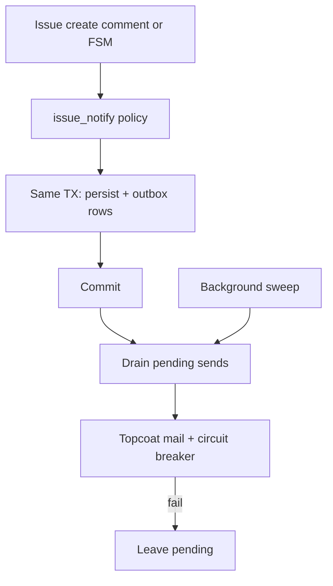

# Issue notification mail

## Locked product matrix

Exclude only the **actor of this event** (`exclude_actor`, default true). Soft-deleted users never receive mail. Destinations come from Postgres, not `vcp.conf` address lists.

- **create** — other active `portal_role=admin` only
- **comment** (company user account) — other Support only
- **support_comment** — other Support **and** other active company memberships on `issue.organization_id` (`portal_role=org`)
- **status** (FSM timeline row) — other Support only; **no** company mail

Actor for FSM is the **session user** who POSTed, not `author_user_id=0` on the `system` timeline row.

## Why an outbox (not invitation-style send)

Today invitations/revocations send after the write and **warn-and-continue** on SMTP failure ([`src/companies_accounts.rs`](src/companies_accounts.rs)). That loses mail on process crash between commit and send.

Issue mail is critical: **enqueue in the same Toasty transaction as the issue/comment/status write**, commit, then drain. SMTP/circuit failure leaves pending rows; a sweeper retries. The HTTP handler never fails because TEM is down. `enabled = false` skips enqueue.

Rejected alternative: inline `send()` after persist (simpler, same as magic links) — wrong when the requirement is robustness.



## Config — `[issues.notify]`

Nested under existing [`IssuesConfig`](src/config.rs). SMTP stays in `[mail]`; From / reply-to stay in `[magiclinks]`.

```toml
[issues.notify]
enabled = true
exclude_actor = true
support_events = ["create", "comment", "status"]
company_events = ["support_comment"]
max_attempts = 5
drain_interval_secs = 30
```

- Unknown event tokens or empty `drain_interval_secs` / `max_attempts == 0` **fail closed at config validate** (same style as `validate_magiclinks`).
- Defaults in Rust = locked matrix. Copy the block into [`config/vcp.conf`](config/vcp.conf), [`config/default.toml`](config/default.toml), [`config/development.toml`](config/development.toml), [`config/testing.toml`](config/testing.toml).
- Reload = process restart (no hot-reload).

## Implementation seams

**Pure policy** (no Topcoat / SMTP): new [`src/issue_notify.rs`](src/issue_notify.rs)

- `NotifyEvent` catalogue: `create` / `comment` / `support_comment` / `status`
- `notify_audiences(event, cfg) -> { support: bool, company: bool }`
- `filter_recipients(candidates, actor_id, exclude_actor) -> Vec<UserId>` — never include actor when flag is true; never include `deleted_at != USER_NOT_DELETED`

**SQL loaders** (Toasty filters, no `User::all()` + Rust scan):

- Support: `User` `portal_role.eq(admin)` AND `deleted_at.eq(USER_NOT_DELETED)` AND `id.ne(actor)` when excluding
- Company: `Membership` by `organization_id`, then `User` `id.in_list(...)` AND `portal_role.eq(org)` AND active

**Outbox** — migration `0018_issue_mail_outbox.sql` + model

- Columns: `issue_id`, `event`, `source_id` (comment id, or `0` for create), `actor_user_id`, `recipient_user_id`, `created_at`, `sent_at` (0 = pending), `attempts`, unique `(issue_id, event, source_id, recipient_user_id)` so OCC / double-submit cannot double-mail
- Enqueue after recipient resolution **inside** the write TX
- Hooks:
  - create: [`src/app/org/issues.rs`](src/app/org/issues.rs) after successful `Issue` create (wrap create + outbox in a TX)
  - company comment: [`src/app/org/issues/issue_key.rs`](src/app/org/issues/issue_key.rs)
  - Support comment: [`src/app/admin/issues/issue_key.rs`](src/app/admin/issues/issue_key.rs)
  - FSM: [`src/issue_status.rs`](src/issue_status.rs) `advance_issue` — pass `actor_user_id`; enqueue only on `AdvanceOutcome::Applied` (not `Noop`); same existing TX
- Seed / `ensure_demo_*` in [`src/db.rs`](src/db.rs) must **not** enqueue

**Drain** — [`src/mailer.rs`](src/mailer.rs) + sweeper (mirror [`src/magic_link.rs`](src/magic_link.rs) purge loop)

- After commit, fire-and-forget drain of this issue’s pending rows (or all pending, bounded)
- Background `drain_interval_secs` sweep for leftovers / circuit-open
- Send via existing `send_branded_mail` + `MailCircuitBreaker`; on failure increment `attempts`, keep `sent_at=0`; stop at `max_attempts` and `tracing::error` (`vcp::issue_notify`)
- Circuit open: do not increment as success; leave pending

**Mail content** (U.S. English, branded like `email/user-join.html`)

- New `email/issue-event.html` + `ISSUE_EVENT_HTML` in [`src/mail_templates.rs`](src/mail_templates.rs)
- Subject e.g. `[VAU-12] Support replied` / `[VAU-12] Status: In analysis`
- Body: org name, issue key+title, event label, **escaped excerpt** (cap ~500 chars — no unbounded comment in SMTP), absolute URL from `primary_public_origin()`
  - Support: `/admin/issues/{key}?org={slug}`
  - Company: `/{slug}/issues/{key}`
- Do not log raw comment bodies; recipient email logging matches invitation (`to` already used)

Handlers stay thin: after persist they call `enqueue_issue_notify(...)`; they do not build recipient lists inline.

## Pyramid (mandatory — all six layers)

**Unit** (`src/issue_notify.rs`, config parse, excerpt/escape)

- Matrix: each event × `{enabled, exclude_actor}` × audience flags
- Actor excluded; soft-deleted excluded; admin membership on the org does not count as a company account
- Unknown config tokens rejected; default TOML parse equals locked matrix
- `Noop` FSM produces no outbox rows
- Excerpt cap + HTML escape

**Invariants**

- New `scripts/check_issue_notify.sh` (+ call from `scripts/check_portal_issues.sh` or standalone): pins `[issues.notify]` in `vcp.conf` / overlays; hooks call `enqueue_issue_notify`; FSM enqueue only on `Applied`; no `User::all().exec()` without filter; `portal_role` not string-compared in handlers; seed path has no enqueue
- `include_str` pins in `tests/integration_tests/issue_notify_invariants_test.rs`

**Proptest**

- Random `support_events` / `company_events` subsets: audiences match membership; actor never in output when `exclude_actor`
- Random comment bodies: excerpt length bound + escape
- Random actor/recipient id spaces: unique outbox key stable

**Battle**

- Parallel Support + company comments + FSM on one issue (`Barrier`): outbox unique key holds; MemoryTransport message count = distinct recipients (no doubles)
- Parallel drain vs sweep: `sent_at` set once per row
- Circuit open under flood: issues still persist; outbox stays pending

**E2E** (`tests/integration_tests/issue_notify_e2e_test.rs`, `test_router_with_memory_mail`)

- Company user creates issue → N-1 Support inboxes; creator has 0
- Company user comments → Support only (not sibling company accounts)
- Support comments → other Support + all other company accounts; commenter has 0
- Support (or company user) FSM only → Support only; company inboxes empty
- Soft-deleted company account: 0 mail
- `enabled=false`: 0 mail, issue/comment still stored
- Cross-org: company B never receives company A mail
- Member 404 / missing `issues_write`: 0 mail

**Smoke runbook** — [`docs/runbooks/issue_notify_smoke_test.md`](docs/runbooks/issue_notify_smoke_test.md)

- Audience: ops / Support. Severity: **BLOCKING**
- Mailpit (dev) or TEM (staging): create, company comment, Support comment, FSM; confirm To/From/subject/link; confirm actor has no self-mail; `enabled=false` then restart; pending drain after toggling TEM back
- Link from [`docs/runbooks/portal_issues_smoke_test.md`](docs/runbooks/portal_issues_smoke_test.md)

## Validation gate

`just fmt` → `rtk cargo fmt --all -- --check` → clippy `-D warnings` → `bash scripts/check_issue_notify.sh` → `just test -- --test integration_tests -- issue_notify` plus lib filter `issue_notify`.

## Out of scope

- Per-user notification preferences / mute
- Extra CC mailbox (can reuse `magiclinks.vcp_admin` later)
- Mail on attachment-only edits (attachments ride create/comment)
- Hot-reload of `vcp.conf`
