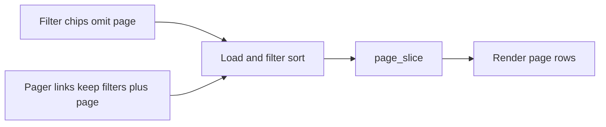

# List pagination standard (skills + retrofit)

## Locked decisions

- **Page size:** shared `LIST_PAGE_SIZE = 10` (same as Builds).
- **Idiom:** SSR only — `page: Option<u32>` on list query params; navigation via `<a href>`; no shards/signals/JS **for paging controls**. Live-search shards may still update results; when the search signal changes, **reset to page 1** for the shard slice.
- **Chips present:** pager on the **same** `vb-chip-row` as chips (group left, pager right via `margin-left: auto`), chip-height face (`padding: 6px 12px`). Filter chip hrefs **omit** `page` (reset). Pager keeps other query (`q`, `cat`, `status`, `org`, …); omit `page=1`.
- **No chips** (admin Docs / Rel.): pager in a `vb-list-toolbar` row above the table, right-aligned (same visual language).
- **In-memory slice** after existing filter/sort (no DB `LIMIT/OFFSET` yet).
- **Surface names:** extend existing pyramids (`docs_search_shard`, `org_issues_search_shard` / `portal_issues`, `admin_issues_search_shard`, `admin_docs`, `admin_releases`); Builds migrates onto shared helpers without renaming `builds_entitlement`.

## 1. Skills / agent guidance

Update so the next list page ships pagination by default:

| Skill / doc | Change |
|-------------|--------|
| [`.cursor/skills/web-stack/SKILL.md`](.cursor/skills/web-stack/SKILL.md) | New section **List pagination (mandatory)** — `LIST_PAGE_SIZE`, `?page=`, chip-row vs toolbar placement, filter resets page, shared helpers/components, pyramid required. |
| [`.cursor/skills/topcoat/SKILL.md`](.cursor/skills/topcoat/SKILL.md) | Short **VCP** note: list paging is SSR GET links; shards receive `page` as arg; do not invent client pagers. |
| [`.cursor/skills/designing-beautiful-websites/references/PAGE-PATTERNS.md`](.cursor/skills/designing-beautiful-websites/references/PAGE-PATTERNS.md) | Pattern “Filterable list”: search → chip row + pager → results. |
| [`.cursor/skills/quality-assurance/SKILL.md`](.cursor/skills/quality-assurance/SKILL.md) | Under pyramid / DoD: new or changed **list pages** must pin pagination (helpers, markup, chip reset, e2e ≥11 items). |
| [`.cursor/skills/make-interfaces-feel-better/surfaces.md`](.cursor/skills/make-interfaces-feel-better/surfaces.md) | Pager shares chip face/height; with chips, same row right-aligned. |

Optional thin rule [`.cursor/rules/list-pagination.mdc`](.cursor/rules/list-pagination.mdc) (`alwaysApply: false`, agent-requestable) pointing at `web-stack` — only if it stays short.

## 2. Shared implementation

Extract from [`src/app/org/builds.rs`](src/app/org/builds.rs) into something like [`src/list_page.rs`](src/list_page.rs) (public crate module):

- `LIST_PAGE_SIZE`, `parse_page`, `page_count`, `clamp_page`, `page_slice`
- Generic query-string helper for `page` (omit when 1)

UI components in [`src/app/_components/`](src/app/_components/):

- Extend [`chips.rs`](src/app/_components/chips.rs): `vb-chip-group` + optional trailing pager (or sibling `filter_row(chips, pager)`), matching Builds markup.
- New `pager` component: Prev / numbers / Next as `<a>` / disabled `<a aria-disabled>` — reuse `.vb-pager` / `.vb-pager-link` from [`styles.css`](styles.css).
- New thin `list_toolbar` for no-chip admin tables (right-aligned pager).

Re-export helpers from `vcp::app` / keep Builds API so existing `builds_entitlement` unit/proptest keep compiling (`BUILDS_PAGE_SIZE` can alias `LIST_PAGE_SIZE`).



## 3. Retrofit surfaces

| Surface | Files | Notes |
|---------|-------|-------|
| **Builds** (migrate) | [`builds.rs`](src/app/org/builds.rs) | Use shared helpers + `filter_row`/`pager`; keep behavior. |
| **Client Docs** | [`org/docs.rs`](src/app/org/docs.rs), [`search_shard.rs`](src/app/org/docs/search_shard.rs) | `page` on `DocsQuery` + shard args; chip hrefs omit page; pager on chip row; `@input` resets page signal to 1. |
| **Client Issues** | [`org/issues.rs`](src/app/org/issues.rs), [`search_shard.rs`](src/app/org/issues/search_shard.rs) | Same as Docs with `status` / `q`. |
| **Admin Issues** | [`admin/issues.rs`](src/app/admin/issues.rs), shard | Chips + `q`/`org`/`status` + `page`. |
| **Admin Docs** | [`admin/docs.rs`](src/app/admin/docs.rs) | No chips → `list_toolbar` above table. |
| **Admin Rel.** | [`admin/releases.rs`](src/app/admin/releases.rs) | Same as admin Docs. |

Preserve existing empty states (“No matching…”, “No published…”).

## 4. Pyramid (per surface)

For each surface above, extend the **existing** check script + invariants / proptest / battle / e2e / runbook:

| Layer | Deliverable |
|-------|-------------|
| **Unit** | Shared `list_page` tests (empty, 10, 11→2, clamp); surface-specific href builders if non-trivial. |
| **Invariants** | `page` on query; `LIST_PAGE_SIZE`/`page_size`=10; pager in chip-row **or** toolbar; chip hrefs without sticky `page=`; no client JS pager. |
| **Proptest** | Totals `0..=40` slice/clamp (can live once on `list_page` + thin surface pins). |
| **Battle** | Parallel GET `?page=1` / `?page=2` with ≥11 fixtures → OK + distinct markers. |
| **E2E** | Seed 11+ rows; page 1 has ≤10; page 2 remainder; chip/filter resets page; (shards) live query shows page-1 slice. |
| **Smoke** | Short “Pagination” subsection on each surface runbook. |

Primary filters to run at the end: `list_page` / `builds_entitlement_` / `docs_search_shard` / `org_issues_search_shard` / `portal_issues` / `admin_issues_search_shard` / `admin_docs` / `admin_releases` (plus their `check_*.sh`).

## 5. Validation

```bash
just fmt
just clippy
bash scripts/check_builds_entitlement.sh
bash scripts/check_docs_search_shard.sh
bash scripts/check_org_issues_search_shard.sh
bash scripts/check_portal_issues.sh
bash scripts/check_admin_issues_search_shard.sh
bash scripts/check_admin_docs.sh
bash scripts/check_admin_releases.sh
just test builds_entitlement_
just test docs_search_shard
just test org_issues_search_shard
just test portal_issues
just test admin_issues_search_shard
just test admin_docs
just test admin_releases
```

## Out of scope

- DB-level `LIMIT/OFFSET`
- Paginating non-list UIs (detail, new, dashboards)
- Changing search ranking / sort order beyond slicing the current sorted list
