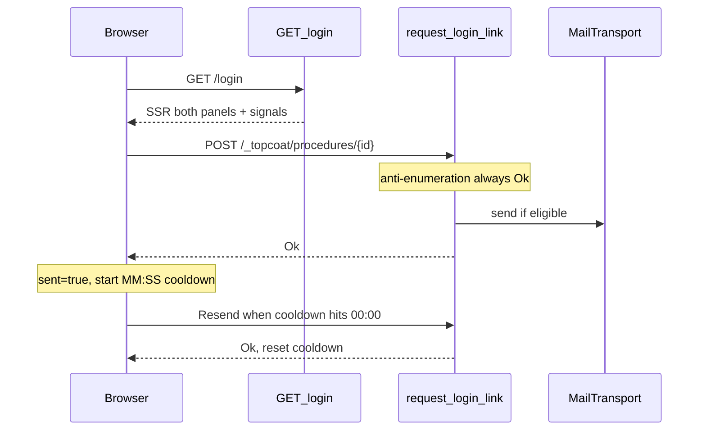

# Login magic-link: signals + procedure (choix A)

## Decisions (locked)

- **No progressive-enhancement POST**: runtime Topcoat requis; remove `POST /login` and `GET /login/check-email`.
- **UI copy (US English)**: “Check your email”; “If that address can access the portal, we sent a sign-in link to {email}.”; while cooling down show `Resend in MM:SS` (button disabled); at `00:00` enable **Resend** (no auto-send); **Use a different email** resets client state.
- **Cooldown** = `cfg.magiclinks.token_ttl_secs` (default 300 → `05:00`), display **MM:SS** with zero-padding on both parts.
- Reuse existing tick CSS [`.vb-eph-tick`](styles.css) (same pattern as [`builds.rs`](src/app/org/builds.rs) ephemeral countdown).

## Flow



## Implementation

### 1. [`src/app/login.rs`](src/app/login.rs)

- Extract shared issue/send logic into `#[procedure] async fn request_login_link(cx: &Cx, email: String) -> Result<()>` (same steps as today’s `POST /login`: normalize, `Mailbox`, rate limit, JIT admin / active user, `issue_token`, `send_login_magic_link`, always `Ok(())`).
- Rewrite `login_page` with `view! { cx => … }`:
  - Signals: `sent`, `email`, `remaining`, `mins`, `secs`, `cooling` (bool), plus seed signals for TTL reset (`ttl_remaining`, `ttl_mins`, `ttl_secs`) baked from `cfg.magiclinks.token_ttl_secs` at SSR.
  - Form panel `:style` hidden when `sent`; confirmation panel hidden when `!sent`.
  - `@submit` async: `prevent_default`, `request_login_link(email.get()).await`, then `sent.set(true)` + reset countdown from TTL seeds + `cooling.set(true)`.
  - Confirmation: recall `$(email.get())`; countdown `MM:SS` (pad mins/secs when `< 10`); tick via `@animationiteration` on `.vb-eph-tick` while `cooling`; at `remaining <= 0` set `cooling.set(false)`.
  - Resend button: enabled only when `sent && !cooling`; calls same procedure then restarts cooldown.
  - “Use a different email”: `sent.set(false)`, clear cooling (no HTTP).
- Delete `login_check_email_page` and `#[route(POST "/login")]`.
- Keep `GET /login/magic` + logout unchanged.
- Small pure helper for SSR seed math (unit/proptest), e.g. `fn cooldown_mm_ss(total_secs: u64) -> (u64, u64)` and/or pad helpers — no client JS.

### 2. Test harness helpers — [`tests/integration_tests/common/mod.rs`](tests/integration_tests/common/mod.rs)

- `procedure_path_from_html(html)` — mirror `shard_path_from_html`, look for `/_topcoat/procedures/`.
- `request_login_link_json(email) -> String` body `["normalized-or-raw"]` matching Topcoat wire (`JSON` array of dehydrated args; String is a JSON string).
- Optional thin helper: GET `/login` → extract path → `post_json` procedure.

Procedure IDs are compile-time UUIDs ([topcoat procedure macro](https://docs.rs/topcoat)); tests **must** scrape SSR HTML, never hardcode the path.

### 3. Pyramid updates

| Layer | What |
|-------|------|
| **Unit** | `cooldown_mm_ss` / pad: 300→(5,0), 61→(1,1), 9→(0,9), 0→(0,0); existing magic_link/mailer units untouched |
| **Invariants** | [`magic_link_invariants_test.rs`](tests/integration_tests/magic_link_invariants_test.rs): pin `#[procedure]`, `signal sent`, `request_login_link`, `.vb-eph-tick`, **no** `/login/check-email`, **no** `see_other("/login/check-email")`, no `password` field |
| **Proptest** | Random `total_secs` in `0..=10_000`: `mins == total/60`, `secs == total%60`, `secs < 60` |
| **Battle** | Update [`auth_tenant_battle_test.rs`](tests/integration_tests/auth_tenant_battle_test.rs) flood off `POST /login` → concurrent `post_json` to procedure (still 200/OK, no oracle). Keep [`magic_link_battle_test.rs`](tests/integration_tests/magic_link_battle_test.rs) consume race as-is. Add focused battle: N parallel `request_login_link` for same known email — at most sensible mail count / no panic |
| **E2E** | Rewrite [`magic_link_e2e_test.rs`](tests/integration_tests/magic_link_e2e_test.rs) + login bits in [`auth_tenant_e2e_test.rs`](tests/integration_tests/auth_tenant_e2e_test.rs): GET `/login` has both panels + signals/handlers; procedure known email → mail; unknown → no mail + same OK; rate-limit still OK; JIT admin via procedure + consume; SSR pins `05:00` / hydrate seeds for ttl=300; `assert_topcoat_click_handlers_are_functions` (and submit handlers if present) on login fragment |
| **Smoke** | [`docs/runbooks/magic_links_smoke_test.md`](docs/runbooks/magic_links_smoke_test.md): no redirect; in-page check-email; Resend disabled with MM:SS then enabled at 00:00; Mailpit `+ui` note optional |

Also grep-fix any remaining `/login/check-email` asserts (auth_tenant e2e/battle already found).

### 4. Docs / plan note

- Touch [`.cursor/plans/magic_links_mail_b6cb5f62.plan.md`](.cursor/plans/magic_links_mail_b6cb5f62.plan.md) only if needed for accuracy (check-email → signals).
- README login blurb if it mentions check-email redirect.

## Validation (blocking)

After implementation: `just fmt` / `fmt-check`, clippy `-D warnings`, then:

```bash
rtk cargo test --test integration_tests -- magic_link auth_tenant -- --test-threads=1
```

Widen if blast radius unclear; prefer `just validate` before hand-off.

## Out of scope

- Separate shorter resend-cooldown config key.
- Progressive enhancement POST fallback (choix B).
- Changing `token_ttl_secs` default (stays 300).
