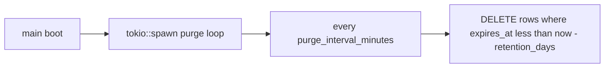

# Magic-link token purge job

## Behavior

- Cutoff: `expires_at < now_unix - token_retention_days * 86400` (covers consumed and unused-expired alike).
- Loop: run once at spawn, then `tokio::time::interval` every `purge_interval_minutes` (converted to secs).
- Log `info!(deleted = n, retention_days, …)` without hashes.
- Keep existing invalidate/consume `UPDATE consumed_at` (single-active / one-shot); purge owns retention.

## Config (human units)

Extend [`MagicLinksConfig`](src/config.rs):

| Field | Defaults | Notes |
|-------|----------|-------|
| `token_retention_days` | `default.toml` / `vcp.conf` = **1**; `development.toml` = **7**; `testing.toml` = **0** | `0` = delete as soon as `expires_at < now` |
| `purge_interval_minutes` | **60** everywhere | validate `>= 1` |

Helpers on the struct (or free fns next to purge): `retention_secs()`, `purge_interval_duration()`.

Update TOML: [`config/default.toml`](config/default.toml), [`config/development.toml`](config/development.toml), [`config/testing.toml`](config/testing.toml), [`config/vcp.conf`](config/vcp.conf), mention in [`config/local.toml.example`](config/local.toml.example) if useful. Extend [`validate_magiclinks`](src/config.rs) for `purge_interval_minutes >= 1`.

## Implementation

1. **`purge_expired_tokens(db, now, retention_days) -> Result<u64>`** in [`src/magic_link.rs`](src/magic_link.rs)  
   - `cutoff = now.saturating_sub(retention_days * 86400)`  
   - SQL-side filter: `MagicLinkToken::fields().expires_at().lt(cutoff)` (Toasty `.lt` — see toasty skill)  
   - Delete matching rows (load + `.delete()` per row; volume is auth-scale)  
   - Return deleted count  

2. **`start_magic_link_purge(db: Db, magic: MagicLinksConfig)`** in same module (or tiny `src/magic_link/purge.rs` if file grows)  
   - Mirror ACME pattern in [`src/acme/scheduler.rs`](src/acme/scheduler.rs): `tokio::spawn` + interval  
   - Errors logged, loop continues  

3. **Wire in [`src/main.rs`](src/main.rs)** after `db::connect` (alongside ACME spawn): pass `database.clone()` + `cfg.magiclinks.clone()`.

4. **Migration `0012_magic_link_tokens_expires_at_index.sql`** + snapshot/history:  
   `CREATE INDEX … ON magic_link_tokens (expires_at)` for the purge predicate.

5. **Docs**: [`docs/runbooks/magic_links_smoke_test.md`](docs/runbooks/magic_links_smoke_test.md) — note retention + hourly purge; optional manual `SELECT count(*)` before/after. Extend [`scripts/check_auth_tenant.sh`](scripts/check_auth_tenant.sh) / magic invariants for the new keys + `start_magic_link_purge` pin in `main.rs`.

## Pyramid (mandatory)

| Layer | Deliverable |
|-------|-------------|
| **Unit** | Cutoff math: retention 0/1/7; `purge_interval` minutes → `Duration`; validate rejects `purge_interval_minutes = 0` |
| **Invariants** | TOML pins (`token_retention_days` / `purge_interval_minutes` per env); `purge_expired_tokens` + `start_magic_link_purge` exist; `main.rs` calls spawn; no `token_retention_secs` / `purge_interval_secs` |
| **Proptest** | `retention_secs = days * 86400` for days in 0..=365; interval minutes 1..=10_000 → secs |
| **Battle** | Barrier: parallel `purge_expired_tokens` + `issue_token` / `consume_token` — no panic; active (non-expired) token still consumable |
| **E2E** | Insert old row (`expires_at` well before cutoff) + fresh active row; call `purge_expired_tokens`; assert old gone, fresh kept; still can `issue`/`consume` after purge |
| **Runbook** | One smoke note: table should not grow without bound; purge interval 60 min |

Also extend config unit tests that load each environment layer and assert the new defaults.

## Validation

`just fmt` → clippy `-D warnings` → `scripts/check_auth_tenant.sh` → `just test --test integration_tests magic_link` (and focused config tests).
