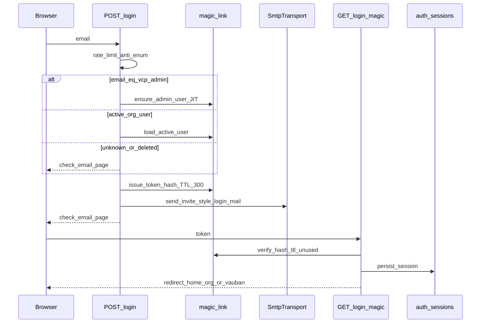
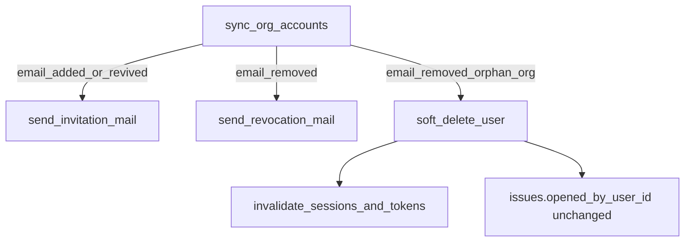

# Magic links + mail + soft-delete accounts

## Locked product decisions

- Passwordless only: drop `users.password_hash`; `/login` is email-only.
- `[magiclinks] token_ttl_secs = 300`; one-shot token; DB stores **hash only**.
- `vcp_admin`: JIT create `display_name = "Vauban Support"`, `portal_role = admin` → consume → `/vauban`.
- Org users: magic link only if active `User` exists (provisioned via companies); unknown email → same “check your email” UX (anti-enumeration).
- Company account **create/revive** → invitation mail (magic link); **remove membership** → org-scoped revocation mail (no link) even if the user remains in other orgs; **orphan** (no remaining memberships) → soft-delete + session/token invalidation.
- Soft-delete via `users.deleted_at`; **revive** same email clears `deleted_at`, restores membership, re-invites; preserve `issues.opened_by_user_id`.
- All runtime envs use SMTP (Mailpit locally / Scaleway TEM in prod). No `FileTransport`.

## Architecture





## Config (extend existing TOML)

Already present: `[mail]` / `[magiclinks]` in [`config/vcp.conf`](config/vcp.conf), [`default.toml`](config/default.toml), [`development.toml`](config/development.toml), [`testing.toml`](config/testing.toml).

Add to every `[magiclinks]` block:

```toml
token_ttl_secs = 300
```

Wire in [`src/config.rs`](src/config.rs):

- `MailConfig { smtp_host, smtp_port, smtp_encryption, smtp_username, smtp_password }`
- `MagicLinksConfig { from_address, from_name, reply_to, vcp_admin, token_ttl_secs }`
- Enum `SmtpEncryption { Plaintext, Starttls, Tls }`
- `validate()`: production rejects `plaintext`; require non-empty `from_address` / `vcp_admin` (Mailbox-parseable); `token_ttl_secs > 0` (default 300)

## Dependencies / mail transport

- [`Cargo.toml`](Cargo.toml): Topcoat features `mail` + **`mail-smtp`**.
- New [`src/mailer.rs`](src/mailer.rs): `build_smtp_transport(&MailConfig) -> SmtpTransport` mapping encryption → Topcoat `unencrypted` / `starttls` / `relay`.
- [`src/app.rs`](src/app.rs): replace hardcoded `FileTransport` with SMTP from config.
- Mail helpers (Topcoat `Mail::builder` + `send`): login link, company invitation, revocation — from/reply_to from `[magiclinks]`; absolute URL via `Config::primary_public_origin()` + `/login/magic?token=…`.

**Test mail capture (concrete):** production/dev/testing **config** stays SMTP/Mailpit. Integration harness adds `test_router_with_memory_mail()` that builds the same router but registers Topcoat `MemoryTransport` so invite/login/revoke E2E can assert subjects/recipients **without** Mailpit. Unit tests still cover `build_smtp_transport` against Mailpit- and TEM-shaped configs (no network). Smoke runbook covers real Mailpit/TEM.

## Schema (Toasty)

Edit [`src/models/mod.rs`](src/models/mod.rs) then `just db-migrate-generate`:

1. **`User`**: remove `password_hash`; add `deleted_at: i64` (`0` = active — avoid Option friction with Toasty if needed; document convention `0` means active). Prefer `i64` Unix secs; active filter `deleted_at.eq(0)`.
2. **`MagicLinkToken`** (new table): `token_hash` (unique key), `user_id`, `expires_at`, `consumed_at` (`0` = unused), `created_at`.
3. Drop bootstrap password paths in [`src/db.rs`](src/db.rs) / [`src/companies_accounts.rs`](src/companies_accounts.rs).

Seed change (`seed_if_empty`):

- Stop creating admin with password; **do not** pre-create `support@vauban.sh` (JIT on first magic login from `vcp_admin`).
- Demo org user(s) remain for catalog seed **without** password; they log in via magic link in smoke/dev (or tests issue tokens directly).

## Core modules

| Module | Responsibility |
|--------|----------------|
| [`src/magic_link.rs`](src/magic_link.rs) | Generate secure token; SHA-256 hex hash; persist; consume (atomic mark used); purge/invalidate by user; TTL from config |
| [`src/mailer.rs`](src/mailer.rs) | SMTP build + send templates (login / invite / revoke) |
| [`src/app/login.rs`](src/app/login.rs) | Email-only form; POST request-link; GET `/login/magic`; check-email page; remove seed copy |
| [`src/companies_accounts.rs`](src/companies_accounts.rs) | Soft-delete + revoke mail; create/revive + invite mail; no password |
| [`src/login_limit.rs`](src/login_limit.rs) | Keep rate limiter for request-link; remove `verify_login_password` / Argon2 dummy path once unused |
| [`src/db.rs`](src/db.rs) | Drop `hash_password` usage for users (keep only if still needed elsewhere — otherwise remove) |

### Login POST (anti-enumeration)

1. Normalize email (trim + lowercase); `Mailbox` validate — invalid → same check-email redirect (no oracle).
2. `LoginRateLimiter::allow`; on deny still show check-email (no lockout oracle).
3. If email == `cfg.magiclinks.vcp_admin`: ensure active admin user (create or revive if soft-deleted admin edge; set display/role).
4. Else load user by email where `deleted_at == 0`; if missing → no token/mail.
5. If eligible: issue token; send login mail; `clear` limiter on successful **issue** (not on consume).
6. Always redirect to check-email page.

### Consume GET `/login/magic`

- Lookup by hash; reject if missing / expired / consumed / user soft-deleted.
- Mark consumed; `session::start` + `persist_session`; redirect `home_org_slug` (`/vauban` for admin).

### Companies sync

Replace hard delete in [`sync_org_accounts`](src/companies_accounts.rs) / [`delete_org_with_accounts`](src/companies_accounts.rs):

- Remove from form: delete membership; if orphan org user → set `deleted_at = now`, invalidate sessions + tokens, send **revocation** mail (best-effort log on mail failure; DB state still committed).
- Add email: if soft-deleted user exists → revive (`deleted_at = 0`) + membership + **invitation** mail; if new → create + membership + invitation; if active elsewhere — keep existing membership rules (same as today for multi-org: rare; preserve current single-org client model).
- Never soft-delete `portal_role = admin` via company sync.
- `delete_org_with_accounts`: soft-delete orphan org users + revocation mails, then delete org.

### Auth guards

- `load_user_for_token_hex` / `current_user`: treat soft-deleted as no session (and delete stale session row).
- Issue display via `users_by_ids` unchanged — soft-deleted openers still resolve `display_name`.

## Login UI

[`src/app/login.rs`](src/app/login.rs): remove password field and seed paragraph; button e.g. “Email me a sign-in link”; add quiet check-email page (same layout).

## Test pyramid (mandatory — auth/tenant/mail)

### Shared test infrastructure

- [`tests/integration_tests/common/mod.rs`](tests/integration_tests/common/mod.rs):
  - `create_test_user` / `create_org_with_membership`: **no password** arg (or ignore deprecated).
  - `login_cookie(router, email)`: issue token via shared `magic_link::issue…` **or** POST `/login` + MemoryTransport extract + GET consume — must exercise consume path.
  - `test_router_with_memory_mail()` for mail assertion tests.
  - Migrate **all ~30** e2e/battle files off `password=password`.

### Layer matrix

| Surface | Unit | Invariants | Proptest | Battle | E2E | Smoke runbook |
|---------|------|------------|----------|--------|-----|----------------|
| Config mail/magiclinks | encryption parse; prod plaintext reject; ttl default 300 | TOML keys present in all env files | random encryption/ttl corpora reject invalid | — | load development/testing/production configs | — |
| SMTP builder | starttls/tls/plaintext builder selection | `mail-smtp` feature pin / no FileTransport in app.rs | — | — | — | Mailpit send in runbook |
| Magic token | issue/consume/expire/reuse/deleted user | model has no `password_hash`; has `deleted_at` + tokens table | random token uniqueness / ttl bounds | parallel consume same token → one winner | full POST→mail→GET session | TTL 300 ops check |
| Login UI/API | — | login.rs has no password field / no seed string | — | flood POST `/login` rate limit | unknown email same UX; admin JIT → `/vauban`; org → `/{org}`; soft-deleted no session | staging Mailpit |
| Companies invite/revoke | revive clears deleted_at; soft-delete sets it | sync never hard-deletes User; revoke mail not inside soft_delete | — | concurrent sync same org | create→invite; remove→revocation; multi-org remove→mail without soft-delete; opener preserved | admin companies / magic links smoke |
| Session + soft-delete | current_user ignores deleted | — | — | revoke under concurrent requests | deleted user cookie dies | — |

Artifacts (extend existing where possible):

- New: `tests/integration_tests/magic_link_e2e_test.rs`, `magic_link_battle_test.rs`, unit/proptest in `src/magic_link.rs` / `src/mailer.rs` / `src/config.rs`.
- New: `tests/integration_tests/companies_magic_mail_e2e_test.rs` (invite + revoke + revive + issue opener).
- Invariants: extend [`tests/integration_tests/admin_companies_invariants_test.rs`](tests/integration_tests/admin_companies_invariants_test.rs) + new `magic_link_invariants_test.rs` (pins: no `password_hash`, no FileTransport, login email-only, `token_ttl_secs`).
- Runbook: [`docs/runbooks/magic_links_smoke_test.md`](docs/runbooks/magic_links_smoke_test.md) (Mailpit + admin JIT + org invite/revoke); link from [`docs/runbooks/admin_companies_smoke_test.md`](docs/runbooks/admin_companies_smoke_test.md) and README login section.
- Update README seed/login docs (remove password table rows that claim password login).

### Denial paths (must pass)

- Expired token; reused token; forged token; soft-deleted user token; rate-limited email; unknown email (no user row, no mail); org user cannot hit admin JIT; company sync cannot delete admin; plaintext SMTP rejected when `environment = production`.

## Docs / audit

- README: passwordless + Mailpit; remove bootstrap password narrative.
- Close audit item #9 / §3.8 in [`.cursor/audits/vcp_architecture_toasty_query_debt_2026-08-02.md`](.cursor/audits/vcp_architecture_toasty_query_debt_2026-08-02.md) when done.
- Structural lint optional: `scripts/check_no_password_login.sh` grepping `password_hash` / FileTransport — only if cheap and stable.

## Implementation order

1. Config structs + `token_ttl_secs = 300` in TOMLs + validation tests.
2. `mail-smtp` + `mailer.rs` + wire `app.rs` (SMTP); MemoryTransport test helper.
3. Migration: `deleted_at`, drop `password_hash`, `magic_link_tokens`.
4. `magic_link.rs` issue/consume + unit/proptest/battle.
5. Login email-only + consume route + check-email; migrate `login_cookie` + all e2e/battle.
6. JIT `vcp_admin` + seed cleanup.
7. Companies sync soft-delete/revive + invite/revoke mails + issue opener E2E.
8. Runbooks + README + audit close; `just validate`.

## Out of scope

- Shared Redis/login store (#8).
- Multi-admin catalogue beyond single `vcp_admin`.
- Changing issue tracker UX labels for soft-deleted openers (keep `display_name`).
- Bastion / WebSocket patterns.
