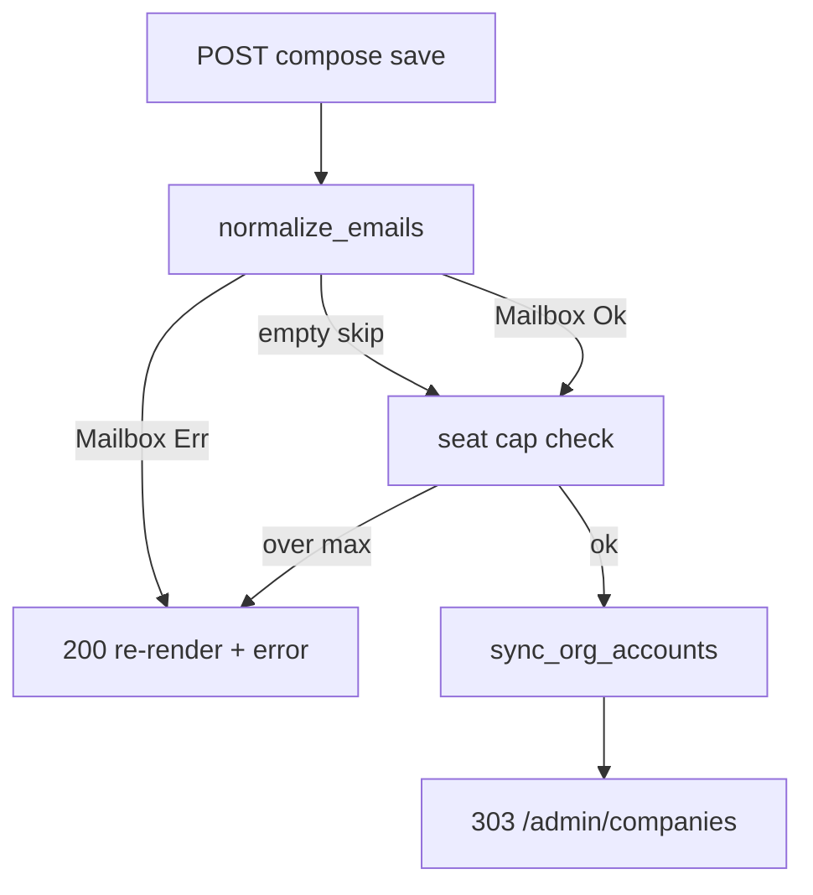

# Mailbox email validation for company accounts

## Locked decisions

- **Scope**: USER ACCOUNTS emails on admin company create/edit Save only (not Contact point, not login yet). Shared helper lives where other surfaces can reuse it later.
- **Feature**: enable Topcoat `mail` only (not `mail-smtp` in this slice). Validation uses `topcoat::mail::Mailbox`; SMTP comes with magic links later.
- **Fail-closed**: any non-empty invalid address rejects the whole Save with a clear form error; never silently drop bad rows.
- **Transport now**: register `FileTransport` under `target/mail` in the app router (and the same in integration `test_router`) so `send` is ready later and never panics for missing `MailConfig`. No outbound SMTP in this slice.

## Implementation

### 1. Cargo + router mail wiring

- [`Cargo.toml`](Cargo.toml): `topcoat = { …, features = ["tailwind", "font-fontsource", "mail"] }`.
- [`src/app.rs`](src/app.rs) `router()`: `.mail(MailConfig::builder().transport(FileTransport::new("target/mail")).build())` via `RouterBuilderMailExt` (same pattern as Topcoat mail docs).
- Mirror registration in the integration test router helper so E2E that later call `send` (or any code path requiring `MailConfig`) stay green.

### 2. Shared parse / normalize API

Extend [`src/companies_accounts.rs`](src/companies_accounts.rs) (or extract `src/email.rs` if the module grows — prefer staying in `companies_accounts` unless clippy/noise forces a split):

```rust
pub fn parse_portal_email(raw: &str) -> Result<String, String> {
    let email = raw.trim().to_ascii_lowercase();
    if email.is_empty() { /* caller skips empties */ }
    Mailbox::new(&email)
        .map(|m| m.address().to_owned())
        .map_err(|_| format!("Invalid email address: {email}"))
}

/// Trim, lowercase, drop empties, validate via Mailbox, dedupe (first wins).
pub fn normalize_emails(raw: &[String]) -> Result<Vec<String>, String>
```

- Empty slots still skipped (compose UX).
- First invalid non-empty → `Err` with stable English copy including the bad value.
- Call sites in [`new.rs`](src/app/admin/companies/new.rs) / [`company_id.rs`](src/app/admin/companies/company_id.rs) `save_*`: `let emails = normalize_emails(...)?;` surface the string on the form (existing error path).



### 3. Docs / lint pins

- Update [`scripts/check_admin_companies.sh`](scripts/check_admin_companies.sh): pin `features = .*mail`, `Mailbox::new` / `parse_portal_email`, and that `normalize_emails` returns `Result`.
- Touch [`docs/runbooks/admin_companies_smoke_test.md`](docs/runbooks/admin_companies_smoke_test.md) denial step for invalid email.
- Brief note in [`project-overview.mdc`](.cursor/rules/project-overview.mdc) only if it already mentions account emails (keep one line: syntax validated via Topcoat `Mailbox`).

## Test pyramid (`admin_companies` + email helper)

| Layer | Deliverable |
|-------|-------------|
| **Unit** | `parse_portal_email` / `normalize_emails`: happy (`a@b.co`), trim+case, dedupe, empty skip, reject `not-an-email`, reject `a@`, reject spaces-only-as-empty; error message contains the bad address |
| **Invariants** | `check_admin_companies.sh` + `inv_*`: mail feature on; `Mailbox` / `parse_portal_email` used; Save paths use `Result` normalize (no silent drop) |
| **Proptest** | For random printable garbage (no `@` or broken local/domain): `normalize_emails` is `Err`; for a small corpus of RFC-plausible addresses: `Ok` and idempotent lowercase |
| **Battle** | Parallel `normalize_emails` across threads on a mixed valid/invalid corpus (no races / panics); optional concurrent create with invalid email still leaves DB unchanged |
| **E2E** | Staff create with `not-an-email` → `200`, error text, org count unchanged; create with two valid emails still `303` + pills; edit save with one invalid email does not update memberships |
| **Smoke** | Runbook: try invalid account email on New company → form error, no new card |

Filter: `just test --test integration_tests -- admin_companies` plus `rtk cargo test -p vcp -- companies_accounts`.

## Out of scope

- Magic-link tokens / actual invite send.
- `mail-smtp` / production SMTP secrets.
- Validating Contact point or login email in this slice.
- MX / deliverability checks (syntax only via lettre).
