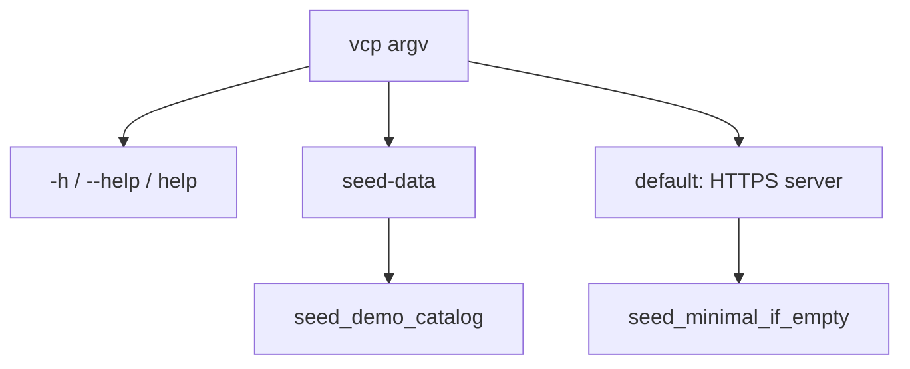

# Minimal boot seed + `vcp seed-data`

## Goal

| Moment | Docs | Builds | Issues | Tenants |
|--------|------|--------|--------|---------|
| Fresh install / `just db-reset` + `db-create` + delete `vcp-storage` + `just run` | **1** (`quick-start` only) | **0** | **0** | `l.martin` + `acme-infrastructure` + reserved `vauban` (needed for `/{org}/…`) |
| `vcp seed-data` | **7** (as today) | **24** (23 GA + Acme private) | **2** (+ comments) | ensure tenants exist if missing |

Default locked: boot keeps demo login/orgs + Quick start; full catalog is **opt-in** via CLI.

## Root cause today

[`src/main.rs`](src/main.rs) always runs:

```rust
db::seed_if_empty(&database).await?;
db::ensure_demo_catalog(&database).await?;
```

[`ensure_demo_catalog`](src/db.rs) **re-upserts all GA releases and the 6 extra docs on every boot**, so a “clean” DB cannot stay clean. [`seed_if_empty`](src/db.rs) also inserts all 7 docs, all releases, and 2 issues on first empty boot.

## Design



### 1. Split seed API in [`src/db.rs`](src/db.rs)

- Rename/refactor responsibilities (keep implementations, change call sites):
  - **`seed_minimal_if_empty`**: if no users → create `l.martin` / orgs / membership + **only** `quick-start` doc (rich `QUICK_START_BODY`). **No** `upsert_ga_releases`, **no** Acme private release, **no** issues.
  - **`seed_demo_catalog`** (today’s full catalog, idempotent): ensure tenants if needed, create any missing of the 6 extra docs, `upsert_ga_releases`, `upsert_acme_private_release`, insert the 2 demo issues if absent (move issue create out of empty-only path), `refresh_thin_doc_bodies`, `ensure_demo_issue_comments`.
- Remove **`ensure_demo_catalog` from server boot** (or reduce it to a no-op deprecated alias that only `seed_demo_catalog` uses). Boot must never call `upsert_ga_releases`.
- Extract shared doc title tuples / release catalog helpers so both paths stay DRY; pin inventory constants (e.g. `MINIMAL_DOC_SLUGS`, `DEMO_DOC_SLUGS`, release count) for tests.

### 2. `vcp` CLI surface (like [`src/bin/vcp_store.rs`](src/bin/vcp_store.rs))

In [`src/main.rs`](src/main.rs) (default-run `vcp`):

- Early argv parse: `wants_help` → print usage to stdout, exit 0.
- `seed-data` → load config, connect DB, run `seed_demo_catalog`, log summary counts, exit 0 (no HTTPS listen).
- No ops subcommand → current server path, but only `seed_minimal_if_empty` after connect.
- Unknown arg → stderr + usage, exit 1.

Usage sketch (ASCII, match store tone):

```text
usage: vcp [options] | vcp <command>

Server (default): load config, minimal empty-DB seed, serve HTTPS.

Commands:
  seed-data    Seed the database with test data (docs, builds, issues)

Help: -h, --help, help
```

Reuse the same `Config::load` / `db::connect` as the server (respect `VCP_ENVIRONMENT`).

### 3. Docs / ops copy

- Update [`README.md`](README.md) seed blurb: empty boot = Quick start + demo login; full catalog = `vcp seed-data`.
- Touch nearest runbooks that assume a full GA catalog after reset (e.g. [`docs/runbooks/toasty_migrations_smoke_test.md`](docs/runbooks/toasty_migrations_smoke_test.md), builds/docs smoke if they imply auto-seed releases).
- Optional one-liner in [`docs/runbooks/storage_helper_ops.md`](docs/runbooks/storage_helper_ops.md) only if it mentions demo releases.

### 4. Tests that assume auto-seeded GA catalog

Integration tests do **not** call `seed_if_empty` today; many insert their own high versions. Still:

- Grep/adjust any assertion that expects ≥23 GA rows after a bare connect.
- [`is_seed_release_version`](tests/integration_tests/common/mod.rs): keep for cleanup hygiene; document that those versions appear only after `seed_demo_catalog` / explicit fixtures.
- Where an e2e truly needs the full catalog, call `vcp::db::seed_demo_catalog` in that test (or a common helper), not via server boot.

## Pyramid (mandatory)

| Layer | Deliverable |
|-------|-------------|
| **Unit** | `wants_help` / usage strings; inventory constants (7 demo docs, 1 minimal, release count); `seed_minimal` vs `seed_demo` function boundaries in `db` / `main` |
| **Invariants** | `scripts/check_*.sh` or `include_str` pins: boot path calls `seed_minimal_if_empty` and must **not** call `ensure_demo_catalog` / `upsert_ga_releases`; `seed-data` + `cli_usage` / `--help` present in `main.rs` |
| **Proptest** | Property: demo doc slug set always contains `quick-start` and size 7; minimal set is exactly `{quick-start}` |
| **Battle** | Parallel `seed_demo_catalog` on empty-ish DB (Barrier) → no panic, stable final counts |
| **E2E** | Against `vcp_test`: (1) empty → `seed_minimal_if_empty` → 1 doc `quick-start`, 0 releases, 0 issues; (2) then `seed_demo_catalog` → 7 docs, expected release/issue counts |
| **Smoke runbook** | Short section (README or `docs/runbooks/…`): `just db-reset` → `just run` → expect Quick start only; `vcp seed-data` → full demo; Pass/Fail |

Validation: `just fmt` / fmt-check, clippy `-D warnings`, focused filters + structural lint if added.

## Out of scope

- Pruning already-full production/dev DBs without `db-reset` (no auto-delete of the 6 docs/releases on upgrade).
- Changing `vcp-cli` migrations binary.
- Seeding real blobs under `vcp-storage` (releases stay metadata-only as today).
