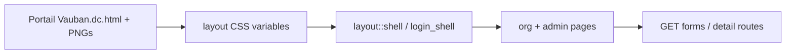

# Mockup-faithful VCP UI (Topcoat only)

## Constraints (locked)

- **Stack:** Topcoat `view!` + CSS (and Tailwind only where it helps utility classes). **No React, no application JS, no HTMX/Alpine** for product UI.
- **Source of truth:** [`.cursor/mockups/Concept/`](.cursor/mockups/Concept/) — PNG `01.png`–`08.png` + structure/tokens in [`Portail Vauban.dc.html`](.cursor/mockups/Concept/Portail%20client%20Vauban%20%5B%20avec%20administration%20%5D/Portail%20Vauban.dc.html).
- **Ignore** the bundled React export (`Vauban Customer Portal.html` / `support.js`) except for visual comparison.
- **Scope:** visual system + shell + **all current routes** (login, dashboard, docs, builds, issues, account, admin docs/releases/companies). Data stays seed/stub; behaviour stays server forms + links.
- Mockup `onClick` drawers/modals become **server routes** or `
` (no client state).

## Visual tokens (from mockup)

Extract into CSS variables used by the shell (replace the approximate styles in [`src/layout.rs`](src/layout.rs)):

| Token | Value |
|-------|--------|
| `--accent` | `#117a6b` |
| `--bg-app` | `#f5f6f4` |
| `--bg-rail` | `#14171c` |
| `--bg-card` | `#fff` |
| `--border` | `#e0e2de` |
| `--text` | `#14171c` |
| `--muted` | `#6b6f76` / `#8a8f96` |
| `--warn` | `#b3801f` |
| `--ok` | `#1f9d86` |
| Rail width | **76px** (items 56px, logo SVG star) |
| Type | **Hanken Grotesk** (UI) + **JetBrains Mono** (crumbs, labels, tables) via Google Fonts or self-hosted under `assets/` |
| Radius | **4–6px**, hairline borders; cards for interactive/content blocks as in mockup |

## Architecture

### 1. Design system module

- Add [`src/ui.rs`](src/ui.rs) (or expand `layout.rs`) with shared CSS string / class names: `.vb-rail`, `.vb-card`, `.vb-row`, `.vb-chip`, `.vb-stat`, `.vb-table`, badges LTS/EOL, search input, filter chips.
- Prefer one `<style>` block in the shell (mockup-faithful) rather than scattering inline styles per page.
- SVG rail icons (Home grid, Docs square, Builds hex, Issues flag, Admin pencil/arrow/org) inlined as static markup — no icon JS lib.
- Keep `topcoat::dev::script()` for hot-reload only in development (Topcoat tooling, not product JS).

### 2. Shell fidelity ([`src/layout.rs`](src/layout.rs))

Match mockup shell exactly:

- Dark rail 76px, brand mark SVG, icon+label nav, `ADMIN` divider, org initials control → `/{org}/account`.
- White topbar with bottom border; crumb `vauban://portal / {org} / {section}` (active segment accent).
- Content area on `#f5f6f4`; active rail item teal fill / light text as in PNG 01–02.
- Login shell: dark `#14171c` branding panel aligned with splash (VAUBAN / CUSTOMER PORTAL), not a generic dark card.

### 3. Page comps (Topcoat pages, server-driven)

Rewrite bodies to match PNG structure; wire existing seed models where possible.

| Route | Mockup ref | Notes |
|-------|------------|--------|
| `/login` | splash + form | Brand-forward; form POST unchanged |
| `/{org}` | `01.png` | Stat strip (joined cards), 3 shortcut cards, recent activity + latest build |
| `/{org}/docs` | `02.png` | Search + category chips via **GET** `?q=&cat=`; article list rows |
| `/{org}/docs/{slug}` | article drawer → page | Full article (headings, pre, callout) — replaces modal |
| `/{org}/builds` | builds table | Channel chips GET; row → `/{org}/builds/{version}` changelog |
| `/{org}/issues` | issues list + report | List + POST report form on same or `/issues/new` |
| `/{org}/account` | account/subscription | Plan, LTS counters, contact |
| `/{org}/admin/docs` | admin editor | Table/list + publish affordances (stub actions OK) |
| `/{org}/admin/releases` | release manager | Channel metadata UI |
| `/{org}/admin/companies` | companies | Max-5 seats copy, onboard stub |

No SPA: filters and “open detail” are links/forms only.

### 4. Assets / fonts

- Load Hanken Grotesk + JetBrains Mono (link tags in shell head, or vendor woff2 under static assets if Topcoat asset pipeline prefers local).
- Do not depend on mockup React bundle or `support.js`.

### 5. Validation / acceptance

- Visual pass against PNG 01–08 (side-by-side): rail, crumbs, cards, tables, chips, login.
- `just validate` green; extend E2E only if new routes break existing selectors (login / wrong-org / admin 403 unchanged).
- Smoke: `just run` + browser on HTTPS self-signed — dashboard and docs list look like Concept, not scaffold.

## Out of scope

- Real search backend, file downloads, or admin mutations beyond stub UI.
- Reintroducing any client SPA from the HTML bundler.
- Pixel-perfect animation of mockup `vbIn` / hover transforms beyond light CSS `:hover` already in `.dc.html`.
