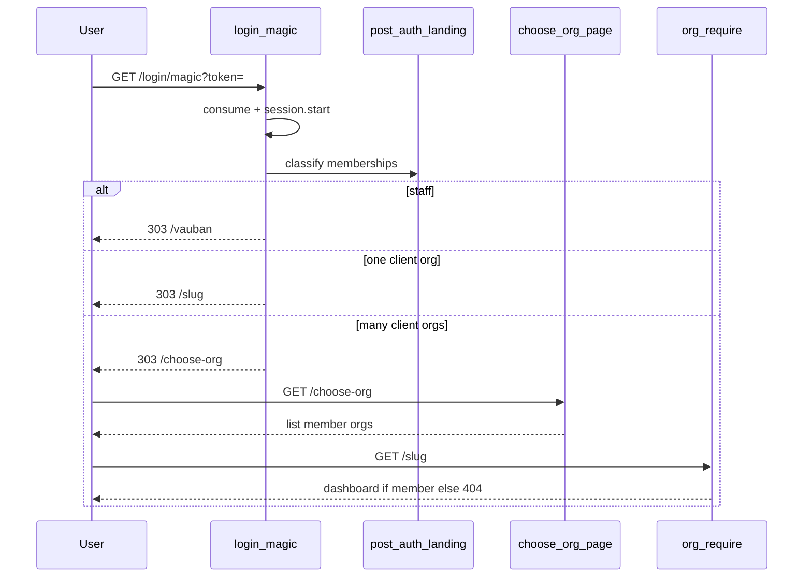

# Multi-org picker after magic link

## Locked decisions (v1)

- **Staff** (`portal_role=admin`): always land on `/vauban` — no picker.
- **Org users**: `0` client memberships → no session keep / back to `/login` (same as today); `1` → `303/307` to `/{slug}`; `N>1` → `/{choose-org}` picker.
- **No** `last_org` cookie, **no** invite `?org=` deep-link, **no** “Switch organization” in the portal chrome (v1). Same landing rules apply to authenticated `GET /` and `GET /login` so multi-org users are not auto-routed to the arbitrary “first” membership.
- Picker UI: login splash layout ([`src/app/login.rs`](src/app/login.rs)); list org **name + slug**; each entry is a normal `<a href="/{slug}">` (membership re-checked by existing `require_org`).
- Sort client orgs by **slug ascending** for stable UX (replaces “first membership row order” for multi-org listing; single-org path still unique).

## Flow



## Implementation

### 1. Auth landing helper — [`src/auth.rs`](src/auth.rs)

Replace the “always first slug” semantics for entry points with:

```rust
pub enum PostAuthLanding {
    Org(String),
    ChooseOrg,
    None,
}
```

- `client_orgs_for_user(cx, user_id) -> Vec<(slug, name)>`: memberships for user → `orgs_by_ids` → filter out reserved `vauban` → sort by slug.
- `post_auth_landing(cx, user) -> PostAuthLanding`: staff → `Org(vauban)`; else match `client_orgs` len `0/1/N`.
- Keep `resolve_home_org_slug` / `first_client_org_slug` only if still needed for tests that pin them; prefer migrating entry callers to `post_auth_landing`. Update [`auth_tenant_proptest`](tests/integration_tests/auth_tenant_proptest.rs) / battle that assume “first membership” for landing.

### 2. Wire entry points

| Caller | Behavior |
|--------|----------|
| [`login_magic`](src/app/login.rs) | After session: `ChooseOrg` → `see_other("/choose-org")`; `Org(s)` → `see_other(/{s})`; `None` → stop session + `/login` (or existing link-error only for consume fail) |
| [`login_page`](src/app/login.rs) (already authed) | `redirect` same three-way |
| [`root`](src/app.rs) | `redirect` same three-way (`ChooseOrg` → `/choose-org`) |

### 3. Page `GET /choose-org`

- Add under login module (module router / discover): session required → else `redirect("/login")`.
- Staff → `redirect("/vauban")`.
- `0` client orgs → `redirect("/login")` (or stop session).
- `1` client org → `redirect("/{slug}")` (bookmark safety).
- `N` → render list (login layout): heading “Choose an organization”, links `/{slug}` with org name.
- Minimal CSS in [`styles.css`](styles.css) under `.vb-login-panel` (link list, no new JS).

### 4. Docs

- [`docs/runbooks/magic_links_smoke_test.md`](docs/runbooks/magic_links_smoke_test.md): multi-org smoke step (create user in two companies → magic link → picker → pick one).
- [`README.md`](README.md) login blurb: mention choose-org when multiple memberships.

## Pyramid (mandatory)

| Layer | Deliverable |
|-------|-------------|
| **Unit** | `post_auth_landing` / classify: staff, 0, 1, N (pure or thin helpers over slug lists) |
| **Invariants** | Pins: `/choose-org`, `PostAuthLanding` / `post_auth_landing`, no auto-`first_client` in `login_magic` for landing; entry points call landing helper |
| **Proptest** | Random client slug lists → 0→None, 1→Org, N→ChooseOrg; staff always vauban |
| **Battle** | Parallel GET `/choose-org` + concurrent pick of two orgs (both members) stay 200/redirect OK; non-member slug still 404 |
| **E2E** | Seed user with 2 orgs → consume magic → Location `/choose-org` → HTML lists both → GET `/{a}` OK, GET `/{foreign}` 404; 1-org still direct; staff JIT still `/vauban`; anonymous `/choose-org` → login |
| **Smoke** | Runbook step for dual-membership picker |

Helpers in [`tests/integration_tests/common/mod.rs`](tests/integration_tests/common/mod.rs): create second membership for an existing user (or thin wrapper) without inventing a parallel auth path.

## Validation

```bash
just fmt && just fmt-check
rtk cargo clippy -p vcp --all-targets -- -D warnings
just test -- magic_link auth_tenant choose_org post_auth_landing
```

## Out of scope (v1)

- Remember last org; invite deep-link `?org=`; in-app org switcher; changing Casbin roles per org beyond existing membership gate.
