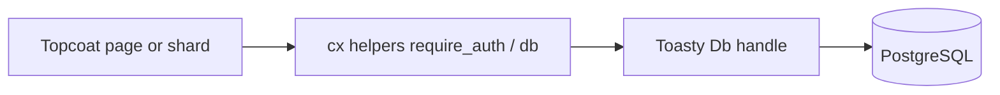

# ORM: Toasty + PostgreSQL for VCP

## Decision

- **ORM:** [Toasty](https://github.com/tokio-rs/toasty) (async, Tokio ecosystem; Topcoat ships `examples/toasty-todo`).
- **Database:** **PostgreSQL** in all non-toy environments (dev/staging/prod). SQLite only if a future local smoke needs it — not the default.
- **Risk posture:** Toasty is **0.x** (breaking churn expected). Pin exact versions in `Cargo.toml` / lockfile; bump deliberately. Do not track `main` ad hoc.
- **Escape hatch:** for a query Toasty cannot express cleanly, allow a narrow `sqlx` (or equivalent) path behind a documented module — not a second parallel data model.

## Architecture (at scaffold time)

- Register a `Db` (or Toasty connection type) with `.app_context(...)` on the Topcoat router.
- Access via `fn db(cx: &Cx) -> ...` (clone/pool handle), per [functions-not-middlewares](https://github.com/tokio-rs/topcoat/blob/main/crates/topcoat/docs/functions_not_middlewares.md).
- Models: `#[derive(toasty::Model)]` under something like `src/models/` (or `src/db/models/`).
- Session storage for Topcoat sessions: persist **`TokenHash` + `expires_at` + user id** in Postgres via Toasty — never the raw token ([session guide](https://github.com/tokio-rs/topcoat/blob/main/crates/topcoat/docs/session.md)).
- Tenant isolation: every org-scoped query filters on the active organization id resolved from session membership (see `casbin-permissions.mdc` / `portal-security.mdc`).

## Docs / Cursor hygiene (first deliverable when executing)

Update without inventing a full app tree yet:

1. [`/.cursor/skills/web-stack/SKILL.md`](.cursor/skills/web-stack/SKILL.md) — lock ORM row: Toasty + PostgreSQL; pin policy; `db(cx)` pattern; escape-hatch note.
2. [`/.cursor/skills/topcoat/SKILL.md`](.cursor/skills/topcoat/SKILL.md) — § ORM: Toasty decision, Postgres driver feature, pointer to Topcoat `toasty-todo` example and [Toasty guide](https://tokio-rs.github.io/toasty/nightly/guide/).
3. [`/.cursor/skills/quality-assurance/SKILL.md`](.cursor/skills/quality-assurance/SKILL.md) — note DB tests need Postgres (or documented testcontainer / CI service); denial paths still apply on tenant queries.
4. [`/.cursor/rules/project-overview.mdc`](.cursor/rules/project-overview.mdc) — one line under stack: Toasty + PostgreSQL.

Optional later (when scaffolding the binary): `DATABASE_URL`, reset/migrate commands from Toasty’s schema workflow, and a thin `src/db.rs` module.

## Explicit non-goals (this plan)

- Do not copy Diesel schemas or migrations from `../Vauban`.
- Do not enable Topcoat `websocket`.
- Do not scaffold the full Topcoat app in this step unless you ask to execute further — this plan locks the ORM choice and docs first.

## When the app is scaffolded (follow-on)

1. `cargo add toasty` with **PostgreSQL** driver feature; pin versions.
2. Wire pool into router app context; `db(cx)` helper + `#[memoize]` where useful.
3. First models: `User`, `Session` (token hash), `Organization`, membership — enough for login + tenant.
4. CI: Postgres service + focused Toasty/repository tests (pyramid for auth/tenant seams).
