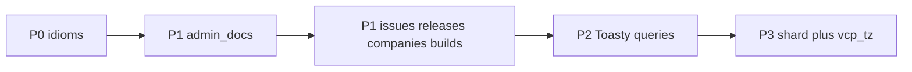

# Campaign P0–P3: Topcoat idioms + product slices + test pyramid

## Defaults (locked)

- **Knowledge base stays global** (no `organization_id` on `DocArticle` for this campaign): matches current seed/model; admin with `docs_write` manages the shared catalog; client lists show only `PUBLISHED`.
- **Article body** is plain `String`, HTML-escaped in `view!` (newlines → paragraphs). No Markdown renderer in this campaign.
- **Builds**: entitlement gate only (Casbin `builds_download` + tenant) — no artifact storage/S3; authorized happy path returns a clear **501** “download not configured”.
- **Issues**: persist `details` only — no comment thread.
- **Releases**: metadata POST only (no binary upload).
- **Companies**: create `Organization` (+ slug); seat invariant helper tested; no auto-provisioned users on create.
- Custom TLS / no Topcoat UI / no WebSocket unchanged.

## Campaign flow

Pyramid rule (every new behavioral surface): unit + `scripts/check_<surface>.sh` + `inv_` + `prop_` + `battle_` + `e2e_` + `docs/runbooks/<surface>_smoke_test.md`. Denial paths mandatory. Filter: `cargo test --test integration_tests -- <surface> -- --test-threads=1`. Extend existing `auth_tenant` for P0 memoize; do not invent parallel harnesses.

---

## P0 — Idiom adoption

**Goal:** memoized org context; kill admin GET mutation stubs (POST handlers arrive in P1).

### Code

1. Add `#[memoize]` on [`require_org`](src/auth.rs) (mirror `session_user` / `require_perms`). Adjust call sites if memoize returns refs (`OrgContext` is already `Clone`).
2. Optional chrome locality (same phase): let [`vb_rail`](src/app/_components/rail.rs) / [`vb_topbar`](src/app/_components/topbar.rs) resolve nav inputs via memoized `require_org` + `perms_for_user` when given `org` slug — reduce prop-drill from [`org_layout`](src/app/org.rs). Keep presentational badges.
3. Admin compose forms ([`admin/docs/new.rs`](src/app/org/admin/docs/new.rs), [`releases/new.rs`](src/app/org/admin/releases/new.rs), [`companies/new.rs`](src/app/org/admin/companies/new.rs)): switch to `method="POST"` targeting real routes (implemented in P1). Until P1 lands in the same campaign, do not leave GET form posts that only bounce to the list.

### Pyramid (`auth_tenant` extension)

| Layer | Deliverable |
|-------|-------------|
| Unit | Memoize semantics: two `require_org` calls same request share org/membership work (assert via counter helper or documented inv pin on `#[memoize]` attribute) |
| Invariants | Extend [`scripts/check_auth_tenant.sh`](scripts/check_auth_tenant.sh): pin `#[memoize]` on `require_org`; pin admin new forms are `method="POST"` (not GET) |
| Proptest / battle / E2E | Keep existing wrong-org 404 / admin 403; add battle that parallel `require_org` reads stay correct under load (extend [`auth_tenant_battle_test.rs`](tests/integration_tests/auth_tenant_battle_test.rs)) |
| Runbook | Note in [`auth_tenant_smoke_test.md`](docs/runbooks/auth_tenant_smoke_test.md): org shell still 200; no GET admin compose |

---

## P1 — Product depth (CRUD behind the shell)

### P1a — Surface `admin_docs` (spine)

**Model** ([`src/models/mod.rs`](src/models/mod.rs)): add `body: String`, `updated_at: i64` (unix seconds). Keep global catalog.

**Seed** ([`src/db.rs`](src/db.rs)): fill `body` for seed articles (migrate `quick-start` hardcode from [`docs/doc.rs`](src/app/org/docs/doc.rs) `article_blocks` into seed body); set `updated_at`.

**Routes / handlers**

| Route | Behavior |
|-------|----------|
| `GET /{org}/admin/docs` | List all statuses (existing + status chip) |
| `GET+POST /{org}/admin/docs/new` | Create DRAFT or PUBLISHED; slug from title (unique); require `docs_write` |
| `GET+POST /{org}/admin/docs/{doc}` | Edit; POST update fields |
| `POST /{org}/admin/docs/{doc}/publish` / `unpublish` | Toggle `status`; PRG back to list/detail |
| Client `GET /{org}/docs` | Filter `status == PUBLISHED` only |
| Client `GET /{org}/docs/{doc}` | Render escaped `body`; 404 if not published (members) |

Gates: `require_org` + `docs_write` (admin) / `docs_read` (client). PRG via `see_other`.

### P1b — Surface `portal_issues`

- Add `Issue.details: String`.
- [`report_issue`](src/app/org/issues.rs): persist form `details` (stop `let _details`).
- Detail page shows details. Still org-scoped via `organization_id`.

### P1c — Surface `admin_releases`

- POST create `Release` from form (`version`, `channel`, `date` → `released_on`, `notes`; defaults for `size_mb` / `signature_prefix` / `status`).
- Drop-zone stays visual-only (no upload).
- Gate: `releases_manage`. Client builds list already reads releases — ensure new rows appear.

### P1d — Surface `admin_companies`

- POST create `Organization`: derive unique `slug` from name; set contact/vat/address/plan defaults/`status`.
- Helper `membership_count` + `can_add_member(org) -> bool` enforcing [`MAX_USERS_PER_COMPANY`](src/models/mod.rs) (tested now; wired when invite lands later — create-org path does not add users).
- Gate: `companies_manage`.

### P1e — Surface `builds_entitlement`

- Dedicated download route (e.g. `POST /{org}/builds/{version}/download` or GET with non-cacheable response): `require_org` + `builds_download`; on success **501** with stable message; denial **403**/wrong-org **404**.
- UI: download control posts/links to that route (replace ephemeral fake token string in [`builds.rs`](src/app/org/builds.rs)).

### Pyramid per P1 surface

For each of `admin_docs`, `portal_issues`, `admin_releases`, `admin_companies`, `builds_entitlement`:

| Layer | Typical content |
|-------|-----------------|
| Unit | Slugify / seat helper / status transitions / details persist mapping |
| Invariants | `check_<surface>.sh` pins POST handlers, Casbin flags in pages, no GET stubs, published-only client docs |
| Proptest | Slug uniqueness corpus; seat boundary 0..=5; status strings; details length bounds |
| Battle | Concurrent creates / publish toggles / parallel membership counts |
| E2E | Admin happy path + member 403 + wrong-org 404 + anonymous redirect; CSRF/Origin: non-GET only |
| Runbook | Staging checklist with seed logins (`admin@acme.example` / `l.martin@acme.example`) |

Wire modules in [`tests/integration_tests/main.rs`](tests/integration_tests/main.rs) and document filters like existing surfaces.

---

## P2 — Toasty query style (surface `toasty_filters`)

Apply on list/detail paths after P1 models exist:

1. **DB filters** instead of `::all()` + Rust filter on [`docs.rs`](src/app/org/docs.rs), [`issues.rs`](src/app/org/issues.rs), [`builds.rs`](src/app/org/builds.rs) (category/status/channel/q where Toasty 0.9 expresses cleanly; narrow `sqlx` only if blocked — document at call site).
2. **`#[deferred]` on `DocArticle.body`** (and optionally `Release.notes`): lists omit body; detail `.include(body)`.
3. **`.select()`** for admin/client list rows (title, slug, category, version, status, updated_at).
4. Prefer slug/key getters over scan-`find` in [`docs/doc.rs`](src/app/org/docs/doc.rs), [`issues/issue_key.rs`](src/app/org/issues/issue_key.rs).

### Pyramid (`toasty_filters`)

| Layer | Content |
|-------|---------|
| Unit | Deferred load / select projection helpers |
| Invariants | Script fails if list handlers still `DocArticle::all()` then filter in Rust for primary filters; pin `.include` on detail body |
| Proptest | Filter combinations (cat × q) return subset of full catalog |
| Battle | Concurrent filtered list reads |
| E2E | Docs/issues/builds list query params still work; published-only docs |
| Runbook | Spot-check filters on HTTPS staging |

---

## P3 — Progressive UI + timezone

### P3a — Surface `docs_search_shard`

- Client docs search: `signal query` + `#[shard]` re-render of result list (announcement pattern).
- Shard **must** re-run `require_org` + `docs_read` + published filter; treat args as untrusted.
- Keep GET deep links (`?q=` / `/{org}/docs/{doc}`) for shareability.
- No `#[procedure]` for writes.

### P3b — Surface `display_tz`

- Implement `browser_tz(cx)` from cookie `vcp_tz` + `format_local` / `format_local_with_seconds` (per [`timezone-localization.mdc`](.cursor/rules/timezone-localization.mdc)).
- Use on `DocArticle.updated_at`, release `released_on` if parsed as date, issue list if timestamps added (minimum: docs `updated_at` + any new unix fields from P1).
- Cookie absent → UTC. `<time datetime>` stays RFC3339 UTC.

### Pyramid

**`docs_search_shard`:** unit (query mapping), inv (shard re-checks org/perms — source pin), prop (query strings), battle (parallel shard hits), E2E (search updates list; member cannot hit admin), runbook (type-ahead on staging).

**`display_tz`:** unit (known instant × tz → string), inv (no naked `.format` on UTC for HTML display in touched files), prop (tz names / offsets), battle (N/A light or concurrent format calls), E2E (set `vcp_tz` cookie changes visible string, not stored instant), runbook (browser tz smoke).

---

## Validation / hand-off

After each phase: `just validate` (fmt-check + clippy `-D warnings` + ensure-vcp-test + tests). Before campaign done: all new `check_*.sh` green; focused filters for every new surface; runbooks linked from README or nearest operator doc if one exists.

## Out of scope (explicit)

- Org-scoped KB, Markdown/HTML sanitizer pipeline, artifact blob storage, issue comments, Topcoat UI vendor, `topcoat::start`, PSP/billing, user-invite UI (seat helper only).
