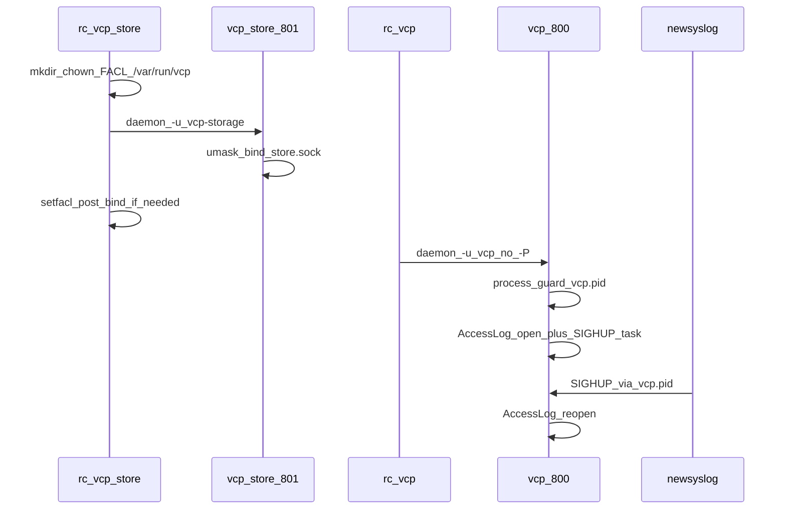

# FreeBSD `pkg/` + access-log SIGHUP reopen

## Locked decisions

- Scaffold **full** `pkg/` now (inspired by [`../Vauban/pkg`](../Vauban/pkg)); `just package` / `pkg create` is **FreeBSD-only** (document; no macOS CI for `pkg create`).
- Socket reachability: **FACL** on `/var/run/vcp` (access + default), mode base `0700`/`0600`, **reapplied every** `vcp_store` start (tmpfs survival). Peercred `expected_peer_uid=800` unchanged. **No** FACL on `/var/db/vcp/storage`.
- Users: `vcp` UID/GID **800**, `vcp-storage` UID/GID **801**.
- newsyslog: **no compression**; access log line uses `C` + pidfile + signal `1` (**no `W`**).
- Portal pid for newsyslog = VCP [`process_guard`](src/process_guard.rs) file `/var/run/vcp/vcp.pid` — rc.d must **not** use `daemon -P` for `vcp` (avoids fighting the in-process pidfile). Helper may use `daemon -P` for `/var/run/vcp/vcp-store.pid`.
- Version substitution: write to **temp copies** for `pkg create` (do **not** mutate tracked `+MANIFEST` / scripts in-place like Vauban’s pitfall).
- ACME block already edited in [`config/vcp.conf`](config/vcp.conf) ships as packaged sample.
- **Agreed: unset `VCP_ENVIRONMENT` ⇒ production.** Already the contract in [`Config::load`](src/config.rs) / module docs (same as Vauban). Production means: load **`vcp.conf` only** (no layered `default.toml`), and with the new dir lookup below, the config tree is **`/usr/local/etc/vcp`** unless `VCP_CONFIG_DIR` overrides. Packaged samples already use absolute prod paths (`/var/run/vcp/...`, `/var/db/vcp/...`, `/var/log/...`, `/usr/local/etc/vcp/...`).
- **Remove runtime use of `CARGO_MANIFEST_DIR` for config / path resolution** (this lot). New `find_config_dir` order only:

  1. `VCP_CONFIG_DIR` if set and exists  
  2. `/usr/local/etc/vcp` if it exists  
  3. else hard error (tell operator to set `VCP_CONFIG_DIR` or install conf)

  No compile-time checkout fallback in the binary.

### Config / path cleanup (Part A0 — before or with pkg)

| Area | Change |
|------|--------|
| [`find_config_dir`](src/config.rs) | Drop `{CARGO_MANIFEST_DIR}/config`; document new order |
| [`resolve_paths`](src/config.rs) | Resolve relative paths against the **loaded config directory**, not `CARGO_MANIFEST_DIR` |
| [`justfile`](justfile) | `export VCP_CONFIG_DIR := env("VCP_CONFIG_DIR", justfile_directory() / "config")` so `just run` / migrate / seed keep working with layered dev TOML + `VCP_ENVIRONMENT=development` |
| rc.d | `export VCP_CONFIG_DIR=/usr/local/etc/vcp` (both services) |
| [`PolicyStore::default_path`](src/perms.rs) / helper path defaults | Stop baking manifest dir; tests pass explicit `config/` via `VCP_CONFIG_DIR` or `load_with_environment(path, …)` |
| [`run_migration`](src/main.rs) | Stop `chdir(CARGO_MANIFEST_DIR)`; locate Toasty project via `VCP_CONFIG_DIR` parent / documented package share path (dev: repo root via just cwd + env) |
| Lint | `check_freebsd_pkg.sh` + config invariant: **no** `env!("CARGO_MANIFEST_DIR")` in `src/config.rs` / runtime path helpers |

**Allowed to remain (compile-time only, not runtime config discovery):** `include_bytes!` / `include_str!(concat!(env!("CARGO_MANIFEST_DIR"), …))` for assets and **tests**. Those are build inputs, not “where is production conf”.

**Dev contract after change:** running `./target/debug/vcp` with neither `VCP_CONFIG_DIR` nor `/usr/local/etc/vcp` **fails closed** — use `just run` (exports both env vars) or export explicitly. Production package never needs the checkout.



---

## Part A — Access log reopen on SIGHUP

### Code

1. Extend [`src/tls/access_log.rs`](src/tls/access_log.rs):
   - Store `path: PathBuf` beside `Arc<Mutex<File>>`.
   - Add `pub fn reopen(&self) -> io::Result<()>`: under the mutex, open append+create on `path`, replace `File` (old FD drops). On error: log `tracing::error!`, **keep previous FD** (fail soft for writes continuity).
   - Keep `write_line` locking the same mutex so reopen/write cannot race.

2. Wire signal in [`src/main.rs`](src/main.rs) (after `AccessLog::open`, before serve):
   - Spawn a tokio task: loop on `tokio::signal::unix::{signal, SignalKind::hangup}` (cfg unix); call `access_log.reopen()`.
   - Non-unix: no-op compile (dev macOS still has unit reopen tests without signals).

3. Document in module docs: newsyslog must signal the **process_guard** pid (not a parent `daemon -P` pid).

### Pyramid (mandatory)

| Layer | Deliverable |
|-------|-------------|
| **Unit** | `AccessLog::open` → write → simulate rotate (rename path aside, create empty at path) → **without** reopen writes still hit old inode; **with** `reopen()` new lines land on original path. Reopen failure keeps writing on old FD. |
| **Invariants** | Source pins: `reopen` exists; `main`/`run_server` spawns hangup listener; `SignalKind::hangup` / `access_log.reopen` present. Extend [`scripts`](scripts/) check if an http/tls lint exists, or add pins in `tests/integration_tests` next to access-log coverage. |
| **Proptest** | Random corpora of line batches interleaved with `reopen()` calls (no panic, all lines accounted on final path after last reopen). |
| **Battle** | N threads/`tokio` tasks writing while another task hammers `reopen()` under barrier — no poison panic, no lost-process abort. |
| **E2E** | Extend HTTP/TLS seam (see [`docs/runbooks/http_edge_smoke_test.md`](docs/runbooks/http_edge_smoke_test.md) / existing TLS tests): boot with temp `access_log_path`, issue request, rename+recreate file, send `SIGHUP` to test process (or call shared reopen hook if signal hard in harness), issue second request, assert second CLF line only in live path. |
| **Smoke runbook** | New or extended section in http-edge / process runbook: rotate with `newsyslog -F` (or `kill -HUP`), confirm writes continue on `/var/log/vcp-access.log`. |

Validation: `just fmt` + fmt-check, clippy `-D warnings`, focused filters then widen.

---

## Part B — `pkg/` tree and build script

### Layout

```
pkg/
  +MANIFEST
  +PRE_INSTALL
  +POST_INSTALL
  +PRE_DEINSTALL
  +POST_DEINSTALL
  build-pkg.sh
  acl.sh                    # detect_acl_type / set_acl / set_default_acl (from Vauban)
  rc.d/vcp_store
  rc.d/vcp
  newsyslog.conf.d/vcp.conf
```

### Staging install map

| Staged path | Source |
|-------------|--------|
| `usr/local/bin/vcp` | `target/release/vcp` |
| `usr/local/sbin/vcp-store` | `target/release/vcp-store` |
| `usr/local/etc/vcp/vcp.conf` | [`config/vcp.conf`](config/vcp.conf) (`@config`) |
| `usr/local/etc/vcp/vcp-store.conf` | [`config/vcp-store.conf`](config/vcp-store.conf) (`@config`) |
| `usr/local/etc/vcp/access/vcp_policy.csv` | [`config/access/vcp_policy.csv`](config/access/vcp_policy.csv) |
| `usr/local/etc/vcp/certs/` | empty `@dir` |
| `usr/local/etc/rc.d/vcp_store`, `vcp` | mode `555` |
| `usr/local/etc/newsyslog.conf.d/vcp.conf` | `@config` |
| `usr/local/libexec/vcp/acl.sh` | shared FACL helpers (sourced by rc.d + POST_INSTALL) |

### `build-pkg.sh`

- Read version from root [`Cargo.toml`](Cargo.toml) `version = "…"`.
- Require release bins `vcp` + `vcp-store`.
- Stage, generate plist (`@config` for confs + newsyslog; `@dir` certs/access).
- Substitute `%%VERSION%%` into **temp** metadata dir for `pkg create -m` (never rewrite tracked files).
- Output `pkg/vcp-${VERSION}.pkg`; clean staging/plist.
- Fail clearly if not FreeBSD / `pkg` missing.

### rc.d

**`vcp_store`**

- `PROVIDE: vcp_store` / `REQUIRE: LOGIN` / `KEYWORD: shutdown`
- `vcp_store_enable` default `NO`
- `start_precmd`: `mkdir -p /var/run/vcp`; `chown vcp-storage:vcp-storage`; `chmod 0700`; source `acl.sh`; access FACL `u:vcp:rx` + default `u:vcp:rw`
- `start_precmd` also: `export VCP_CONFIG_DIR=/usr/local/etc/vcp` (mandatory; same pattern as Vauban `VAUBAN_CONFIG_DIR`)
- `daemon -P /var/run/vcp/vcp-store.pid -r -H -t vcp-store -u vcp-storage -o /var/log/vcp-store.log /usr/local/sbin/vcp-store --config /usr/local/etc/vcp/vcp-store.conf --production`
- `start_postcmd`: if socket exists and missing ACE, `setfacl` `u:vcp:rw` on `store.sock`

**`vcp`**

- `PROVIDE: vcp` / `REQUIRE: LOGIN postgresql vcp_store` / `KEYWORD: shutdown`
- `start_precmd`: `export VCP_CONFIG_DIR=/usr/local/etc/vcp` (mandatory — **not** optional); ensure `/var/run/vcp` exists
- `daemon` **without** `-P`: `-r -H -t vcp -u vcp -o /var/log/vcp.log /usr/local/bin/vcp`
- Never rely on compile-time `{CARGO_MANIFEST_DIR}/config` for packaged starts

### newsyslog

[`pkg/newsyslog.conf.d/vcp.conf`](pkg/newsyslog.conf.d/vcp.conf):

```
/var/log/vcp-access.log  640  20  1048576  *  C  /var/run/vcp/vcp.pid  1
```

Optional companion lines for `daemon -o` logs (`vcp.log`, `vcp-store.log`) with their pidfiles / `N` as appropriate — include both daemon logs with `C` + correct pidfiles for consistency.

### Install scripts

- **`+PRE_INSTALL`**: stop `vcp` then `vcp_store` on upgrade; `pw` create groups/users 800/801.
- **`+POST_INSTALL`**: create `/var/db/vcp/storage` `0700` vcp-storage; `/var/log` touch access log ownership; apply FACL helpers once on a live `/var/run/vcp` if present; Postgres DB/role + `vcp migration` fail-loud when postgres up (mirror Vauban pattern, adapted to `vcp migration`); print `sysrc` enable order.
- **`+PRE_DEINSTALL`**: stop services.
- **`+POST_DEINSTALL`**: optionally remove users; **leave** `/var/db/vcp`, DB, `/usr/local/etc/vcp`.

### Justfile / docs / rules

- `just package` → `cd pkg && ./build-pkg.sh` (after release build note).
- Update [`docs/runbooks/storage_helper_ops.md`](docs/runbooks/storage_helper_ops.md): FACL + rc.d recreate `/var/run/vcp`; fix 0700-only wording.
- Short note in web-stack / project-overview: packaged paths + `just package` FreeBSD-only.
- Plan file under [`.cursor/plans/`](.cursor/plans/) if not auto-stored by CreatePlan alone — CreatePlan output is enough; add ops smoke runbook `docs/runbooks/freebsd_pkg_smoke_test.md`.

### Pyramid for packaging surface

| Layer | Deliverable |
|-------|-------------|
| **Unit** | Shellcheck-level: N/A in Rust; small Rust/unit not required for sh. |
| **Invariants** | `scripts/check_freebsd_pkg.sh`: tree exists; rc.d `REQUIRE` order (`vcp_store` before `vcp`); `acl.sh` sourced; no `model.conf`; policy `vcp_policy.csv`; newsyslog has no `Z/J/X/Y` and references `vcp.pid` + signal `1`; `build-pkg.sh` does not `sed -i` tracked manifests; bins paths `bin/vcp` + `sbin/vcp-store`; UIDs 800/801 in PRE_INSTALL. Wire into validate or auth/storage lint list as appropriate. |
| **Proptest** | Parse staged plist / rc.d text properties over random whitespace-safe fixtures (or table of required substrings). |
| **Battle** | Parallel `check_freebsd_pkg.sh` invocations (idempotent). |
| **E2E** | On non-FreeBSD: skip `pkg create` with explicit ignore; on FreeBSD CI/host: dry-run stage+plist without full install if rootless. Document FreeBSD install smoke in runbook (real `pkg add` is staging ops). |
| **Smoke runbook** | `freebsd_pkg_smoke_test.md`: install → enable → reboot → FACL/`getfacl` → peercred → HUP access log → artefact GET. |

---

## Implementation order

1. **Config path cleanup** — drop runtime `CARGO_MANIFEST_DIR`; justfile `VCP_CONFIG_DIR`; pins/tests (Part A0).
2. Access log reopen + signal + pyramid (Part A) — unblocks correct newsyslog semantics.
3. `pkg/acl.sh` + rc.d + newsyslog + install scripts + `build-pkg.sh` + `just package`.
4. Structural lint + packaging runbook + ops doc alignment.
5. `just fmt-check`, clippy, focused then broader tests.

## Out of scope this lot

- Jail templates, ZFS dataset creation, SMTP secret injection automation beyond CHANGE-ME placeholders.
- Changing Capsicum / peercred protocol.
- Porting Vauban multi-UID ACL sprawl to portal blobs.