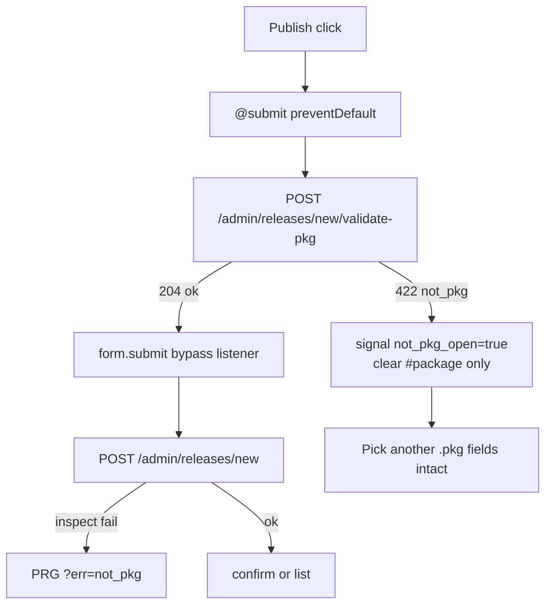

# Preserve compose form on FreeBSD package refusal

## Goal

When Publish rejects a non-FreeBSD package, the admin must keep Version, Channel, Date, Target organization, and Release notes, pick another `.pkg`, and retry — without a full page reload wiping the form.

## Approach (committed)

Hybrid Topcoat + dedicated validate route (not a `#[procedure]` with package bytes):

1. **`POST /admin/releases/new/validate-pkg`** — multipart field `package` only; `freebsd_pkg::inspect`; **no** STAGING / `put_begin`.
2. **Compose page** — `@submit` intercept (raw JS function: `FormData` + `fetch` are not expressible in dual `$()`), show modal via a Topcoat **signal** bridge, clear only the file input on failure.
3. **On validate OK** — native `HTMLFormElement.submit()` so the existing create POST + WebAuthn redirect runs unchanged.
4. **Defense in depth** — [`admin_releases_create`](src/app/admin/releases/new.rs) keeps `freebsd_pkg::inspect` before STAGING (never trust the client-only preflight).
5. **No-JS fallback** — keep today’s PRG `?err=not_pkg` + SSR modal init; fields are lost without the runtime (acceptable: admin surface already depends on Topcoat / WebAuthn).

Accepted cost on the happy path with JS: the `.pkg` crosses the wire twice (validate then create). Out of scope for this slice: upload tokens / dedup.



## Server: validate-pkg route

In [`src/app/admin/releases/new.rs`](src/app/admin/releases/new.rs):

```rust
#[route(POST "/admin/releases/new/validate-pkg")]
async fn admin_releases_validate_pkg(cx: &Cx, multipart: Multipart) -> Result<Response>
```

- `require_staff` + `perms.releases_manage` (same as create); deny → capability 404.
- Parse only `package` bytes (reuse a tiny helper shared with create parse).
- Empty / missing / `inspect` Err → **422** JSON `{"ok":false,"code":"not_pkg"}` (stable code; no parse detail leak).
- Ok → **204** empty body (or `{"ok":true}` — prefer **204**).
- Must not call `sweep_staged_releases`, `toasty::create!`, `put_begin`, or `stash_pending_release`.

OriginLayer already covers this POST (same-origin `fetch` sends `Origin` / `Sec-Fetch-Site`).

## Client: form intercept + signal modal

Refactor [`admin_releases_new_page`](src/app/admin/releases/new.rs) to `view! { cx => … }`:

- `signal not_pkg_open = show_not_pkg` (from `?err=not_pkg` for PRG fallback).
- Replace the separate `not_pkg_modal` component that owns its own `signal open = true` with a modal driven by **page-level** `not_pkg_open` (Close → `not_pkg_open.set(false)`; dismiss `href="/admin/releases/new"` still works without JS).
- Give the form a stable id, e.g. `id="vcp-release-create"`, and the file input `id="package"` (already present).
- Hidden bridge control (clipboard-style Topcoat pattern from RUNTIME.md):

```rust
<button
    type="button"
    id="vcp-not-pkg-open"
    style="display: none"
    @click=$(|_e| not_pkg_open.set(true))
></button>
```

- Form `@submit` as a **raw function expression** (not `$()`), because `FormData` / `fetch` cannot dual-compile:

```js
(async (e) => {
  e.prevent_default();
  const form = e.current_target.inner;
  const input = form.querySelector("#package");
  const file = input && input.files && input.files[0];
  if (!file) { form.reportValidity(); return; }
  const fd = new FormData();
  fd.append("package", file, file.name || "upload.pkg");
  const res = await fetch("/admin/releases/new/validate-pkg", {
    method: "POST",
    body: fd,
    credentials: "same-origin",
  });
  if (res.status === 204) {
    HTMLFormElement.prototype.submit.call(form); // bypass listener
    return;
  }
  input.value = "";
  document.getElementById("vcp-not-pkg-open").click();
})
```

Pin with `assert_topcoat_click_handlers_are_functions` / existing click-bind helper if the attribute is scanned the same way (`@submit` must still be a function expression).

Do **not** add a first-party `assets/vcp_*.js` for this.

## Wire-up checklist

| File | Change |
|---|---|
| [`src/app/admin/releases/new.rs`](src/app/admin/releases/new.rs) | validate route; page `cx =>` + signal modal; `@submit` intercept; keep create `inspect` |
| [`scripts/check_admin_releases.sh`](scripts/check_admin_releases.sh) | Pin validate route, no STAGING/put_begin there; `@submit` present; bridge id; create still inspects |
| Tests + runbook | Pyramid below |

## Test pyramid

| Layer | Deliverable |
|---|---|
| **Unit** | Response helper / status mapping if extracted; existing `freebsd_pkg` tests unchanged |
| **Invariants** | [`admin_releases_invariants_test.rs`](tests/integration_tests/admin_releases_invariants_test.rs) + check script: validate route gated; validate body has no `RELEASE_STATUS_STAGING` / `put_begin`; create still has `inspect` before STAGING; page has `vcp-not-pkg-open`, `@submit`, `not_pkg_open`; `@submit` is a function expression |
| **Proptest** | Random garbage upload to validate-pkg → always non-204 / `code=not_pkg` shape; crafted valid pkg → 204 |
| **Battle** | Parallel validate-pkg (valid + invalid) under contention: invalid never creates rows; valid still 204 |
| **E2E** | (1) POST validate-pkg garbage → 422, zero releases; (2) validate-pkg crafted → 204; (3) create with garbage still PRG `err=not_pkg` + modal SSR; (4) create with crafted pkg still publishes / reaches confirm; (5) HTML of compose page contains intercept + bridge + signal-driven modal markup |
| **Runbook** | [`docs/runbooks/admin_releases_smoke_test.md`](docs/runbooks/admin_releases_smoke_test.md): wrong file → modal, fields still filled, re-pick `.pkg` and succeed; note Topcoat runtime required for field preservation |

## Security bar

- Same Casbin + staff gates as create.
- Validate never stages or opens helper uploads.
- Stable error code only; no manifeste dump in JSON.
- Create path still fail-closed on `inspect`.
- `fetch` same-origin + credentials; OriginLayer stays on (no CSRF bypass).

## Validation cycle

`just fmt` / `fmt-check`, `clippy -D warnings`, `scripts/check_admin_releases.sh`, `just test --test integration_tests admin_releases`.
