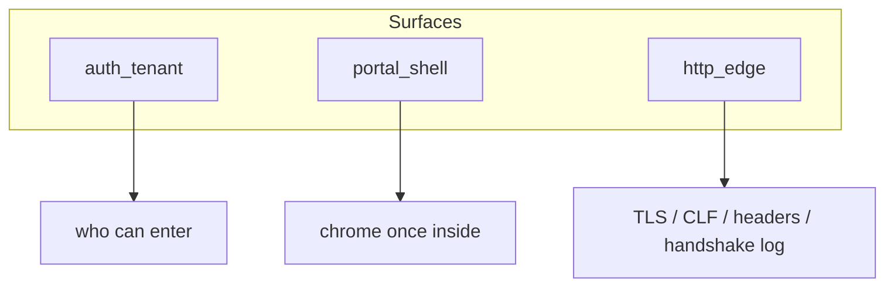

# Pyramid compliance backfill

Oui — l’option 2 est la plus complète. Ce plan la fige.

## Scope

| Surface | Action |
|---------|--------|
| [`http_edge`](tests/integration_tests/http_edge_e2e_test.rs) | Fermer E2E TLS→CLF fichier ; rendre le coalescer handshake testable (vrai code) ; étendre invariants / proptest / battle / runbook |
| **`portal_shell`** (nouveau) | Pyramide 6 couches pour chrome layouts/nav Topcoat (`2fe545b`) |
| [`auth_tenant`](tests/integration_tests/auth_tenant_e2e_test.rs) | Ne pas retester (déjà conforme) |

Hors scope : snapshots CSS/pixels, pyramide par composant (modal/chips), rejouer 403/404 Casbin.



---

## 1. `http_edge` — fermer les trous

### 1a. E2E HTTPS → ligne CLF dans un fichier

Ajouter `e2e_serve_https_writes_clf_access_log` dans [`tests/integration_tests/http_edge_e2e_test.rs`](tests/integration_tests/http_edge_e2e_test.rs) :

- `install_crypto_once()` (`OnceLock` dans [`tests/integration_tests/common/mod.rs`](tests/integration_tests/common/mod.rs))
- `build_server_config(&test_config())` + `TcpListener::bind("127.0.0.1:0")`
- `AccessLog::open(temp_path)` + `serve_https(..., shutdown oneshot)`
- Client HTTPS : ajouter `reqwest` en `[dev-dependencies]` (`default-features = false`, `rustls-tls`) avec `danger_accept_invalid_certs(true)`
- `GET /login` → status 200 ; lire le fichier ; assert `\"GET /login HTTP/` + ` 200 `
- Garder les E2E headers in-process existants

### 1b. Coalescence handshake — vrai code de prod (plié dans `http_edge`)

Dans [`src/tls/serve.rs`](src/tls/serve.rs) :

- Extraire un coalescer testable (`HandshakeFailureLog` ou fonctions `pub(crate)`) avec emit injectable / buffer capturable
- Remplacer les unit tests **creux** (logique rejouée localement) par des tests qui appellent le vrai coalescer
- Cas unit : N erreurs identiques → 1 emit `count=N` ; changement d’erreur → flush précédent ; `flush` au shutdown

Étendre :

| Layer | Ajout |
|-------|--------|
| Invariants + [`scripts/check_http_edge.sh`](scripts/check_http_edge.sh) | Pins `note_handshake_failure`, `flush_handshake_failures`, template `TLS handshake failed error=` + `count=`, `debug!`, `HANDSHAKE_LOG_IDLE` |
| Proptest | Séquences d’erreurs → somme des counts = N ; runs identiques coalescés |
| Battle | Flood parallèle Barrier sur le coalescer ; somme counts = N ; pas de poison |
| E2E | Exercer le coalescer de prod (API `pub(crate)` / inject), pas un second simulateur |
| Runbook | Section D dans [`docs/runbooks/http_edge_smoke_test.md`](docs/runbooks/http_edge_smoke_test.md) : flood client TLS incompatible → une ligne `count=N` |

### 1c. Config path (renfort léger)

- Proptest ou unit déjà présents sur `access_log_path` : garder les asserts config ; pin `.gitignore` `logs/` déjà dans le check script

---

## 2. `portal_shell` — rattrapage Topcoat layouts

Nouveau filtre : `cargo test --test integration_tests -- portal_shell -- --test-threads=1`

### Refactor minimal pour unit/proptest

Dans [`src/nav.rs`](src/nav.rs) : extraire `nav_from_path(path: &str) -> (NavSection, String)` ; `nav_from_cx` délègue. Unit table (Home/docs/issues/new/admin/…/unknown).

### Artefacts

| Layer | Fichier |
|-------|---------|
| Unit | `#[cfg(test)]` dans `src/nav.rs` |
| Invariants | [`scripts/check_portal_shell.sh`](scripts/check_portal_shell.sh) + `portal_shell_invariants_test.rs` — pins `#[layout]`, `vb_rail`/`vb_topbar`, `show_admin: perms.admin_view`, `nav_from_cx`, `runtime::script`/`stylesheet!`, **absence** de `src/layout.rs` / `layout::shell` |
| Proptest | `portal_shell_proptest.rs` — paths aléatoires → pas de panic ; crumb non vide ; unknown → Home |
| Battle | `portal_shell_battle_test.rs` — parallel GET `/login` + GET `/{org}` (cookie) → 200 + `vb-login-body` / `vb-shell` |
| E2E | `portal_shell_e2e_test.rs` — (1) `/login` contient chrome splash ; (2) admin dash : `vb-shell`+`vb-rail`+`vb-topbar`+lien admin ; member : shell **sans** `vb-rail-admin` |
| Smoke | [`docs/runbooks/portal_shell_smoke_test.md`](docs/runbooks/portal_shell_smoke_test.md) + lien depuis README / auth_tenant runbook |

Wiring : mods dans [`tests/integration_tests/main.rs`](tests/integration_tests/main.rs).

---

## 3. Validation (DoD)

```bash
bash scripts/check_http_edge.sh
bash scripts/check_portal_shell.sh
just fmt-check
rtk cargo clippy --all-targets -- -D warnings
rtk cargo test --test integration_tests -- http_edge -- --test-threads=1
rtk cargo test --test integration_tests -- portal_shell -- --test-threads=1
just validate
```

Definition of done : plus aucun trou listé dans l’audit (E2E CLF TLS, coalescer réel, pyramide layouts) ; runbooks à jour ; pas de commit sans demande explicite.