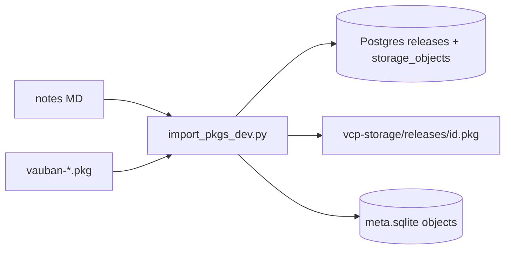

# Replace Rust import-pkgs with autonomous Python lab script

## Goal

Delete the product-binary lab command and ship a **self-contained** Python importer for local backfill of FreeBSD `.pkg` files + notes markdown. No subprocess to `vcp`, `cargo`, or the storage helper IPC.

Script location (operator choice): [`.cursor/audits/import_pkgs_dev.py`](.cursor/audits/import_pkgs_dev.py), next to the notes markdown it consumes.

## Remove Rust surface

Delete and unwire:

- [`src/import_pkgs.rs`](src/import_pkgs.rs)
- `pub mod import_pkgs` in [`src/lib.rs`](src/lib.rs)
- `import-pkgs` match arm + `run_import_pkgs` in [`src/main.rs`](src/main.rs)
- CLI help + `cli_usage` test mention in [`src/cli.rs`](src/cli.rs)

No change to production publish / WebAuthn paths.

## Add [`.cursor/audits/import_pkgs_dev.py`](.cursor/audits/import_pkgs_dev.py)

Autonomous script (stdlib + common lab deps: `psycopg`/`psycopg2`, `zstandard`). Document at top: **dev/testing only**; stop the portal first.

### Defaults / flags

- `--pkgs-dir` default: `~/Downloads`
- `--notes` default: sibling [`.cursor/audits/vauban_release_notes_from_git_2026-08-08.md`](.cursor/audits/vauban_release_notes_from_git_2026-08-08.md)
- `--config` default: repo-root `config/development.toml` (resolve relative to crate root: parent of `.cursor/`) — read `database.url` + `storage.blob_path` + optional `server.pid_file`; fall back to `postgresql://postgres@localhost/vcp`, `vcp-storage`, `/tmp/vcp.pid`
- `--pid-file` overrides config / default

### Fail-closed guards

1. Refuse if `VCP_ENVIRONMENT=production` or config `environment = "production"`.
2. Refuse if resolved `blob_path` is empty / missing (prod-shaped portal config).
3. Refuse if PID file names a live process whose `comm` basename is `vcp` (same idea as the Rust preflight).

### Package inspect (no Rust)

Mirror the minimal contract of [`src/freebsd_pkg.rs`](src/freebsd_pkg.rs):

- Detect compression (zstd / gzip / xz / raw tar)
- Open tar, read `+MANIFEST` (prefer) or `+COMPACT_MANIFEST`
- Parse JSON (enough for Vauban packages)
- Require `version` (and skip file if missing)

### Notes MD

Port the existing parser behavior from the Rust module: headings `### vX.Y.Z (JJ-MM-YYYY)` → ISO date + joined `TAG:` lines. Map key `v{version}`.

### Channel / sort fields

Keep current lab semantics:

- Portal version: `v` + manifeste version (strip one leading `v`)
- Channel: `LTS` if `+LTS`; else `EOL` when `0.x` with `x < 9`, else `Stable`
- Semver columns: simple parse of major/minor/patch + optional `-client` suffix (aligned with [`version_sort_fields`](src/release_pkg.rs))

### Writes (order)

For each matching pkg + notes section:

1. Upsert `releases` in Postgres (`PUBLISHED`, `organization_id = 0`, notes, date, channel, sort cols) — select-then-update/insert by `version`
2. Take `release.id`
3. Write bytes to `{blob_path}/releases/{id}.pkg`
4. Upsert Postgres `storage_objects` (`scope='release'`, `object_key=str(id)`, sha256 lowercase, size)
5. Upsert SQLite `{blob_path}/meta.sqlite` table `objects` with the schema from [`src/storage/meta_db.rs`](src/storage/meta_db.rs) (`CREATE TABLE IF NOT EXISTS` then `INSERT ... ON CONFLICT DO UPDATE`)

Print one line per import + final counts.

### Docs

Short usage block in the script docstring only (example invocation from repo root pointing at `.cursor/audits/import_pkgs_dev.py`).

## Validation

- `rtk cargo fmt --check` + `rtk cargo clippy -p vcp --all-targets -- -D warnings` after Rust removal
- `rtk cargo test -p vcp cli_usage -- --test-threads=1` (no longer mentions import-pkgs)
- `python3 .cursor/audits/import_pkgs_dev.py --help`

## Commit scope (when authorized later)

Rust deletion + new `.cursor/audits/import_pkgs_dev.py` only.
