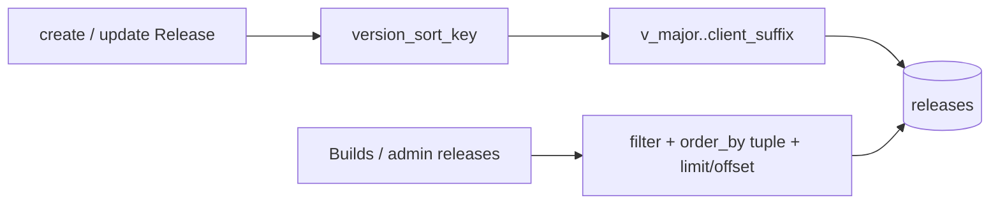

# Release semver sort keys in SQL

## Decision (locked)

Use **five explicit columns** on [`Release`](src/models/mod.rs) (not an opaque `sort_key` blob):

- `v_major`, `v_minor`, `v_patch`: `u64`
- `has_client_suffix`: `u64` (`0` / `1`) — avoids introducing `bool` into the Toasty model surface
- `client_suffix`: `String` (empty when GA plain)

SQL / Toasty order matching [`cmp_version_desc`](src/release_pkg.rs):

```text
ORDER BY v_major DESC, v_minor DESC, v_patch DESC,
         has_client_suffix DESC, client_suffix ASC
```

Toasty already supports multi-key order via a tuple (upstream example: `.order_by((age.desc(), name.asc()))`).

Source of truth for parsing stays [`version_sort_key`](src/release_pkg.rs). Derive columns from the first three numeric components (pad to 3); align Rust compare to the same first-three rule so SQL and `cmp_version_desc` never drift. Product versions today are `vX.Y.Z[-client]`.



## Schema

1. Migration `toasty/migrations/0008_release_version_sort.sql` + snapshot + [`toasty/history.toml`](toasty/history.toml):
   - `ADD COLUMN` the five fields `NOT NULL` with defaults (`0` / `''`)
   - No attempt to encode full semver in raw SQL backfill (too fragile)
2. After migrations, [`db::connect`](src/db.rs) calls a small `resync_release_sort_keys(db)` that loads all releases and `update()`s sort fields from `version` (table is tiny; pre-production OK). Seed upserts ([`upsert_ga_releases`](src/db.rs) / Acme private) must also set the columns on create/update.

## Application writes

Central helper in [`src/release_pkg.rs`](src/release_pkg.rs), e.g. `version_sort_fields(version) -> VersionSortFields`, plus unit tests that pin equality with `cmp_version_desc` order samples.

Every write path sets the five fields:

- [`src/app/admin/releases/new.rs`](src/app/admin/releases/new.rs) `create!`
- [`src/app/admin/releases/release_id.rs`](src/app/admin/releases/release_id.rs) `update` when `version` changes (always rewrite sort fields with version)
- [`src/db.rs`](src/db.rs) GA / Acme upserts
- Any test helpers that `create!(Release { ... })` ([`tests/integration_tests/common`](tests/integration_tests/common), builds/admin fixtures)

## List loaders (close the exception)

**Org Builds** — [`load_releases_for_org`](src/app/org/builds.rs) + page handlers (`builds.rs`, `release_ver.rs`):

- Keep SQL entitlement filters (`status`, `organization_id.in_list`, channel)
- Add `.order_by((v_major.desc(), v_minor.desc(), v_patch.desc(), has_client_suffix.desc(), client_suffix.asc()))`
- Replace full-set load + `sort_releases` + `page_slice` with:
  - `count()` (same filters) for pager
  - `.limit(BUILDS_PAGE_SIZE).offset(page_offset(...))` for the page
- Keep Rust `release_visible_to_org` as defense-in-depth on the **page** rows only (small)
- Remove hot-path dependence on `sort_releases` / in-memory catalogue sort (helper may remain for tests or disappear if unused)

**Admin Releases** — [`src/app/admin/releases.rs`](src/app/admin/releases.rs):

- Stop `Release::all()` + Rust sort + `page_slice`
- Same SQL order + `count` + `limit`/`offset`
- Delete-overlay target: load by id (or filter id on page); do not require full catalogue in memory

## Lint / docs / audit

- Update [`scripts/check_builds_entitlement.sh`](scripts/check_builds_entitlement.sh) and [`scripts/check_admin_releases.sh`](scripts/check_admin_releases.sh): require SQL `order_by` on sort columns + `limit`/`offset`; **forbid** `cmp_version_desc` / `page_slice` on those list hot paths (keep `cmp_version_desc` required in `release_pkg.rs` for the pure order contract).
- Update [`.cursor/skills/toasty/SKILL.md`](.cursor/skills/toasty/SKILL.md): remove “semver exception” for builds/admin releases; document sort columns + tuple `order_by`.
- Update [`.cursor/audits/vcp_architecture_toasty_query_debt_2026-08-02.md`](.cursor/audits/vcp_architecture_toasty_query_debt_2026-08-02.md) §3.4: exception **closed**.
- Touch smoke runbooks [`docs/runbooks/builds_entitlement_smoke_test.md`](docs/runbooks/builds_entitlement_smoke_test.md) and [`docs/runbooks/admin_releases_smoke_test.md`](docs/runbooks/admin_releases_smoke_test.md): note SQL version order / paging.

## Behavioral test pyramid (mandatory)

Extend existing filters `builds_entitlement` and `admin_releases` (prefer extend over new parallel harnesses):

| Layer | Deliverable |
|-------|-------------|
| **Unit** | `version_sort_fields` + `cmp_version_desc` agreement; pad/truncate-to-3; client suffix above plain; alpha suffix |
| **Invariants** | `check_*.sh` pins + `include_str` on loaders (order_by tuple, limit/offset, no hot-path `page_slice`/`sort_releases`); migration `0008` in history |
| **Proptest** | Random version corpora: SQL column tuple order matches `cmp_version_desc`; page_offset math unchanged |
| **Battle** | Parallel GET Builds / admin releases under concurrent creates with colliding numeric cores + distinct suffixes — stable order, no cross-tenant leak |
| **E2E** | Seed/create releases with known versions; assert HTML order on page 1 and page 2 (SQL paging); deny paths (member on `/admin/releases`, wrong org build) unchanged |
| **Smoke runbook** | Staging checklist line: version order + pager without reshuffle on publish toggle |

Denial paths already in those suites stay green (wrong org, anonymous, missing `releases_manage`).

## Validation gate

`just fmt` → fmt-check → clippy `-D warnings` → `scripts/check_builds_entitlement.sh` + `scripts/check_admin_releases.sh` (+ toasty migrations check) → `just test --test integration_tests -- builds_entitlement -- admin_releases` (and focused lib unit filters) with `--test-threads=1`.
