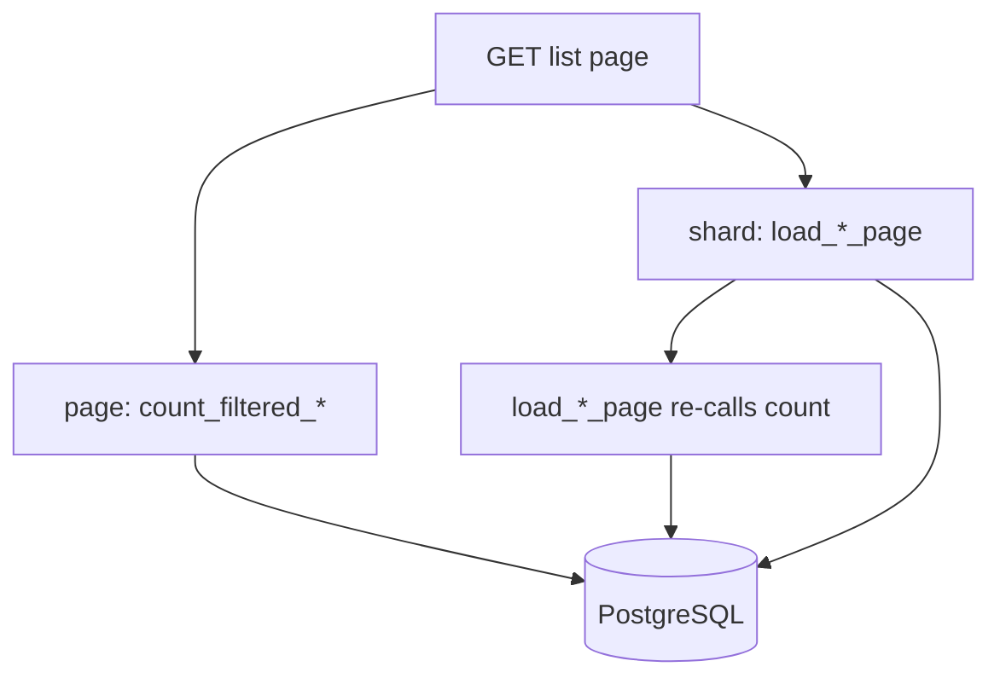

# Request-scoped domain SQL dedup (capacity lever)

## Problem

On authenticated list GETs, Topcoat renders **page + embedded search shard** in the **same** HTTP request / `Cx`. Auth is already deduped (`#[memoize]` on [`org_context`](src/auth.rs) / [`require_perms`](src/perms.rs)). Domain loaders are not:



Measured pattern today:

| Surface | Waste on one GET |
|---------|------------------|
| Org docs / org issues / admin issues | **2× COUNT** + 1× page rows |
| Admin companies | **2×** `load_company_cards_page` (page drops cards, keeps `total` only) → double search + hydrate |

Shard-only POSTs (`/_topcoat/shards/…`) are **separate** requests — out of scope for cross-request caching (must keep re-auth).

## Locked decisions

- **Scope v1:** list page+shard only — org docs, org issues, admin issues, admin companies. **Not** dashboard multi-COUNT consolidation (follow-up).
- **Mechanism:** Topcoat `#[memoize]` (request-scoped), same pattern as `require_org` — not a global cache, not sqlx.
- **Keys:** normalized filter strings (+ `org_id` / `page` as needed). Prefer `&str` / `String` / `u64` / `usize` over newtypes unless a filter struct already needs `Clone + Eq + Hash`.
- **No product behavior change:** same HTML, same page sizes, same denial 404s.

## Implementation

### 1. Org docs — memoize COUNT

In [`src/app/org/docs.rs`](src/app/org/docs.rs):

- Add `#[memoize] async fn count_filtered_docs_memo(cx, q: &str, cat: &str) -> usize` (normalize inside, or take already-normalized values from `DocsFilter`).
- Public/wrapper `count_filtered_docs` calls the memoized helper (`.clone()` / copy `usize`).
- Keep `load_filtered_docs_page` calling `count_filtered_docs` so page COUNT + shard recount share one execution.

### 2. Org issues — same pattern

In [`src/app/org/issues.rs`](src/app/org/issues.rs):

- `#[memoize]` count keyed by `(org_id, q, status)`.
- `load_filtered_issues_page` continues to go through that count helper.

### 3. Admin issues — count + org resolve

In [`src/app/admin/issues/search_shard.rs`](src/app/admin/issues/search_shard.rs) (and page caller in [`admin/issues.rs`](src/app/admin/issues.rs)):

- `#[memoize]` `resolve_org_id_sql` equivalent keyed by trimmed org hint (or thin `cx` wrapper).
- `#[memoize]` admin filtered COUNT keyed by `(org_id_opt, q, status)`.
- Page + shard both call these helpers before / inside the filtered query path.

### 4. Admin companies — memoize full page load

Worst case today in [`src/app/admin/companies.rs`](src/app/admin/companies.rs): page calls `load_company_cards_page` and discards cards; shard loads again.

- Add a `Cx`-facing wrapper in [`companies/load.rs`](src/app/admin/companies/load.rs) (or sibling):

```rust
#[memoize]
async fn company_cards_page_memo(cx: &Cx, q: &str, page: usize) -> (Vec<CompanyCard>, usize) { … }
```

- Page and shard both call it (clone result). One hydrate per `(q, page)` per request.
- Keep `load_company_cards_page(&mut Db, …)` as the SQL core if useful for non-`Cx` callers; memo wrapper owns `db(cx)`.

### 5. Hardening / docs

- Widen or add `scripts/check_request_sql_dedup.sh` (or extend [`check_toasty_filters.sh`](scripts/check_toasty_filters.sh)): pin `#[memoize]` on the four count/load helpers; pin companies page + shard both call the memo wrapper name.
- Update [`vcp_capacity_gisco_freebsd_2026-08-02.md`](.cursor/audits/vcp_capacity_gisco_freebsd_2026-08-02.md) §3.2 / §7: note list page+shard COUNT/hydrate dedup landed; dashboard fan-out still open.
- Short note in [`toasty_filters_smoke_test.md`](docs/runbooks/toasty_filters_smoke_test.md) or capacity-related runbook: Pass = list GET still correct; DEBUG should show one COUNT per filter key on list navigations.

## Pyramid (mandatory per surface)

Surface tag suggestion: `request_sql_dedup` (+ keep existing `docs_search` / `*_issues*` / `admin_companies` green).

| Layer | Deliverable |
|-------|-------------|
| **Unit** | Filter key normalization stable; `DocsFilter` / issue filter strings produce identical memo keys for equivalent inputs |
| **Invariants** | `check_*.sh` + `include_str` pins: `#[memoize]` on domain count/load helpers; page and shard call the **same** helper name; companies page must not call raw `load_company_cards_page` while shard uses another path |
| **Proptest** | Random `q`/`cat`/`status`/`page` corpora: normalize then key equality; page_offset math unchanged |
| **Battle** | Existing parallel list/shard battles stay green (`battle_parallel_*_search_shard_*`, companies/docs/issues pagination battles) |
| **E2E** | Existing list + live-search E2Es stay green; add focused asserts that list HTML still pages/searches (behavior). Runtime “COUNT ran once” is enforced by Topcoat memoize + source pins (no second query counter harness unless one already exists) |
| **Runbook** | Smoke note: DEBUG list GET shows single COUNT per filter; shard POST still re-auths and queries (separate request) |

Denial paths unchanged (wrong org / anon / missing perm → 404) — re-run existing denial E2Es as part of the filter.

## Validation gate

```bash
just fmt && rtk cargo fmt --all -- --check
rtk cargo clippy --all-targets -- -D warnings
bash scripts/check_toasty_filters.sh   # and new/extended dedup script
just test --test integration_tests -- request_sql_dedup
just test --test integration_tests -- docs_search
just test --test integration_tests -- org_issues_search
just test --test integration_tests -- admin_issues
just test --test integration_tests -- admin_companies
```

Prefer `just validate` before commit-bound hand-off.

## Out of scope

- Dashboard issue/doc COUNT consolidation
- Cross-request / global query cache
- Changing page sizes or shard debounce
- Dedup of Toasty pool health `simple_query("")` (unrelated keepalive)
