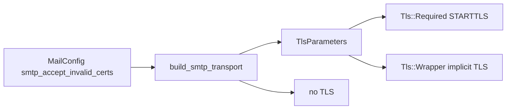

# Plan: `smtp_accept_invalid_certs`

## Decision

- Config key: `smtp_accept_invalid_certs` under `[mail]`, **default `false`** (`#[serde(default)]`).
- Applies to **`starttls` and `tls` only**. If set with `smtp_encryption = "plaintext"`, validation fails (flag is meaningless without a TLS handshake).
- **Production: allowed** (needed for local self-signed submission), with a **`tracing::warn!`** when building the transport if the flag is true. Not forbidden like plaintext.
- Names using `smtp_tls_*` are rejected (would collide with `smtp_encryption = "tls"` vs STARTTLS).

## Why not Topcoat-only

[`topcoat-mail` `SmtpTransportBuilder`](file:///Users/mnemonic/.cargo/registry/src/index.crates.io-1949cf8c6b5b557f/topcoat-mail-0.5.0/src/transport/smtp.rs) only exposes `port` / `credentials` / `timeout` / `build`. It does **not** call lettre’s `.tls(Tls::…)` or `TlsParametersBuilder::dangerous_accept_invalid_certs`.

lettre already supports the knob (`TlsParameters::builder(domain).dangerous_accept_invalid_certs(true)`).

## Implementation

### 1. Config

In [`src/config.rs`](src/config.rs) `MailConfig`:

```rust
#[serde(default)]
pub smtp_accept_invalid_certs: bool, // default false via bool::default
```

In `validate()` (mail section):

- Keep existing plaintext-in-production ban.
- If `smtp_accept_invalid_certs && smtp_encryption == Plaintext` → bail with a clear error.

Update TOML samples (explicit `false` for readability / invariants):

- [`config/default.toml`](config/default.toml)
- [`config/development.toml`](config/development.toml)
- [`config/testing.toml`](config/testing.toml)
- [`config/vcp.conf`](config/vcp.conf)

### 2. Transport builder ([`src/mailer.rs`](src/mailer.rs))

Add a **direct `lettre` dependency** in [`Cargo.toml`](Cargo.toml) aligned with Topcoat (`0.11`, features: `smtp-transport`, `tokio1`, `tokio1-rustls-tls`, `pool` — same stack as `topcoat-mail`).

Replace Topcoat `SmtpTransport::{starttls,relay,unencrypted}` construction with an internal builder that always sets TLS mode explicitly:

| `smtp_encryption` | lettre TLS mode |
|---|---|
| `plaintext` | no TLS (`builder_dangerous`) |
| `starttls` | `Tls::Required(params)` |
| `tls` | `Tls::Wrapper(params)` |

`params` from:

- `false` → `TlsParameters::new(host)` (verify)
- `true` → `TlsParameters::builder(host).dangerous_accept_invalid_certs(true).build()`

Wrap `AsyncSmtpTransport<Tokio1Executor>` in a small public/crate struct (e.g. `ConfiguredSmtpTransport`) that implements `topcoat::mail::Transport`:

- Assemble wire form via public `Mail::formatted(cx)` (keeps Topcoat MIME / views).
- Build `lettre::address::Envelope` from `mail.from` / `to` / `cc` / `bcc` (`Mailbox::address()`).
- Deliver with `send_raw`.
- Build `Receipt` from the `Message-ID` header in the formatted bytes (or declared `mail.message_id()`).

Change `build_smtp_transport` return type from `SmtpTransport` to `ConfiguredSmtpTransport` (still `impl Transport + 'static` for [`src/app.rs`](src/app.rs)). Emit warn when flag is true.

Keep helper `encryption_mode` for tests; add `accepts_invalid_certs(cfg) -> bool` if useful for pins.

### 3. Docs / ops

- Extend [`docs/runbooks/magic_links_smoke_test.md`](docs/runbooks/magic_links_smoke_test.md): document the key, default false, when to set true for self-signed submission, and that it applies to both starttls and tls.
- Comment in `config/vcp.conf` next to `[mail]`.

### 4. Test pyramid (mandatory)

| Layer | Deliverable |
|---|---|
| **Unit** | Config default false; validate rejects `plaintext` + `true`; `build_smtp_transport` succeeds for starttls/tls with true/false (and plaintext + false); warn path covered by flag getter. Update existing `MailConfig { … }` literals in [`src/mailer.rs`](src/mailer.rs) / [`src/config.rs`](src/config.rs) tests. |
| **Invariants** | Extend [`tests/integration_tests/magic_link_invariants_test.rs`](tests/integration_tests/magic_link_invariants_test.rs) (or a focused `mail_*_invariants_test.rs`): every sample TOML contains `smtp_accept_invalid_certs`; `mailer.rs` pins `dangerous_accept_invalid_certs` + both `Tls::Required` and `Tls::Wrapper`; no `smtp_tls_insecure` / `smtp_tls_verify` names. Optional pin in [`scripts/check_auth_tenant.sh`](scripts/check_auth_tenant.sh) / companies check if they already grep mail wiring. |
| **Proptest** | In `config.rs` tests: arbitrary bool round-trips through TOML/`MailConfig`; default when key absent is false; invalid combo plaintext+true always fails validate. |
| **Battle** | Parallel threads calling `build_smtp_transport` for starttls/tls × true/false (Barrier), assert all `Ok`. |
| **E2E** | Integration test with a **minimal local SMTP stub** (self-signed via `rcgen`): (1) implicit TLS (`tls`) — connect with flag true succeeds handshake/SMTP greeting path far enough for `send_raw` or a probe connect helper; flag false fails cert verify; (2) STARTTLS stub (220 → EHLO → 250 STARTTLS → STARTTLS → 220 → TLS upgrade) — same true/false matrix. No dependency on external Mailpit TLS. |
| **Smoke runbook** | Section in magic-links (or FreeBSD pkg) runbook: set `smtp_accept_invalid_certs = true` against self-signed submission, send a magic link, Pass/Fail. |



## Validation (after implementation)

- `just fmt` + `just fmt-check`
- `rtk cargo clippy --all-targets -- -D warnings`
- Focused tests: mailer/config + new E2E filter, `-- --test-threads=1`
- Touch structural `check_*.sh` if pins added there

## Out of scope

- Trusting a custom CA file (only accept-invalid, not `smtp_ca_file`)
- Changing Topcoat upstream
- Forbidding the flag in production