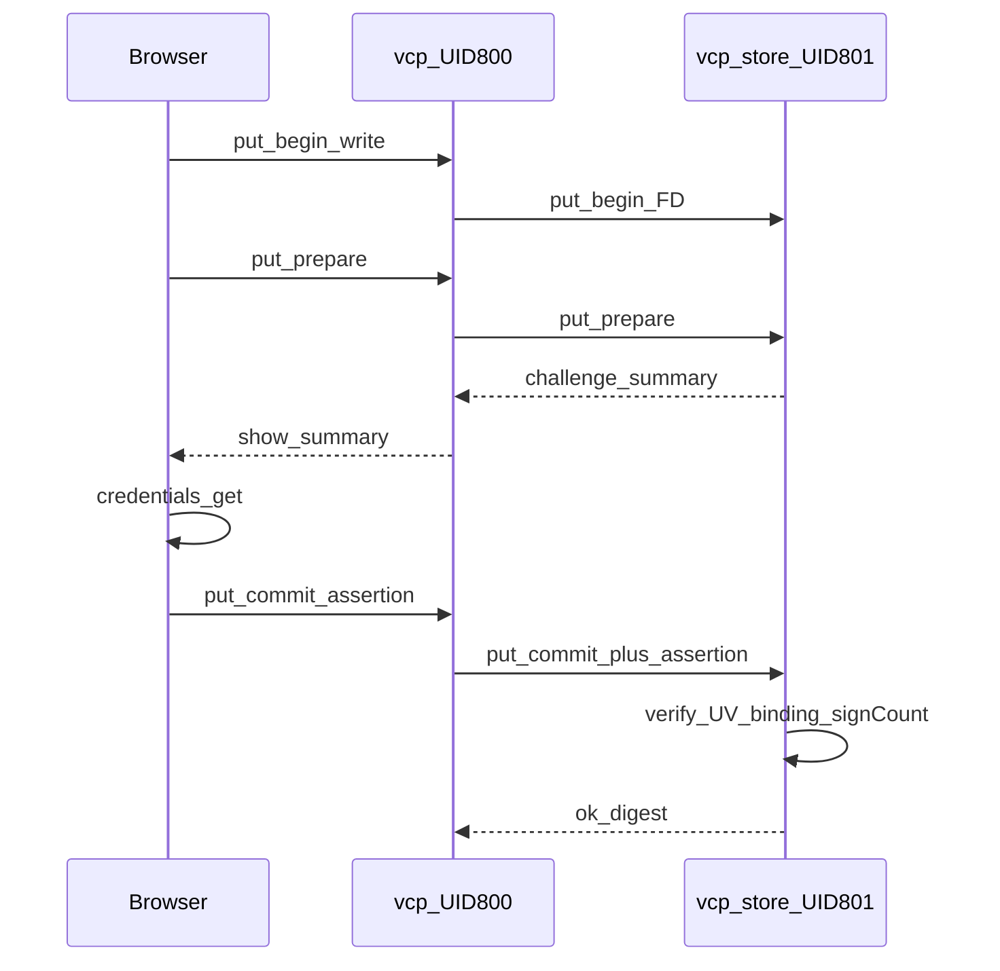

# Implémentation Storage Helper Architecture 1.2

## Contrat (déjà figé — ne pas rouvrir)

- Normatif : [`docs/technical/VCP_Storage_Helper_Architecture_EN(1.2).md`](docs/technical/VCP_Storage_Helper_Architecture_EN(1.2).md)
- ADR [002](docs/adr/002-storage-webauthn-ceremony-channel-c1.md) C1 + mitigations ; **C2 hors scope**
- ADR [003](docs/adr/003-ctap2-enrol-revoke-asymmetry.md) E1 web PENDING / E2 CLI ACTIVE ; revoke dashboard only
- ADR [004](docs/adr/004-webauthn-sign-count-policy.md) `webauthn_strict_sign_count` default `false`
- Phase A (docs/ADR) **déjà livrée** (`5f8cb1a`). Ce plan = **B → F**.

## État du code aujourd’hui

- Helper SoT digests + verify-on-read : OK (`src/storage/*`, `vcp-store`)
- Upload release monolithique : `put_begin` → write → `put_commit` dans [`src/app/admin/releases/new.rs`](src/app/admin/releases/new.rs)
- **Absent** : `put_prepare`, `challenge_begin`, assertions, tables `webauthn_*`, CLI `ctap2`, UI `/admin/ctap2`, codes d’erreur WebAuthn
- Pyramide storage existante à **étendre** (pas un second harness) : `storage_*` + `scripts/check_storage.sh` + runbooks storage

## Décisions d’implémentation (verrouillées)

| Sujet | Choix |
|-------|--------|
| Vérif WebAuthn | Crate `webauthn-rs` (+ core) en **chemin sync** dans le helper (D6) ; pas de réseau sortant |
| Audit | Append-only JSONL `blob_path/audit/webauthn.log` (hors écriture UID 800) |
| PENDING enrol | Postgres (UX) **et** stage helper SQLite `status=pending` via IPC `ctap2_enrol_stage` ; seul `ctap2 approve` passe ACTIVE |
| Fingerprint | `hex(SHA-256(credential_id \|\| public_key_cose))` ; approve échoue si mismatch |
| Cérémonie navigateur | Petit asset JS first-party (pipeline Topcoat / hash CSP) : `credentials.create` / `credentials.get` → POST assertion au portal (C1) |
| Casbin | `ctap2, manage` → `ctap2_manage` ; rail + page `/admin/ctap2` ; deny → 404 |
| Conf | Knobs 1.2 dans [`config/vcp-store.conf`](config/vcp-store.conf) + `StoreHelperConfig` ; boot `--production` refuse `webauthn_required=false` |
| Env | development spawn : `webauthn_required=true` ; testing inline : `false` (CI) ; soft authenticator **uniquement** dans les tests unit/E2E WebAuthn |
| Hors scope | C2, attestation hardware-only, Capsicum FreeBSD au-delà de l’existant |

---

## Phase B — Fondation helper (protocole, SQLite, conf, verify)

**Fichiers pivots :** [`src/storage/protocol.rs`](src/storage/protocol.rs), [`src/storage/error.rs`](src/storage/error.rs), [`src/storage/meta_db.rs`](src/storage/meta_db.rs), nouveau `src/storage/webauthn.rs` (+ audit), [`src/config.rs`](src/config.rs), [`src/bin/vcp_store.rs`](src/bin/vcp_store.rs), confs.

1. Étendre `StorageRequest` / `StorageResponse` : `PutPrepare`, `ChallengeBegin`, champs `assertion` / `challenge` / `summary` / `rp_id` / `allow_credentials` ; `Ctap2EnrolStage`, `Ctap2Revoke`.
2. Codes fermés : `webauthn_required`, `webauthn_invalid`, `webauthn_expired`, `challenge_unknown`, `object_modified`.
3. Migrer `meta.sqlite` : `webauthn_credentials` (ACTIVE/PENDING via `activated_at` ou `status` + `revoked_at`), `webauthn_challenges` (`summary`, `binding_json`, TTL, `consumed_at`).
4. Module verify : UV required ; consume one-shot ; sign_count (ADR 004) ; purge TTL sur `put_prepare` / `challenge_begin`.
5. Boot guard production + knobs conf (dev/testing/prod templates).
6. Refactor `put_commit` release : si `webauthn_required`, exiger assertion + challenge consommé ; image commit inchangé (pas de WebAuthn).

**Pyramide B**
- Unit : fingerprint, UV manquant, expire, consume double, strict vs permissive sign_count, purge, boot refuse.
- Invariants : pins doc 1.2 + ADR 002–004 + knobs conf + codes d’erreur dans `check_storage.sh` / `storage_invariants_test.rs`.
- Proptest : binding JSON / summary canonique stables ; fingerprint hex.
- Battle : races consume challenge + purge concurrente.
- E2E helper inline : gated op sans assertion → `webauthn_required` ; avec soft key → OK.

---

## Phase C — Release prepare/commit + UI summary (C1)

1. Engine : `put_prepare` hashe le `.partial`, compare digest client, **pas** de `renameat`, émet challenge + `summary`.
2. `put_abort` drop challenge lié.
3. Client API : `put_prepare_release` / `put_commit_release(..., assertion)`.
4. Page [`admin/releases/new.rs`](src/app/admin/releases/new.rs) : flux 3 étapes + **affichage obligatoire du `summary` helper** avant `credentials.get` (ADR 002).
5. Asset JS cérémonie + procédure/form POST assertion.

**Pyramide C**
- Unit engine prepare/commit.
- Invariants : UI contient le `summary` serveur (pas un label inventé) ; pas de `rename` avant verify.
- E2E : publish release (testing bypass) + chemin WebAuthn soft-key ; deny sans assertion.
- Étendre [`docs/runbooks/storage_helper_smoke_test.md`](docs/runbooks/storage_helper_smoke_test.md) (section C1 release).

---

## Phase D — Deletes digest-bound

1. `challenge_begin` pour `delete` release/image et `delete_org` ; binding `sha256` si SoT existe.
2. Exécution : drift / disparition avec digest lié → `object_modified` ; idempotent si absent sans digest.
3. Brancher UI delete release / images / delete_org (surfaces admin existantes) : challenge → summary → assertion → delete.

**Pyramide D**
- Unit + proptest binding.
- Battle : replace blob entre challenge et delete → `object_modified`.
- E2E denial + happy path ; runbook delete + `delete_org`.

---

## Phase E — CTAP2 dashboard + CLI (ADR 003)

1. Casbin : `p, role:admin, ctap2, manage` dans [`config/access/vcp_policy.csv`](config/access/vcp_policy.csv) + [`src/perms.rs`](src/perms.rs) + drift tests.
2. Nav : entrée **CTAP2** après Orgs dans [`rail.rs`](src/app/_components/rail.rs) / [`nav.rs`](src/nav.rs) ; page `/admin/ctap2`.
3. E1 : `credentials.create` → PENDING Postgres + IPC `ctap2_enrol_stage` → afficher fingerprint + instructions CLI.
4. CLI sous-commandes (parse argv ou clap minimal) : `vcp-store ctap2 pending` | `ctap2 approve --fingerprint …` (fail closed mismatch).
5. Revoke : dashboard → IPC `ctap2_revoke` ; **pas** de CLI revoke ; audit.

**Pyramide E**
- Unit fingerprint mismatch / approve.
- Invariants : pas d’activate via portal seul ; revoke sans CLI ; pins ADR 003.
- E2E : enrol PENDING visible ; approve CLI active ; revoke ; anonymous/wrong-role → 404.
- Battle : revoke burst (comportement + audit lines).
- Runbook breakglass E1+E2.

---

## Phase F — Audit, alertes, runbooks, polish ops

1. Audit JSONL complet (issue/consume/verify fail/success/revoke/approve).
2. Hooks alert (tracing structured `ALERT` / compteurs) pour `delete_org` et bursts revoke (ops ; pas de pager externe obligatoire).
3. Runbooks : cérémonie C1, `ctap2 pending`, breakglass, backup joint `meta.sqlite`+blobs+credentials.
4. Invariants finaux : liens ADR dans docs ; production conf `webauthn_required=true` ; `strict_sign_count=false` par défaut.

---

## Ordre de livraison / PRs suggérés

1. **PR-B** fondation (mergeable sans UI) — tests B verts + `just validate` storage
2. **PR-C** release gated + summary UI
3. **PR-D** deletes
4. **PR-E** CTAP2 UI/CLI/Casbin
5. **PR-F** audit/runbooks/alerts (peut chevaucher E si audit déjà amorcé en B)

Chaque PR : `just fmt` → clippy `-D warnings` → `scripts/check_storage.sh` (+ `check_auth_tenant` si Casbin) → tests filtrés `--test-threads=1` → élargir avant hand-off.

## Definition of done (train complet)

- Toutes les ops 1.2 §6.1 / §7 câblées ; image put **sans** WebAuthn.
- ADR 002–004 respectés dans le code (pas seulement docs).
- Pyramide complète par surface (unit / invariants / proptest / battle / E2E / runbook).
- CI testing : bypass WebAuthn ; pas de refus boot prod avec bypass.
- C2 non implémenté ; aucun secret / clé privée dans le repo.
