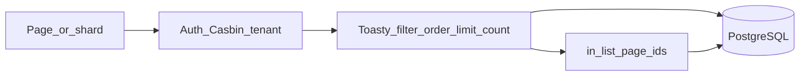

# Fix Toasty query debt (audit 3.1–3.5)

## Context

Architecture debt documented in [`.cursor/audits/vcp_architecture_toasty_query_debt_2026-08-02.md`](.cursor/audits/vcp_architecture_toasty_query_debt_2026-08-02.md) and enforced by [`.cursor/skills/toasty/SKILL.md`](.cursor/skills/toasty/SKILL.md): hot paths must not `Model::all().exec()` then filter/sort/`page_slice` in Rust when Toasty 0.9 can express the work in SQL.



**Locked decisions**

- **No `sqlx`** for this campaign.
- **Companies email search** kept via a **two-phase** Toasty approach (org-field `ilike` OR membership/user email `ilike` → union of org ids → page), not a product regression and not a free SQL join (models have no `has_many` today).
- **Release version order** stays Rust [`cmp_version_desc`](src/release_pkg.rs) after a **SQL-bounded** visible set (status + entitlement [+ channel]). Full SQL `ORDER BY version` would break semver/client-suffix ordering. Document as intentional until a future `sort_key` column.
- **Admin org dropdowns** (release compose): load client orgs with SQL filters (`slug` ≠ reserved) + `order_by(name)` — not `User::all`; full org catalogue for staff compose is acceptable once reserved is excluded in SQL.

## Shared infrastructure (do first)

Add small helpers used by all waves:

| Helper | Location | Role |
|--------|----------|------|
| `ilike_contains(needle) -> String` | new `src/sql_search.rs` (or under `list_page.rs`) | Escape `%`/`_`/`\` then wrap `%…%` for `.ilike_with_escape(..., '\\')` |
| `page_offset(page, page_size) -> usize` | [`src/list_page.rs`](src/list_page.rs) | `(page-1)*size` for `.offset` (requires prior `.limit`) |
| `users_by_ids` / `orgs_by_ids` | thin fns near `db` or `companies_accounts` | `User`/`Organization` `.filter(id.in_list(ids))` — empty ids → empty vec, no `all()` |

Unit + proptest on escape/`ilike_contains` (needles with `%`, `_`, empty).

Widen [`scripts/check_toasty_filters.sh`](scripts/check_toasty_filters.sh) progressively per wave (not a single big-bang at the end): require `in_list`/`organization_id`/`status` on builds loader; require `.count()` in seats; require `.limit(` + `.offset(` on list loaders; forbid naked `User::all().exec` / `Organization::all().exec` in listed hot paths (allowlist seed/`db.rs` only).

Update [`docs/runbooks/toasty_filters_smoke_test.md`](docs/runbooks/toasty_filters_smoke_test.md) and per-surface runbooks (builds, issues, docs, companies) with SQL-path Pass/Fail notes.

---

## Wave A — 3.1 High: release entitlement SQL (+ related callers)

**Target:** [`src/app/org/builds.rs`](src/app/org/builds.rs) `load_releases_for_org`, plus dashboard / download / ephemeral / detail version lookups that still `Release::all()` then Rust `release_visible_to_org`.

**SQL predicate (client org):**

```rust
Release::all()
  .filter(Release::fields().status().eq(RELEASE_STATUS_PUBLISHED))
  .filter(Release::fields().organization_id().in_list([RELEASE_GA_ORG_ID, org_id]))
  // + optional channel.eq
```

**Reserved `vauban`:** `status.eq(PUBLISHED)` only (any `organization_id`). Keep `release_visible_to_org` as defense-in-depth + unit oracle, not the sole net.

**Also:** [`src/app/org.rs`](src/app/org.rs) dashboard releases; [`builds/download.rs`](src/app/org/builds/download.rs), [`ephemeral.rs`](src/app/org/builds/ephemeral.rs), [`release_ver.rs`](src/app/org/builds/release_ver.rs) — version lookup must include the same status + org `in_list` (or reserved published-only) so foreign private rows never enter the process.

**Pagination (3.4 partial):** after SQL filter, keep `sort_releases` + `page_slice` on the **visible** set only (bounded). Do not load other tenants’ HIDDEN/private rows.

### Pyramid — surface `builds_entitlement` (+ `toasty_filters`)

| Layer | Deliverable |
|-------|-------------|
| Unit | Existing `release_visible_to_org` cases; add helper that builds the SQL visibility branches (reserved vs client) |
| Invariants | `check_toasty_filters.sh` + `check_builds_entitlement.sh`: pin `organization_id` + `in_list` (or `.or`) + `status` inside `load_releases_for_org`; pin download/ephemeral version paths include org net |
| Proptest | Visibility matrix: for random `(org_id, release_org_id, status, slug)` agree Rust oracle ↔ “would be in SQL result set” |
| Battle | Existing parallel list/download; ensure no regression under contention |
| E2E | Keep/extend `e2e_org_private_release_hidden_from_other_org`; wrong-org detail/download 404 |
| Runbook | [`builds_entitlement_smoke_test.md`](docs/runbooks/builds_entitlement_smoke_test.md) §B note: SQL tenant net |

---

## Wave B — 3.5 Low: `membership_count` via `.count()`

**Target:** [`src/seats.rs`](src/seats.rs)

```rust
Membership::all()
  .filter(Membership::fields().organization_id().eq(organization_id))
  .count()
  .exec(db)
  .await? as usize
```

### Pyramid — surface `admin_companies` / seats

| Layer | Deliverable |
|-------|-------------|
| Unit | Seat boundary unchanged; optional async unit if harness allows |
| Invariants | `check_admin_companies.sh` or `check_toasty_filters.sh`: `membership_count` must call `.count()` and must not use `rows.len()` after `exec` |
| Proptest | Existing seat boundary props |
| Battle | Existing `battle_parallel_seat_helper_reads` |
| E2E | Existing seat / over-cap create paths |
| Runbook | Note in companies smoke that seat count is SQL `COUNT(*)` |

---

## Wave C — 3.3 + 3.4: issues and docs lists/shards

### Org + admin issues

Refactor loaders so status / org / `q` push into Toasty where possible:

- **Tenant:** already `organization_id.eq` on org side — keep as hard gate.
- **Admin org chip:** resolve slug→id via `Organization::filter(slug.eq)` (or id parse), then `Issue::fields().organization_id().eq(id)` — not `Organization::all()` for the filter alone.
- **Status:** `.filter(status.eq(...))` when chip non-empty (exact stored labels).
- **Search `q`:** `.filter(key.ilike(pat).or(title.ilike(pat)))` with shared `ilike_contains`.
- **Sort:** `.order_by(updated_at.desc())`.
- **Page:** `.limit(LIST_PAGE_SIZE).offset(page_offset(...))` + separate `.count()` with the same filters for pager totals.
- Retire Rust `issue_matches_*` on the hot path (keep as unit oracles / proptest mirrors if useful).

Files: [`src/app/org/issues.rs`](src/app/org/issues.rs), [`search_shard.rs`](src/app/org/issues/search_shard.rs), [`src/app/admin/issues.rs`](src/app/admin/issues.rs), [`admin/.../search_shard.rs`](src/app/admin/issues/search_shard.rs), helpers [`src/issues_search.rs`](src/issues_search.rs).

### Org docs

[`load_filtered_docs`](src/app/org/docs.rs) + [`docs/search_shard.rs`](src/app/org/docs/search_shard.rs): keep published (+ category) SQL; add `title`/`summary` `ilike` OR; `order_by(updated_at.desc)`; `limit`/`offset`/`count`. Drop Rust `text_matches_query` on hot path.

### Admin docs list (3.4)

[`src/app/admin/docs.rs`](src/app/admin/docs.rs): replace `DocArticle::all()` + sort + `page_slice` with `order_by(updated_at.desc).limit.offset` + `.count()`.

### Pyramid — surfaces `portal_issues` / `admin_issues_*` / `docs_search_*` / `toasty_filters`

Per surface: unit (pattern escape + filter builders), invariants (scripts pin `ilike`/`limit`/`offset`/`count`, no naked `Issue::all().exec` on shard without filters), proptest (ilike pattern escaping; page offset math), battle (parallel shard POSTs), E2E (search + page + denial 404), runbook sections for SQL search/paging.

Update existing `check_*_search_shard.sh` pins that currently **require** `page_slice` so they accept SQL paging (pin `.limit` / `.offset` instead of mandating in-memory slice).

---

## Wave D — 3.2 + 3.3 + 3.4: companies + display lookups

### Admin companies list + shard

Today: `Organization::all` + `Membership::all` + `User::all` then Rust match + `page_slice`.

**Empty `q`:**

1. `Organization` filter exclude reserved slug + `order_by(name.asc)` + `count` / `limit`/`offset`.
2. For **page org ids only**: `Membership::filter(organization_id.in_list(page_ids))`, then `User::filter(id.in_list(user_ids))`.

**Non-empty `q` (two-phase):**

1. Org-field match: `ilike` OR across name, slug, contact_name, contact_email, vat, address (+ exclude reserved).
2. Email match: `User::filter(email.ilike(pat))` → ids; `Membership::filter(user_id.in_list(user_ids))` → org ids.
3. Union org ids → load those orgs (`id.in_list`) → sort by name → `limit`/`offset` (or SQL `in_list` + `order_by` + limit/offset if Toasty accepts) → same membership/user hydration as empty-q for the page only.

Files: [`src/app/admin/companies.rs`](src/app/admin/companies.rs), [`search_shard.rs`](src/app/admin/companies/search_shard.rs), [`company_id.rs`](src/app/admin/companies/company_id.rs) `load_org_emails`, [`src/companies_accounts.rs`](src/companies_accounts.rs) `sync_org_accounts` (replace `User::all` with membership user ids / email `in_list`).

### Display lookups elsewhere (3.2)

After page/detail ids known: admin/org issue shards and `issue_key` pages, admin releases list labels — `User`/`Organization` via `in_list` / `get_by` / `filter(slug)`, never full table for a handful of labels.

### Admin releases list (3.4 + 3.2)

[`src/app/admin/releases.rs`](src/app/admin/releases.rs): SQL load all releases is still “global staff catalogue” but apply `order_by` only if safe; **keep Rust `cmp_version_desc` + page_slice** on staff set (same semver exception as builds). Hydrate target org labels with `orgs_by_ids` for the **page** only. Compose dropdowns: orgs excluding reserved, ordered by name (no `User::all`).

### Dashboard cousins

[`src/app/org.rs`](src/app/org.rs): published doc count via `.filter(status).count()`; issue open/in_analysis counts via filtered `.count()`; releases via Wave A loader (not raw `all`).

### Pyramid — `admin_companies*` / `admin_releases*` / account sync

Full six layers: especially E2E search-by-account-email still works; invariants forbid `User::all().exec` in companies list/shard/sync; battle parallel companies shard; runbook §D search notes SQL two-phase.

---

## Wave E — hardening, docs, validation gate

1. Finish expanding [`check_toasty_filters.sh`](scripts/check_toasty_filters.sh) + [`toasty_filters_*` tests](tests/integration_tests/) so the campaign surface is pinned (entitlement SQL, seats `.count()`, list `limit`/`offset`, no hot-path `User::all`/`Organization::all`).
2. Align [`web-stack`](.cursor/skills/web-stack/SKILL.md) / [`list-pagination.mdc`](.cursor/rules/list-pagination.mdc) examples with the semver exception for releases only.
3. Update audit file status section to “remediated” with wave notes.
4. Validation: `just fmt` + `fmt --check`, `clippy -D warnings`, all touched `check_*.sh`, focused filters then widen:

```bash
just test --test integration_tests -- 'builds_entitlement|toasty_filters|admin_companies|admin_issues|docs_search|portal_issues|admin_docs|admin_releases|auth_tenant' -- --test-threads=1
```

Prefer `just validate` before commit-bound hand-off.

---

## Out of scope (explicit)

- Audit 3.6 login rate limiter store, 3.8 magic links/SMTP, 3.9 `unwrap` triage, shard debounce/rate-limit (audit #6).
- Adding Toasty `has_many` relations / schema redesign.
- Release `sort_key` DB column (follow-up if catalogues grow large).
- Changing product page sizes (`LIST_PAGE_SIZE` / `COMPANIES_PAGE_SIZE` / `BUILDS_PAGE_SIZE`).

## Implementation order (suggested PRs or sequential commits)

1. Shared helpers + Wave A (security) + Wave B (small)  
2. Wave C (issues + docs)  
3. Wave D (companies + lookups + admin releases/docs/dashboard)  
4. Wave E (lint widen + runbooks + audit status)

Each wave ships its pyramid layers before the next; do not leave “invariants later”.
