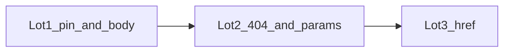

# Topcoat 0.5.0 → 0.6.2 upgrade

Follow [`.cursor/skills/topcoat/references/UPGRADE-0.6.md`](.cursor/skills/topcoat/references/UPGRADE-0.6.md). Pin today is **0.5.0** ([`Cargo.toml`](Cargo.toml), [`Justfile`](Justfile) `topcoat_cli_version`). Target **0.6.2** (not 0.6.0 — need discover rewrite + `await` in `$()` + control-flow binding fix).

**Hard rule:** the pin bump and the HTTP body cap ship in the **same** lot. Topcoat 0.6 defaults `Multipart`/`Form`/`Json` to **2 MiB**. Without a raised `BodyLimit`, admin pkg publish, `validate-pkg`, org images, and issue screenshots return **413** and those features are dead.



**Config (Lot 1, not a magic number in Rust):** add `[server] max_request_body_mib` (integer MiB) to [`config/vcp.conf`](config/vcp.conf), [`config/default.toml`](config/default.toml), [`config/development.toml`](config/development.toml), [`config/testing.toml`](config/testing.toml). Wire in [`src/config.rs`](src/config.rs) `ServerConfig` with `default_max_request_body_mib() -> 2048` (matches `storage.max_artifact_bytes` = 2 GiB).

On the router in [`src/app.rs`](src/app.rs):

```rust
BodyLimit::max(cfg.server.max_request_body_bytes()). // mib * 1024 * 1024
```

Apply **globally** (no hardcoded `.at("/admin/releases")` sizes). Helper quotas stay `storage.max_artifact_bytes` / `max_image_bytes`.

**Validate at load:** `max_request_body_mib >= 1` and `max_request_body_mib * 1 MiB >= max(storage.max_artifact_bytes, storage.max_image_bytes)` so an operator cannot set 8 MiB HTTP + 2 GiB artifact and silently break pkgs. 413 tests use `test_router_with_config` with a tiny pair (e.g. 1 MiB HTTP + 512 KiB artifact).

**Out of scope:** `websocket` / `sse` / `datastar`; vendoring `topcoat-ui`; switching [`src/tls/serve.rs`](src/tls/serve.rs) to `topcoat::start` or Axum `TowerService`; rewriting [`src/list_page.rs`](src/list_page.rs) / `?page=N` SQL; Toasty schema; `sitemap` feature unless a public sitemap is requested later.

---

## Lot 1 — Pin, mechanical compile, assets, CSRF, BodyLimit

Must leave VCP bootable and uploads working.

- Bump facade + CLI to **0.6.2** together. `ensure-topcoat` installs the matching CLI first (old CLI writes `target/assets`; 0.6 `AssetBundle::load()` only reads **next to the binary**).
- Assets: keep packaged [`AssetBundle::load_dir`](src/app.rs) (`package_root/assets`). Local/test: follow exe-adjacent (`target/{debug,release,test-profile}/assets`). Update [`Justfile`](Justfile) `ensure-asset-bundle` / `just bundle` / `just test`, [`pkg/build-pkg.sh`](pkg/build-pkg.sh), and runbooks that still say `target/assets` ([`docs/runbooks/freebsd_pkg_smoke_test.md`](docs/runbooks/freebsd_pkg_smoke_test.md), [`docs/runbooks/http_edge_smoke_test.md`](docs/runbooks/http_edge_smoke_test.md)).
- Mechanical (will not compile otherwise):
  - [`src/app.rs`](src/app.rs) `security_headers`: `&mut CxBuilder` → `&Cx`; `next.run(&cx, body)`.
  - CSRF: drop `SessionConfig::trust_origin`; `.origin_policy(OriginPolicy::new().trust_origins(public_origins))`. Never `dangerous_disable`.
  - All `#[path_param]` → `path_param!(…)` (table in the playbook: `Org`, `Doc`, `ReleaseVer`, `ImageFile`, `IssueKey`, `CompanyId`, `ReleaseId`).
  - `#[memoize(as_ref)]` on `session_user`, `org_context`, `resolve_org_id_memo`.
  - Imports: `router::request::*` / `router::response::*` (`IntoResponse`, `Response`, `Bytes`, `FromRequest`) in `src/app.rs`, `src/tls/access_log.rs`, admin companies modules.
- Register `BodyLimit::max(cfg.server.max_request_body_bytes())` on every router builder path (prod + `router_with_mail` used by tests).
- Update [`scripts/check_auth_tenant.sh`](scripts/check_auth_tenant.sh) + [`tests/integration_tests/auth_tenant_invariants_test.rs`](tests/integration_tests/auth_tenant_invariants_test.rs): pin `OriginPolicy` / `trust_origins` / `max_request_body_mib`; still forbid `dangerous_disable`.
- New `scripts/check_topcoat_0_6.sh` (or extend an existing checker): no `#[path_param]`, no `CxBuilder`, no `trust_origin(`, `BodyLimit` + `max_request_body_mib` present.
- Refresh skills pin lines (`topcoat` / `web-stack` / `UPGRADE-0.6.md` status = in progress / done after the lot).

**Pyramid (Lot 1):**

- **Unit:** `ServerConfig` parse / default 2048 / reject `0` / reject HTTP cap below artifact bytes; `max_request_body_bytes()` math.
- **Invariants:** auth-tenant + new 0.6 checker; config files all declare `max_request_body_mib`; Justfile/pkg look at exe-adjacent assets.
- **Proptest:** random valid MiB (>= ceil(artifact/1MiB)) vs invalid (0, HTTP < artifact).
- **Battle:** parallel multipart publish/validate under the raised cap (extend [`tests/integration_tests/admin_releases_battle_test.rs`](tests/integration_tests/admin_releases_battle_test.rs)); parallel tiny-cap 413 flood.
- **E2E:** existing [`admin_releases_e2e_test.rs`](tests/integration_tests/admin_releases_e2e_test.rs) / storage / issues multipart **must stay green**; add 413 when body > configured MiB; login + org dashboard still render (assets resolve).
- **Runbook:** section on `max_request_body_mib` vs helper quotas + CLI/bundle path in [`docs/runbooks/http_edge_smoke_test.md`](docs/runbooks/http_edge_smoke_test.md) or a short `docs/runbooks/topcoat_0_6_smoke_test.md`.

Widen after the lot: `auth_tenant_*`, `admin_releases_*`, `storage_*`, `portal_issues_*`, `portal_shell_*`.

---

## Lot 2 — Catch-all 404, typed ephemeral params, concurrent-render review

- `not_found!("/")` (and `/admin` if needed) so unmatched URLs still hit layouts. Brand via `downcast_ref::<NotFoundError>()` in the root layout ([`src/app.rs`](src/app.rs) `root_layout`). 0.6 no longer runs layouts on bare 404/405.
- Audit path-scoped layers: `RouterBuilder::build()` **panics** if a layer matches no route. Root `security_headers` stays pathless.
- [`src/app/org/builds/ephemeral.rs`](src/app/org/builds/ephemeral.rs): replace `raw_path_params` with `path_param!(eph_token); path_param!(eph_pkg);` (0.6 allows more than one declaration per module).
- Review `for` loops that instantiate `#[component]` with per-row I/O. Concurrent render fires **all** iterations at once — keep SQL paging; do not turn list rows into N DB components. Document any hot spots in the skill; no `list_page.rs` rewrite.

**Pyramid (Lot 2):**

- **Unit:** 404 helper / `NotFoundError` downcast shape; ephemeral param parse happy/sad.
- **Invariants:** `not_found!` registered; no `raw_path_params` on the ephemeral route; portal_shell still `slot: Result`.
- **Proptest:** random unmatched paths (no existing route prefix collision) → 404 + chrome markers.
- **Battle:** parallel unknown-URL GETs; parallel ephemeral download GETs.
- **E2E:** unknown `/no-such-page` and `/{org}/no-such` return 404 **with** root/org chrome (not a bare router 404); ephemeral download still works.
- **Runbook:** one Pass/Fail line on branded 404 + ephemeral URL in the 0.6 smoke runbook.

Extend [`portal_shell_*`](tests/integration_tests/portal_shell_e2e_test.rs) and builds/ephemeral e2e if present.

---

## Lot 3 — `href!` everywhere (portal URLs)

User choice: adopt `href!` on **all** in-app links, redirects, and mail URLs — not only new code.

- Every `see_other("…")` / `redirect("…")` / `<a href="/…">` that targets a `#[page]` / `#[route]` becomes `href!(handler, params…).query(…).resolve(cx)` (or in-view `href=(href!(…))`).
- Dynamic builders ([`pager.rs`](src/app/_components/pager.rs), chips) take an `Href` / resolved string from the page; do not keep a parallel hand-written path table.
- Mail bodies that embed portal URLs use `.absolute().resolve(cx)` (router already has `base_url` / `public_origins`).
- Leave alone: `asset!` / favicon / Tailwind / runtime script URLs, external URLs, `mailto:`, `#` only.
- Parameter types need `Display` (playbook). Wrong type panics at resolve — catch in unit/e2e, not in production logs as silent wrong URLs.

Do **not** enable `sitemap` unless asked.

**Pyramid (Lot 3):**

- **Unit:** `href!` resolve for org/admin/login/logout/mail landing paths (including query `error=`, `page=`, `err=`).
- **Invariants:** grep pin — no raw `see_other("/admin/…")` / `href="/admin/…"` / `format!("/{slug}")` for known routes (allowlist assets + comments). New or extended `scripts/check_*.sh`.
- **Proptest:** random org slugs / issue keys / doc slugs / pages → resolved URL matches the route pattern (encoding, no double slashes).
- **Battle:** parallel GET of href-built list/pager URLs.
- **E2E:** walk existing navigation (login PRG, companies CRUD redirect, release confirm, issue reply PRG, logout) and assert `Location` / `<a href>` match `href!` output.
- **Runbook:** staging click-through of one client path and one admin path (releases + companies).

---

## Validation (every lot)

[`dev-validation-cycle.mdc`](.cursor/rules/dev-validation-cycle.mdc): `just fmt` + `fmt-check`, clippy `-D warnings`, matching `scripts/check_*.sh`, focused tests `--test-threads=1`, then widen. Commit-bound: `just validate`.

Do not declare a lot done after compile-only. Auth / CSRF / upload / 404 / URL generation are behavioral — full pyramid, no thinning.

---

## Skills / docs at the end

Mark [`UPGRADE-0.6.md`](.cursor/skills/topcoat/references/UPGRADE-0.6.md) **Status: VCP on 0.6.2**. Update pin sentences in `topcoat` + `web-stack` skills. Keep 0.5 notes historical.