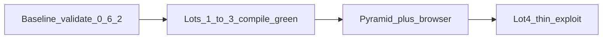

# Topcoat 0.6.2 to 0.8.0 (no-regression)

Follow [`.cursor/skills/topcoat/references/UPGRADE-0.8.md`](.cursor/skills/topcoat/references/UPGRADE-0.8.md). Pin today: `topcoat = "0.6.2"` in [`Cargo.toml`](Cargo.toml), `topcoat_cli_version := "0.6.2"` in [`Justfile`](Justfile), [`rust-toolchain.toml`](rust-toolchain.toml) `1.95.0`. Target **0.8.0** (not 0.7.0). Host **tahoe** already has `rustc 1.98.1` (pkg `latest`); keep `pkg lock rust`.

There is **no incremental merge** of Wave A/B. After the crate pin moves, the tree is red until **all** of: `.runtime()`, `Result<impl View>` + `Ok(view!)`, four layouts on `Slot<'_>` + `error_boundary`, and every `signal name =` rewritten. Treat Lots 1–3 as **one branch / one compile-green PR**. Sequential commits are fine; CI and `just validate` are green only after Lot 3. Lot 4 is additive and lands after that green.



## Hard rules (anti-regression)

- Do **not** enable `websocket` / `sse` / `datastar` / `ui`.
- Do **not** add `live!` / `emit!` / `suspense` on day one. Session / cookie writes stay in the non-streamed prefix (handler before `Ok(view!)`, root layout `<head>`). Jar write after first byte **panics**.
- Server `.get()` of a signal is **user input**. Never authZ / role / tenant.
- No tracked `.get()` on dashboard, release compose, or login auth path.
- Pagination stays `?page=N` + `href!` ([`list-pagination.mdc`](.cursor/rules/list-pagination.mdc)).
- Prefer **extending** existing `*_e2e_test.rs` / `check_*.sh` / runbooks. Do not invent a second auth or list harness.
- Denial paths stay mandatory on login, tenant, Publish, search shards, 404.

## Gate 0 — baseline (still 0.6.2)

On the current pin, before any `Cargo.toml` edit:

- `just validate` green (fmt + clippy `-D warnings` + tests).
- Record that the following suites already cover the seams this bump can break: `topcoat_0_6_*`, `portal_shell_*`, `magic_link_*`, `auth_tenant_*`, `choose_org_*`, `admin_releases_*`, `*_search_shard_*`, `builds_entitlement_*`, `dashboard_stats_*`, `mail_templates_*`, `http_edge_*`.
- Dev Mac: install rustc **1.98** (`rustup`) to match [`rust-toolchain.toml`](rust-toolchain.toml) once bumped. Tahoe is already 1.98.1.

If Gate 0 is red, **stop** — do not mix a 0.8 rewrite with a pre-existing fail.

---

## Lots 1–3 — one compile-green slice

Implement in this order so compile errors stay local.

### Lot 1 — toolchain, pin, `.runtime()`, lazy `View`

Pins (together):

- [`Cargo.toml`](Cargo.toml) `rust-version = "1.98"`; facade + build-dep `topcoat = "0.8.0"` (keep features `tailwind`, `font-fontsource`, `mail`, `mail-smtp`, `multipart`).
- [`rust-toolchain.toml`](rust-toolchain.toml) channel `1.98.0` (or `1.98.1` if you want to match tahoe exactly).
- [`Justfile`](Justfile) `topcoat_cli_version := "0.8.0"` then `just ensure-topcoat` (CLI **before** `topcoat fmt`).
- rust-best-practices MSRV note + skill pin lines (same lot, after compile).

Router ([`src/app.rs`](src/app.rs) `router_with_mail`, today `.discover()` only):

```rust
.discover()
.runtime()  // registers /_topcoat/runtime/pages/… ; script(cx) panics without it
.build()
```

`root_layout` must take `cx: &Cx` and call `topcoat::runtime::script(cx)` (0.8 signature).

Every `#[page]` / `#[component]` / `#[shard]` / mail view that returns HTML: `-> Result<impl View>` and `Ok(view! { … })`. Import `topcoat::view::View`. Drop `?` after `view!`. Redirect-only pages (`redirect_reserved_*`, and any page that only `redirect`s): `-> Result<()>`.

High-count surfaces (compile-driven, do not hand-roll a parallel tree):

- Pages/layouts under [`src/app.rs`](src/app.rs), [`src/app/org.rs`](src/app/org.rs), [`src/app/admin.rs`](src/app/admin.rs), [`src/app/login.rs`](src/app/login.rs), and nested modules.
- Components: [`src/app/_components/`](src/app/_components/) (icons, rail, pager, modal, …), [`src/app/org/dashboard_tiles.rs`](src/app/org/dashboard_tiles.rs), [`src/issue_thumbs.rs`](src/app/issue_thumbs.rs).
- Mail: [`src/mail_views.rs`](src/mail_views.rs).
- Follow-through helpers that are **not** `#[layout]` but take a child `Result`: [`login_splash`](src/app/login.rs) (`body: Result` + `(body?)`) and [`render_admin_page`](src/app/admin.rs). Move those to `Child<'_>` / `error_boundary` in Lot 2 once layouts compile.

`view!` is lazy: clone values used both inside the template and after it.

### Lot 2 — layouts: `Slot<'_>` + `error_boundary`

Four `#[layout]` sites (today `slot: Result` + `match` / `(slot?)`):

- [`src/app.rs`](src/app.rs) `root_layout` — branded 404 via `error_boundary`; rethrow non-`NotFoundError`.
- [`src/app/admin.rs`](src/app/admin.rs) `admin_layout` (keep `require_staff` + 404-on-deny).
- [`src/app/org.rs`](src/app/org.rs) `org_layout` (keep `require_org` / rail / topbar).
- [`src/app/login.rs`](src/app/login.rs) `login_layout` → `login_splash`.

Sketch is in the playbook. Flip pins in the **same** lot or CI stays red:

- [`scripts/check_portal_shell.sh`](scripts/check_portal_shell.sh) (today **requires** `slot: Result` and **forbids** `Slot<`).
- [`tests/integration_tests/portal_shell_invariants_test.rs`](tests/integration_tests/portal_shell_invariants_test.rs) (same assert ~L94).

Keep chrome pins (`vb-shell`, `runtime::script`, favicons, `require_staff`).

### Lot 3 — `signal(cx, init)` (~30 statement sites)

Rewrite **above** `view!`: `let name = signal(cx, || value);`. Import `topcoat::runtime::signal`. Add `cx: &Cx` where missing.

| File | Signals |
|------|---------|
| [`src/app/login.rs`](src/app/login.rs) | 11 (sent/email/ttl/cooling/sending/unavailable + seeds) |
| [`src/app/admin/releases/new.rs`](src/app/admin/releases/new.rs) | `not_pkg_open`, `no_key_open`, `pkg_go` |
| [`src/app/admin/companies.rs`](src/app/admin/companies.rs) + [`form.rs`](src/app/admin/companies/form.rs) | query/page + LTS steppers |
| [`src/app/admin/issues.rs`](src/app/admin/issues.rs) | query/org_query/page |
| [`src/app/org/{docs,issues}.rs`](src/app/org/docs.rs) | query/page |
| [`src/app/org/builds.rs`](src/app/org/builds.rs) | modal `open` / `verify_open` / `use_curl` |
| [`src/app/_components/modal.rs`](src/app/_components/modal.rs) | `open` |

Retarget greps `signal foo =` → `let foo = signal(cx` in:

- [`scripts/check_admin_releases.sh`](scripts/check_admin_releases.sh)
- [`scripts/check_admin_companies.sh`](scripts/check_admin_companies.sh)
- [`scripts/check_builds_entitlement.sh`](scripts/check_builds_entitlement.sh)
- [`scripts/check_admin_companies_search_shard.sh`](scripts/check_admin_companies_search_shard.sh)
- plus docs/issues shard checks if they pin the statement form

**Do not** convert search `query`/`page` into tracked server `.get()` on the parent page. Shards stay the I/O boundary. Keep procedure results as `f64` (`1.0`/`0.0`) on login / Publish.

After Lot 3: first `just fmt` (CLI 0.8) + fmt-check + clippy + `just bundle` so AssetIds match.

---

## Pyramid (Lots 1–3) — extend, do not fork

New structural suite **`topcoat_0_8`** (clone the 0.6 pattern):

- [`scripts/check_topcoat_0_6.sh`](scripts/check_topcoat_0_6.sh) stays for pins that **still apply** (`path_param!`, `OriginPolicy`, `BodyLimit`, `href!`, exe-adjacent assets). Add [`scripts/check_topcoat_0_8.sh`](scripts/check_topcoat_0_8.sh) that **forbids** `signal name =` in `src/`, **requires** `.runtime()`, `error_boundary`, `script(cx)`, `rust-version = "1.98"`, CLI `0.8.0`.
- Tests: `topcoat_0_8_{invariants,proptest,battle,e2e}_*` next to the 0.6 files. Keep 0.6 tests that still assert 0.6-era contracts; drop or retarget only pins that contradict 0.8 (`slot: Result`).
- Runbook: [`docs/runbooks/topcoat_0_6_smoke_test.md`](docs/runbooks/topcoat_0_6_smoke_test.md) successor [`docs/runbooks/topcoat_0_8_smoke_test.md`](docs/runbooks/topcoat_0_8_smoke_test.md) (audience, severity, Pass/Fail, link from the 0.6 runbook).

Per-layer expectations on **existing** seams (same files, new asserts):

- **Unit:** `nav_from_path` still maps rails; login TTL seed math; `topcoat_click` still function-expressions ([`tests/integration_tests/common/topcoat_click.rs`](tests/integration_tests/common/topcoat_click.rs) — fix hydrate attribute names if 0.8 renamed them).
- **Invariants:** `check_topcoat_0_8.sh` + flipped `check_portal_shell.sh` + retargeted signal lints; `include_str` pins for `.runtime()` and `error_boundary`.
- **Proptest:** empty `Option` query: `?q=` / `?page=` / blank filter do not 400 (list `SearchQ` on companies/docs/issues). Arbitrary short query strings still 200 + shard HTML. Property: no `signal \w+ =` in `src/**/*.rs`.
- **Battle:** parallel GET `/login`, org docs search, admin companies search, Publish preflight page (no cookie writes from a stream). Barrier flood must not 5xx from missing `.runtime()`.
- **E2E (in-process router, already in tree):**
  - GET `/login` — both panels, signals present, `assert_topcoat_click_handlers_are_functions` + submit helpers; magic-link procedure still anti-enumerates ([`magic_link_e2e_test.rs`](tests/integration_tests/magic_link_e2e_test.rs)).
  - Wrong org / anonymous / missing `admin_view` still **404** ([`auth_tenant_e2e_test.rs`](tests/integration_tests/auth_tenant_e2e_test.rs)).
  - Unknown path — branded 404 chrome, status 404 ([`portal_shell_e2e_test.rs`](tests/integration_tests/portal_shell_e2e_test.rs)).
  - Publish page still has `vb-pkg-kick` / `animationend` / `pkg_go` ([`admin_releases_e2e_test.rs`](tests/integration_tests/admin_releases_e2e_test.rs)). In-process tests still do **not** click Publish in a browser.
  - Search shards: typing contract unchanged; HTML still isolate-able ([`docs_search_shard_e2e_test.rs`](tests/integration_tests/docs_search_shard_e2e_test.rs), org/admin issues + companies shard e2e).
  - Multipart still under raised `BodyLimit` (not 413) — existing releases e2e.
  - Response HTML includes the 0.8 runtime module path (no panic string about missing `.runtime()`).
- **Smoke runbook:** staging `just run` — runtime script in HTML, login cooldown ticks, search focus survives morph, Publish idle tick, 404 chrome, no 413 on pkg upload.

Also re-run (not rewrite) after compile green: `dashboard_stats_*`, `builds_entitlement_*`, `mail_templates_*`, `http_edge_*`, `choose_org_*`. A green compile with a red existing e2e is a **regression**, not a skipped layer.

**Browser** (after automated green, before “done”): login send + cooldown, org docs search + `?page=2` active rail, admin companies search, `/admin/releases/new` Publish enable path (do not need a real pkg if preflight is enough), unknown URL 404. Desktop viewport is enough unless rail CSS changed (it should not).

Commit gate: `just validate` (not clippy-only).

---

## Lot 4 — thin 0.8 exploit (after Lots 1–3 green)

- `href.is_current(cx)` on rail items **only where** `NavSection` equality misses `?page=` / `?q=`. Keep `NavSection` for org vs admin grouping and `admin_view` gates in [`src/app/_components/rail.rs`](src/app/_components/rail.rs). Do not replace `require_org` / policy checks with `is_current`.
- Confirm empty `Option<T>` query on list forms (proptest from Lot 3 should already lock this).
- **Out of scope:** streaming dashboard, tracked full-page search, `bool` procedure results, infinite scroll, `Signal<T>` shard params on heavy lists.

Lot 4 pyramid: extend `portal_shell` + one list e2e (`?page=2` still marks the same rail item) + runbook line. No new battle harness.

---

## Docs / skills (same PR as compile green)

- Mark [UPGRADE-0.8.md](.cursor/skills/topcoat/references/UPGRADE-0.8.md) status **done**; [SKILL.md](.cursor/skills/topcoat/SKILL.md) + [web-stack](.cursor/skills/web-stack/SKILL.md) + rust-best-practices MSRV: pin **0.8.0** / rustc **1.98**.
- [RUNTIME.md](.cursor/skills/topcoat/references/RUNTIME.md): `signal(cx, …)`, tracked reads, morph, `.runtime()`.
- Do **not** edit [`.cursor/plans/topcoat_0.6.2_upgrade_88699e43.plan.md`](.cursor/plans/topcoat_0.6.2_upgrade_88699e43.plan.md) or the exploit-0.6 plan.

## Forbidden (regression sources)

- Landing on 0.7.0.
- Trusting server `.get()` for staff / org / KEY.
- Streamed cookie writes.
- Deleting search shards “because pages can track signals now”.
- Skipping `just fmt-check` because tests passed.
- Declaring done after clippy + one happy-path unit test.
