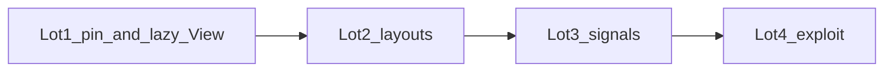

# Topcoat 0.6.2 → 0.8.0 upgrade

Follow [`.cursor/skills/topcoat/references/UPGRADE-0.8.md`](../skills/topcoat/references/UPGRADE-0.8.md). Pin today is **0.6.2** ([`Cargo.toml`](../../Cargo.toml), [`Justfile`](../../Justfile) `topcoat_cli_version`). Target **0.8.0** (not 0.7.0 — 0.8 immediately replaces the signal statement and requires `.runtime()`).

There is **no 0.6.3**. Upstream: [v0.7.0](https://github.com/tokio-rs/topcoat/releases/tag/v0.7.0) (2026-09-05) then [v0.8.0](https://github.com/tokio-rs/topcoat/releases/tag/v0.8.0) (2026-09-09). Studied at `/tmp/topcoat-0.8-study` (`149f0de`).

**Hard rules:**

- Raise **MSRV to 1.98** in the same lot as the crate pin (Topcoat 0.7+).
- Add **`.runtime()`** before `runtime::script()` or the root layout panics.
- Do not enable `websocket` / `sse` / `datastar`.
- Do not stream cookie / session writes (`live!` after commit panics the jar).
- Server-side signal `.get()` is user input — never an authZ source.
- Keep list pagination on `?page=N` + `href!` (`list-pagination.mdc`).

Each lot ships a full `vcp-test-pyramid.mdc` on the touched seams (login, layouts/404, Publish, search shards, rail).
