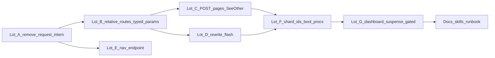

# Topcoat 0.8.1 exploitation (dette 0.6 + nouveautés 0.7-0.8.1)

Pin stays `topcoat = "0.8.1"` / CLI 0.8.1 / MSRV 1.98. URLs publiques inchangées partout. Chaque lot = une tranche compile-green, `just validate` en gate de commit, pyramide complète par surface (`vcp-test-pyramid.mdc`). Ordre imposé par les dépendances de fichiers :

## Lot A — supprimer `request_intern` (memoize `&str`, 0.7 #371)

`[src/request_intern.rs](src/request_intern.rs)` est un contournement du bug HRTB 0.6 ; la doc 0.8.1 montre `#[memoize(as_ref)] async fn lookup(cx: &Cx, name: &str)`.

- Supprimer le module, `pub mod request_intern` dans `lib.rs`, et `let cx = cx.with(StringIntern::default());` dans `security_headers` ([src/app.rs](src/app.rs) ~345, passer `cx` tel quel à `next.run`).
- Signatures `usize` → `&str` (57 sites, 10 fichiers) : `org_context(cx, slug: &str)` + `require_org` ([src/auth.rs](src/auth.rs)), `require_perms(cx, role: &str)` ([src/perms.rs](src/perms.rs)), `count_filtered_docs_memo(cx, q: &str, cat: &str)` ([src/app/org/docs.rs](src/app/org/docs.rs)), `count_filtered_issues_memo` ([src/app/org/issues.rs](src/app/org/issues.rs)), `company_cards_page_memo` ([src/app/admin/companies/load.rs](src/app/admin/companies/load.rs)), `resolve_org_id_memo` + `count_admin_filtered_issues_memo` ([src/app/admin/issues/search_shard.rs](src/app/admin/issues/search_shard.rs)), `dashboard_tiles.rs`, `org.rs`.

Pyramide (couture auth/tenant → complète) :
- Unit : memo tests existants dans les modules ; ajouter un test que `org_context(cx, "a")` et `org_context(cx, "A")` ne partagent pas d'entrée (clé = hash de `&str`).
- Invariants : `check_request_sql_dedup.sh` + nouveau pin dans `request_sql_dedup_invariants_test.rs` / `auth_tenant_invariants_test.rs` : `src/request_intern.rs` absent, aucun `#[memoize]` suivi d'un arg `: usize` de clé texte, `StringIntern` absent de `app.rs`.
- Proptest : étendre `auth_tenant_proptest.rs` — pour slugs aléatoires distincts, `require_org` ne retourne jamais l'org d'un autre slug (pas de collision de clé).
- Battle : re-run `auth_tenant_battle_test::battle_parallel_membership_reads`, `request_sql_dedup_battle_test` (dédup page+shard toujours 1 COUNT).
- E2E : re-run `auth_tenant_*`, `docs_search_shard_*`, `org_issues_search_shard_*`, `admin_issues_search_shard_*`, `admin_companies_search_shard_*`, `dashboard_stats_*`, `request_sql_dedup_e2e`.

## Lot B — routes module-relatives (0.8.1 #406) + `path_param!` typé (0.6)

Convertir les chaînes absolues qui égalent le chemin du module (inventaire complet) :
- `#[route(POST)]` : `admin/releases/{new,confirm,delete_confirm}.rs` (create/confirm/delete-confirm), `admin/docs/new.rs`, `org/issues.rs` (`/{org}/issues`), `admin.rs` `#[route(GET)]`.
- `#[route(POST "./x")]` : `admin/docs/doc.rs` (`./publish`, `./unpublish`, `./delete`, save = `#[route(POST)]`), `admin/releases/release_id.rs` (idem), `admin/releases/new.rs` (`./validate-pkg`), `admin/releases/confirm.rs` (`./cancel`), `admin/issues/issue_key.rs` (`./reply`, `./edit-comment`, `./close`, `./reopen`, `./start-analysis`, `./resolve`), `org/issues/issue_key.rs` (`./reply`, `./close`, `./reopen`), `admin/key.rs` (`./enrol`, `./revoke`), `admin/companies/company_id.rs` (`./delete`), `login.rs` (`#[route(GET "./magic")]`).
- **Rester absolus** (chemin ≠ module) : overrides `/vauban/…` (`org/issues.rs`, `org/issues/{new,issue_key}.rs`), `org/builds/{download,ephemeral}.rs` (module `builds::download` ≠ `/{org}/builds/{release_ver}/download`), `org/images.rs` (`path_param!` déclaré dans le module lui-même), `/`, favicons, `/logout`.
- `path_param!` typé : `path_param!(pub(crate) release_id: u64, error = not_found)` ([src/app/admin/releases/release_id.rs](src/app/admin/releases/release_id.rs), supprime `parse_release_id` + 5 `let Some(id) … else`), idem `company_id` ([src/app/admin/companies/company_id.rs](src/app/admin/companies/company_id.rs), 3 sites). Adapter les `href!` : `ReleaseId(rel.id.to_string())` → valeur typée (`releases.rs` ×4, `release_id.rs` ×2, `companies.rs`, `company_id.rs` ×2, `companies/search_shard.rs`) — vérifier la forme du constructeur de marqueur à la compilation.

Pins à flipper (source-shape) : `admin_releases_invariants_test.rs:86,99,108,191`, `check_admin_releases.sh:81-88,173-174,186-191`, `check_admin_companies.sh:58-61`, `check_issue_comment_edit.sh:26-27`, `magic_link_invariants_test.rs:40` (interdire aussi `#[route(POST)]` / `#[page(POST)]` relatifs dans `login.rs`). Les e2e qui POSTent les URLs restent valides.

Pyramide :
- Unit : `href!` tests dans `hrefs.rs` (URLs identiques avant/après).
- Invariants : nouveau pin `topcoat_0_8_invariants_test.rs` — aucune chaîne absolue `#[route(POST "/admin/` ni `"/{org}/issues/` hors liste blanche (`/vauban`, builds download/ephemeral, images) ; `parse_release_id` / `parse_company_id` absents ; `path_param!(… : u64, error = not_found)` présents.
- Proptest : `admin_releases_proptest.rs` / `admin_companies_proptest.rs` — segments non numériques aléatoires sur `/admin/releases/{x}` et `/admin/companies/{x}` → 404 (jamais 400/500).
- Battle : `admin_releases_battle_test.rs` — flood mixte ids valides/invalides → 200/303 vs 404, zéro 5xx.
- E2E : re-run `admin_releases_*`, `admin_docs_*`, `admin_companies_*`, `portal_issues_*`, `issue_comment_edit_*`, `storage_e2e` (key enrol/revoke), `magic_link_*` (`/login/magic`), `http_edge_*` (Strict inchangé).

## Lot C — re-rendus POST en `#[page(POST)]` + `Err(see_other)` (0.8.1 #398/#408)

- `admin_companies_create` ([src/app/admin/companies/new.rs](src/app/admin/companies/new.rs)) et `admin_companies_update` (`company_id.rs`) deviennent `#[page(POST)] … (cx, Form(form)) -> Result<impl View>` : erreur → `Ok(view! { render_company_form(state) })` sous `root_layout` + `admin_layout` (gate `require_staff` du layout) ; succès → `Err(see_other(href!(admin_companies_page).resolve(cx)).into())` (303 conservé).
- Supprimer `company_form_response` ([src/app/admin/companies/form.rs](src/app/admin/companies/form.rs)) et `render_admin_page` ([src/app/admin.rs](src/app/admin.rs)).
- `choose_org_page` ([src/app/login.rs](src/app/login.rs) ~427-487) → nouveau module `src/app/choose_org.rs` (`/choose-org`), `#[page] -> Result<impl View>`, branches `Err(redirect(…))` (307, invariant GET conservé), corps `login_splash(...)` explicite ; mettre à jour les `href!(choose_org_page)` (`app.rs`, `login.rs`).

Pins : `check_admin_companies.sh:32,91-94` (exiger `#[page(POST)]`, interdire `company_form_response`/`render_admin_page`), `admin_companies_invariants_test.rs:110-112,228-229` (garder `see_other`, interdire `Err(redirect(`), `check_http_edge.sh:90-91` / `http_edge_invariants_test.rs:88-90` inchangés (layer).

Pyramide :
- Unit : `form_view` / `NewFormState` tests existants.
- Invariants : `admin_companies_invariants_test.rs` — `Result<Response>` absent de `new.rs` / `company_id.rs` / `login.rs` (hors réponses machine), `render_admin_page` absent, `#[page(POST)]` présent.
- Proptest : `admin_companies_proptest.rs` — formulaires invalides aléatoires (emails, LTS hors bornes, noms vides) → toujours 200 + message, jamais 303.
- Battle : `admin_companies_battle_test.rs:254` (303 sous flood) + flood de POST invalides → 200, zéro 5xx.
- E2E : `admin_companies_e2e_test.rs` — re-rendu erreur 200 **avec** chrome (`vb-rail`, `vb-topbar`) et texte d'erreur ; succès `SEE_OTHER` ; `choose_org_{e2e,battle}` re-run + assert HTML picker avec chrome root (stylesheet) ; denial : client non staff → 404 sur POST.

## Lot D — `rewrite` pour les erreurs de formulaires revenant sur leur page (0.6 #347)

Règle : **erreur** de POST dont le résultat est la page hôte du formulaire → `Err(rewrite(target, Body::empty()).method(Method::GET).into())` ; **succès** → 303 PRG inchangé ; flags d'état deep-linkables (`token=`, `delete=`, `revoke=`, `edit=`, `enrolled=<fp>`, `dl_error=`) inchangés.

Contrainte vérifiée upstream ([router.rs](file:///tmp/topcoat-0.8.1-study/crates/topcoat-router/src/router.rs) `dispatched_path` compare `path?query`) : la cible doit différer du POST par sa query → réutiliser `ErrQ` en interne (`href!(page).query(ErrQ{..}).resolve(cx)`), pages GET inchangées, barre d'adresse propre. Caveat documenté : F5 re-soumet le POST (comportement standard des erreurs rendues sur POST).

Sites :
- `admin_releases_create` ([src/app/admin/releases/new.rs](src/app/admin/releases/new.rs)) : 12 `see_other(…?err=no_active_key|date|package|not_pkg|identity|upload)` → rewrite (même URL).
- `admin_key_enrol` / `admin_key_revoke` ([src/app/admin/key.rs](src/app/admin/key.rs)) : `err=label|attestation|enrol|revoke`, `KeyRevokeQ{revoke, err=confirm}` → rewrite vers `/admin/key` ; `EnrolledQ` (succès) reste 303.
- Hors périmètre (chemin différent + état deep-link ou flags non rendus) : confirm → `new?err=upload`, deletes `delete=&err=`, issues `err=attach|create|reply|conflict`, `dl_error`, `login?error=link`. Noter les flags `attach|create|reply` non rendus comme nettoyage séparé.
- Helper unique `rewrite_get_with_flash(cx, href: String) -> RewriteError` dans `src/http_canonical.rs` (ou `src/http_flash.rs`) forçant `.method(GET)` et refusant une cible sans `?` (garde-fou cycle).

Pyramide :
- Unit : helper — cible sans query → erreur/`debug_assert`, méthode GET.
- Invariants : `admin_releases_invariants_test.rs` + `check_admin_releases.sh:49-61,96-97` — codes `err=*` toujours présents, `rewrite(` via le helper dans `new.rs` et `key.rs`, plus aucun `see_other(` avec `ErrQ` dans ces deux fichiers ; `storage_invariants` idem key.
- Proptest : `admin_releases_proptest.rs` — pour chaque code du set fermé, POST invalide → 200 + marqueur bannière/modale, jamais 303 ni 5xx ; `storage_proptest` — attestations mal formées → 200 + callout.
- Battle : `admin_releases_battle_test.rs:827,927,993` (Location `?err=`) → 200 + corps ; `storage_battle_test` flood enrol invalides → zéro 5xx.
- E2E : `admin_releases_e2e_test.rs:128,142,285,288,340,1521,1534,1722,1727` → statut 200, corps contient `create_error_message(code)` / modale `no_active_key`, **pas** de `Location` ; `storage_e2e_test.rs` erreurs enrol/revoke → 200 + callout, succès `enrolled={fp}` 303 inchangé (`:699`) ; denial : non staff → 404.

## Lot E — `nav.rs` piloté par `try_endpoint(cx)` (0.6 #318, 0.7 `is_current`)

- `nav_from_cx` : `try_endpoint(cx).map(Endpoint::path)` → nouvelle `nav_from_pattern(pattern)` sur les motifs (`/{org}/docs/{doc}` → Docs, `/admin/companies/{company_id}` → « admin / companies / edit », catch-all `not_found!` → Home/AdminHome) ; fallback `nav_from_path(uri)` quand aucun endpoint. Garder les deux `pub fn` (pins `portal_shell_invariants_test.rs:153-156`, `check_portal_shell.sh:107-110`). Rail inchangé.

Pyramide : Unit `nav_from_pattern` table-driven ; Invariants `try_endpoint` présent dans `nav.rs` ; Proptest `portal_shell_proptest` — motifs inconnus → Home/« dashboard », + `org_account_proptest` inchangé ; Battle re-run `portal_shell_battle` ; E2E `portal_shell_e2e` — `/{org}/docs/{slug}` surligne Docs, `/admin/companies/{id}` crumb « edit », `/no-such` garde le chrome 404.

## Lot F — `id` stables sur lignes de shard (0.8 morph) + procédures `Result<bool>` (0.7 #375)

- Ids : `id="doc-<slug>"` ([src/app/org/docs/search_shard.rs](src/app/org/docs/search_shard.rs) `<a class="vb-row">`), `issue-<key>` (org + admin issues), `company-<org.id>` (companies cards) via un helper `row_dom_id(prefix, key)` (sanitisation `[A-Za-z0-9_-]`).
- Procédures : `request_login_link -> Result<bool>` ([src/app/login.rs](src/app/login.rs), client `status > 0.0` → `if status`), `require_active_key -> Result<bool>` (`new.rs:237-241`, `< 1.0` → `!…`). Spike préalable : confirmer le format JSON `true`/`false` du corps de procédure avant de flipper les parseurs `common/mod.rs:815-844`.

Pins : `magic_link_invariants_test.rs:11,19`, `admin_releases_e2e_test.rs:1701-1702,1788-1789` (`0.0`/`1.0` → `false`/`true`), `admin_releases_battle_test.rs:672-733`.

Pyramide : Unit `row_dom_id` ; Invariants 4 `*_search_shard_invariants` — `id=(` sur la ligne, `Result<f64>` absent ; Proptest ids uniques sur jeux aléatoires + `row_dom_id` jamais vide ; Battle shards existants + assert ids, `magic_link_battle` / `admin_releases_battle` re-run ; E2E 4 shards — ids présents et uniques ; `magic_link_e2e` / `admin_releases_e2e` corps booléens.

## Lot G — `suspense` sur les tuiles du dashboard (0.7), gated

Go/no-go : mesurer TTFB de `/vauban` et `/{org}` avec `just run` + `curl -w '%{time_starttransfer}'` sur données seed ; aller si les loaders (`dashboard_releases`, `dashboard_issue_rows`, `dashboard_docs`) pèsent visiblement, sinon documenter le no-go.
- Envelopper `dash_activity`, `dash_card_builds`/`dash_stat_build`, `dash_notes` ([src/app/org/dashboard_tiles.rs](src/app/org/dashboard_tiles.rs)) dans `suspense(fallback: skeleton, error_boundary(…, tile()))` ; labels dans le shell, valeurs dans l'enfant streamé.
- Préconditions vérifiées : aucun `cookies(`/`session::` dans `org.rs`, `dashboard_tiles.rs`, rail, topbar ; gates 404 avant `Ok(view!` ; `SecurityHeaders` pose ses en-têtes sur la `Response` avant le flux.

Pyramide : Invariants — `suspense(` présent, pin « aucune écriture cookie/session dans org.rs / dashboard_tiles.rs », `error_boundary` dans chaque enfant ; E2E `dashboard_stats_e2e` — `tile_value_after` reste valide (chunks émis après le label) + fallback marqueur présent dans le corps brut + valeurs finales ; Battle `dashboard_stats_battle` re-run ; Proptest `dashboard_stats_proptest` inchangé ; Runbook : le shell s'affiche avant les tuiles, aucune 5xx par tuile.

## Docs / skills / runbook (même PR que le dernier lot)

- `.cursor/skills/topcoat/references/UPGRADE-0.8.1.md` : section « exploit » (POST pages, routes relatives, rewrite + contrainte cycle, memoize `&str`, endpoint nav, ids morph) ; `.cursor/skills/web-stack/SKILL.md` : pattern formulaire = `#[page]` GET + `#[page(POST)]`, règle erreur→rewrite/re-rendu, succès→303, `check_*.sh` retouchés ; `rust-best-practices` : « ne plus interner pour memoize ».
- `docs/runbooks/post_forms_smoke_test.md` (audience staff, sévérité moyenne) : F5 après erreur affiche la confirmation de re-soumission (attendu), barre d'adresse sans `?err=`, succès 303 ; lié depuis `topcoat_0_8_1_smoke_test.md`.

## Interdits

- Routes relatives sur `/vauban/*`, `builds/download|ephemeral`, `images.rs` (chemin ≠ module).
- `rewrite` pour un succès, ou vers une cible sans query différente du POST (cycle → 500).
- Retirer `token=`, `delete=`, `revoke=`, `edit=`, `enrolled=`, `dl_error=`.
- Pagination pilotée par signal (`list-pagination.mdc`), lecture trackée pour l'authZ, écriture cookie/session dans une région streamée.
- Déclarer un lot fini sans `just validate` + pyramide de la surface.