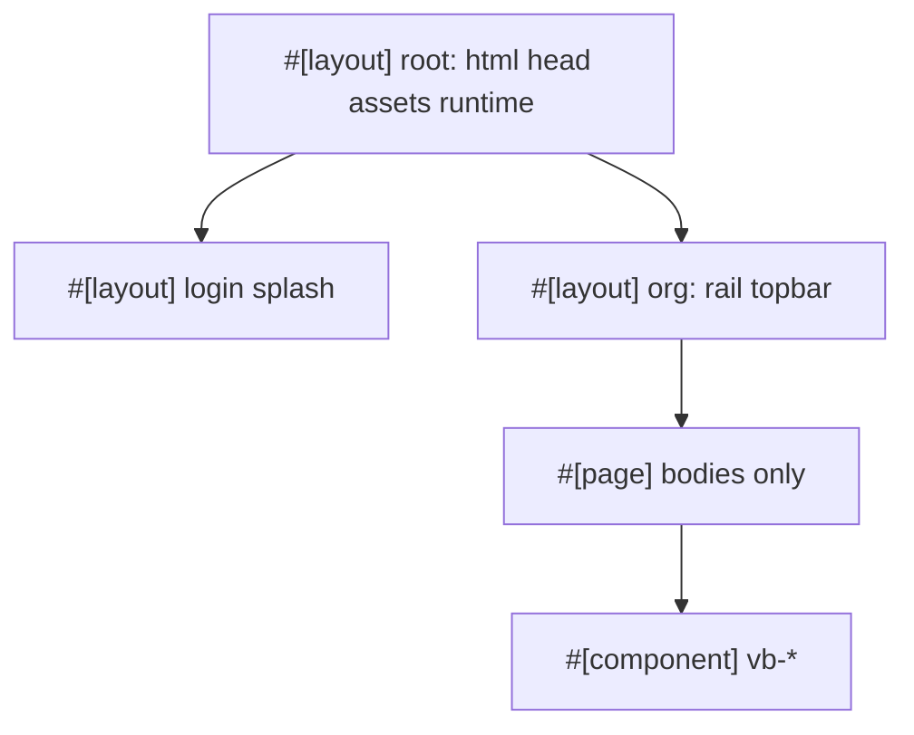

=# Idiomatic Topcoat adoption (VCP)

## Decisions (locked)

- Keep **custom HTTPS serve** ([`src/tls/serve.rs`](src/tls/serve.rs) + [`src/main.rs`](src/main.rs)); do not switch to `topcoat::start`.
- Keep **Concept visual system** (`vb-*` tokens in [`src/ui.rs`](src/ui.rs)); do **not** vendor Topcoat UI (`topcoat ui`) in this work.
- Allow **Topcoat runtime** (signals / `@` / `:`) for progressive UX only; still **no React / HTMX / Alpine**. Sensitive mutations stay **POST forms + PRG**.
- Wire **Tailwind** for real (link `stylesheet!()`, Concept colors in `@theme`); stop the dead feature-only setup.
- Deep-link routes for docs/builds/issues **remain** (shareable URLs); runtime enhances in-page open/close where useful.

## Target architecture

## Phase 1 — Structure (core)

### 1. Root + org layouts

Replace manual [`layout::shell`](src/layout.rs) / `login_shell` / `shell_with_modal` with Topcoat layouts:

- Root layout at app tree (e.g. [`src/app.rs`](src/app.rs) or `_shell` group): `<!DOCTYPE html>`, head, `topcoat::runtime::script()` + `topcoat::dev::script()`, `tailwind::stylesheet!()`, font links via Topcoat font helpers.
- Login layout: dark splash chrome; login page body only.
- Org layout: rail + topbar + crumb; reads `require_org` / `perms` via `cx` helpers (memoized). Pages under `app/org/**` stop wrapping themselves.

Pass active section / crumb via request helpers or small typed request context set by each page (keep rail highlighting).

### 2. Components

Extract from current markup into `#[component]` modules (e.g. `src/app/_components/` group so no URL segment):

- `vb_rail`, `vb_topbar` / crumb
- `vb_chip_row`, `vb_stat_row`, `vb_modal`
- issue severity/status badges, build row panel chrome

Pages call components instead of duplicating HTML strings.

### 3. Assets, fonts, Tailwind

- Add [`Topcoat.toml`](Topcoat.toml) marker; document `topcoat fmt` + `topcoat dev` in [`Justfile`](Justfile) / README.
- Add input CSS (e.g. `styles.css`) with `@import "tailwindcss"`, `@source` for `src/**/*.rs`, and `@theme` mapping Concept tokens (`--accent #117a6b`, `--bg-app`, rail, etc.). Point [`build.rs`](build.rs) at it.
- Link `tailwind::stylesheet!()` from root layout; migrate [`ui::stylesheet()`](src/ui.rs) custom rules into that input (or keep a second `asset!` for residual Concept CSS).
- Prefer **Fontsource** (enable `font-fontsource`) for Hanken Grotesk / JetBrains Mono instead of Google CDN.
- Fail closed in non-dev if `AssetBundle::load()` fails (today: [`AssetBundle::empty()`](src/app.rs) swallows missing bundles).

### 4. Tooling / skills

- Extend `just validate` (or a companion recipe) with `topcoat fmt --check` when CLI is available.
- Update [`.cursor/skills/topcoat/SKILL.md`](.cursor/skills/topcoat/SKILL.md) and [`.cursor/skills/web-stack/SKILL.md`](.cursor/skills/web-stack/SKILL.md): layouts/components/assets are required idioms; Topcoat UI remains optional/out of scope; runtime allowed for progressive UX.

## Phase 2 — Runtime UX (narrow)

Include `runtime::script()` (Phase 1). Then:

| Surface | Behavior |
|---------|----------|
| Docs modal | Keep `GET /{org}/docs/{slug}` for deep-link; add client close via signal/`@click` without full navigation when already on list+modal, or enhance backdrop dismiss without losing SSR first paint |
| Builds expand | Keep `GET /{org}/builds/{version}`; optional signal-driven expand on list when already on builds page; ephemeral fetch/cURL tabs as local signals |
| Docs/issues search | Optional `#[shard]` live filter later; **not** required to close Phase 2 — GET forms stay |

Security: any shard must call `require_org` + perms again; never trust path/query args alone. No procedures for login/admin mutations.

## Phase 3 — Polish / acceptance

- Smoke: `just run` HTTPS — login, dashboard, docs modal, builds expand, admin forms still work.
- Visual: rail/crumbs/modals still match Concept; no purple/shadcn defaults.
- `just validate` green; E2E auth/tenant unchanged.
- README: note `topcoat dev` vs `just run`, asset bundle requirement.

## Out of scope

- Vendoring Topcoat UI registry components.
- Replacing Casbin / session BYO store.
- HTMX / Alpine / React.
- Full search-as-you-type shards across all lists (follow-up).

## Key files

- [`src/layout.rs`](src/layout.rs) → shrink / delete after layouts land
- [`src/app.rs`](src/app.rs), [`src/app/org/**`](src/app/org)
- [`src/ui.rs`](src/ui.rs), new `styles.css`, [`build.rs`](build.rs), [`Cargo.toml`](Cargo.toml)
- [`Justfile`](Justfile), README, cursor skills
