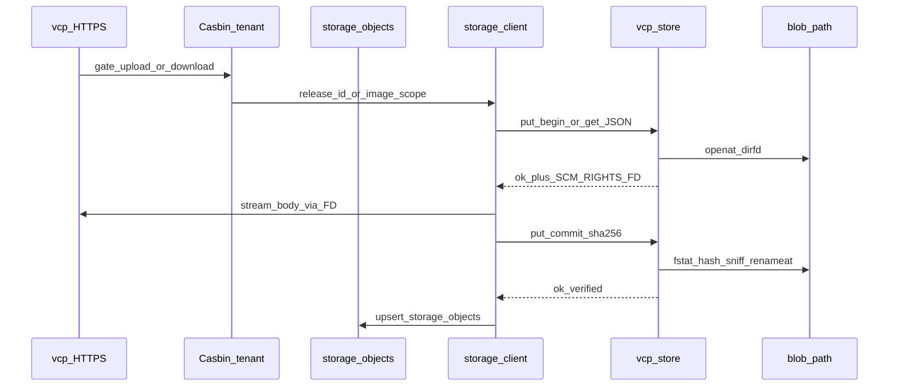

# Plan: vcp-store storage helper (architecture 1.0)

## Baseline (aujourd’hui)

- Pas de `[storage]`, pas de `src/storage/`, pas de binaire helper.
- Digests releases sur `Release.sha256` / `size_mb` (souvent `"pending"`).
- Org download = **501** ; URL éphémère sans GET ; images issues = stub UI.
- AuthZ Casbin / tenancy / `Release` / `EphemeralDownload` / `release_pkg` prêts.

**Source de vérité design :** [docs/technical/VCP_Storage_Helper_Architecture_EN(1.0).md](docs/technical/VCP_Storage_Helper_Architecture_EN(1.0).md). Audit : [.cursor/audits/vcp_capsicum_storage_sandbox_2026-08-02.md](.cursor/audits/vcp_capsicum_storage_sandbox_2026-08-02.md).

## Décisions figées

- Helper process `vcp-store` (D1–D8) ; pas de Capsicum sur `vcp`.
- Deux familles, **un** mécanisme disque/IPC : `releases/<id>.pkg` et `images/<org_id>/<uuid>.<ext>`.
- **Métadonnées blob unifiées :** table Postgres `storage_objects` = **seul** endroit où vivent `sha256` et `size_bytes` (releases **et** images). `Release` = catalogue uniquement (plus de `sha256` / `size_mb` sur la row).
- Dev : `ipc = "spawn"` ; prod : `ipc = "socket"` + `blob_path` non writable par UID `vcp`.
- Deps : `cap-std`, `nix`, `capsicum` (`cfg(freebsd)`) ; `unsafe_code = "deny"`.
- AuthZ uniquement dans `vcp` ; helper = IDs + quotas + digest verify + sniff.
- Types image v1 = **png / jpeg / webp** (pas SVG ni GIF).

### `storage_objects` (SoT digests)

```text
storage_objects
  id, scope ("release"|"image"), object_key,
  organization_id (NOT NULL for image; NULL for release),
  sha256 (64 hex), size_bytes,
  content_type / ext (images; NULL for release),
  created_at, updated_at
  UNIQUE (scope, object_key)
```

| Règle | Détail |
|-------|--------|
| SoT | Digests / tailles **uniquement** dans `storage_objects` — pas sur `Release` |
| Helper | Recalcule SHA-256 avant `renameat` ; ne persiste pas en DB |
| Après `put_commit` OK | `vcp` upsert la row ; puis peut publier le `Release` |
| Sans row | Pas de download / pas de publish (remplace le sentinel `"pending"`) |
| UI Verify / size MB | Lit `storage_objects` ; MB via `size_mb_from_bytes` |
| Migration | Backfill hex réels depuis `releases.sha256` ; drop colonnes `sha256` + `size_mb` |



## Phase 1 — Module I/O portable (sans helper process)

**Livrable :** [`src/storage/`](src/storage/) + `StorageConfig`.

- Config `[storage]` (default / development spawn / testing / vcp.conf socket).
- Validation boot : path absolu, dir ; prod refuse spawn + blob writable par euid.
- Engine : IDs regex, `cap-std::Dir`, tmp+rename, digest, sniff, quotas, purge TTL.

**Pyramide :** unit (digest/sniff/quotas/regex) · invariants `check_storage.sh` · proptest IDs · battle concurrent commit sous tempfile · E2E N/A produit.

## Phase 2 — Binaire `vcp-store` + IPC spawn

**Livrable :** `[[bin]] vcp-store`, protocole §6, client `src/storage/client.rs`.

- SEQPACKET + JSON &lt; 4 KiB ; SCM_RIGHTS ; ops get/put_*/stat/delete/delete_org.
- Boot WARN Capsicum hors FreeBSD + WARN shared UID spawn.
- `just run` démarre le helper en spawn.

**Pyramide :** unit parse/ops · invariants codes erreur · proptest scopes · battle max_concurrent + crash mid-put · E2E socketpair upload→get deux scopes.

## Phase 3 — `storage_objects` + câblage HTTP

**Livrable :** migration + produit ; plus de 501 ; lint anti-`std::fs` blob dans `src/app`.

### Schéma

- Toasty migration : créer `storage_objects` ; backfill ; **drop** `releases.sha256` et `releases.size_mb` ; maj model `Release` + seeds [`src/db.rs`](src/db.rs) + tests qui lisent ces champs.
- Model `StorageObject` + helpers lookup par `(scope, object_key)`.

### 3A — Releases

- Admin upload → IPC put_* → upsert `storage_objects` → publish `Release.status`.
- Org download / ephemeral GET : resolve `Release.id` → require storage row → `get` → `Content-Disposition`.
- Delete release : IPC `delete` + delete storage row + row catalog.
- Dead IPC → 503 sur routes artefacts seulement.

### 3B — Images

- Upload issues (copy png/jpeg/webp) : membership ; put_* ; upsert `storage_objects` (`scope=image`, `organization_id` DB).
- Serve + `nosniff` ; cross-tenant 404 **avant** IPC.
- Org delete : `delete_org` + delete rows `storage_objects` pour l’org.

**Pyramide phase 3**

| Couche | Contenu |
|--------|---------|
| Unit | mapping erreurs IPC→HTTP ; size_mb_from_bytes ; lookup storage row |
| Invariants | plus de `Release.sha256` / `size_mb` dans models ; pins download≠501 ; `check_storage.sh` |
| Proptest | scopes object_key ; ext catalogue images |
| Battle | parallel download ; replace atomique pendant get |
| E2E | upload→download sha match via DB row ; ephemeral GET ; image wrong org sans IPC ; anon 404 |
| Runbook | maj builds_entitlement + admin_releases smoke |

## Phase 4 — Mode socket prod + UID

Socket nommé, peercred, rc.d, ownership 0700 ; prod refuse spawn.

**Pyramide :** invariants config prod · E2E socket+peercred si CI Linux · battle kill helper → 503 → recovery.

## Phase 5 — Capsicum FreeBSD

`cap_rights_limit` + `cap_enter` ; tests jail/gisco ; WARN ailleurs.

## Phase 6 — Ops

Runbooks (restart, rotation blob_path, digest-mismatch, delete_org, Capsicum checklist) ; maj audit Capsicum → implemented ; pointer archi 1.0.

## Ordre de merge / validation

Phases shippables 1→6 ; gate : `just fmt-check` · clippy `-D warnings` · `check_storage.sh` (+ lints surfaces) · `just test -- <filter> -- --test-threads=1` couvrant chaque nouvelle couche pyramid.

## Fichiers clés

| Zone | Fichiers |
|------|----------|
| Archi | `docs/technical/VCP_Storage_Helper_Architecture_EN(1.0).md` |
| Config | `src/config.rs`, `config/*.toml`, `config/vcp.conf` |
| Storage | `src/storage/*`, `src/bin/vcp_store.rs`, `Cargo.toml` |
| DB | migration `storage_objects`, drop release digest cols, `src/models`, `src/db.rs` seeds |
| Product | admin releases, org builds download, ephemeral GET, issues images |
| Tests/ops | `scripts/check_storage.sh`, `tests/integration_tests/storage_*`, runbooks |

## Hors scope

- CDN / object store primary.
- Image re-encode / dimension caps.
- Capsicum sur process `vcp` entier.
- Import privsep bastion depuis `../Vauban`.
