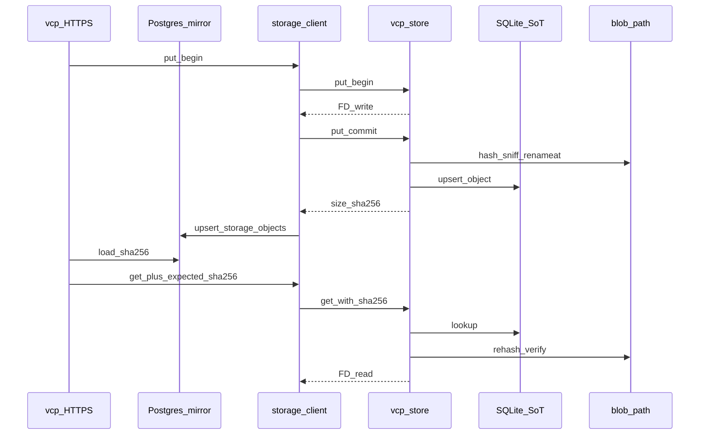

# Plan: vcp-store SQLite SoT (architecture 1.0)

## Décisions figées (conversation)

- **SoT digests / sizes** = SQLite dans `vcp-store` (UID `vcp-store`), fichier sous `blob_path` (ex. `storage/meta.sqlite`).
- **Postgres `storage_objects`** = miroir pour UI / publish gates ; `vcp` y écrit **après** `put_commit` OK avec les valeurs renvoyées par le helper.
- **`get`** : `vcp` présente le `sha256` Postgres ; helper compare à SQLite (constant-time) **puis** re-hash le blob disque (verify-on-read) ; match → FD ; sinon erreur d’intégrité. Pas de scrub différé.
- **Crate** : `rusqlite` sync uniquement (pas `tokio-rusqlite` / deadpool). Helper reste sync / sans tokio (D6).
- **AuthZ** reste dans `vcp` (D7). Le hash n’est pas un secret capability (déjà affiché en UI).
- **Version doc** : rester **1.0** ; réécrire les sections SoT / lifecycle / IPC / threat model (pas de 1.1).

## Phase 0 — Doc architecture 1.0

Éditer [`docs/technical/VCP_Storage_Helper_Architecture_EN(1.0).md`](docs/technical/VCP_Storage_Helper_Architecture_EN(1.0).md) (version reste **1.0**) :

- Abstract / D-table : SoT = SQLite helper ; Postgres = mirror.
- §4 lifecycle : ouvrir/migrer SQLite **avant** `cap_enter` (avec dirfd) ; helper **n’est plus « stateless »** — état durable = disque + SQLite (pas Postgres).
- §5 : schéma SQLite (`objects` : scope, object_key, org_id, sha256, size_bytes, content_type/ext, timestamps) ; Postgres `storage_objects` documenté comme **mirror** (même forme utile côté portail).
- §6 IPC : `get` / `stat` exigent `sha256` attendu ; nouvel err code `integrity_mismatch` (Postgres≠SQLite ou disque≠SoT) ; `put_commit` : helper calcule le digest (client peut encore envoyer un expected pour double-check, ou on aligne sur « helper owns hash » — **retenu** : helper hashe, persiste SQLite, retourne `size`+`sha256` ; le `sha256` du request reste un expected client optionnel / obligatoire comme aujourd’hui pour détecter corruption upload mid-pipe — **garder expected client + égalité avec digest calculé**, puis upsert SQLite avec ce digest).
- Threat model court : UIDs séparés ; miroir falsifié → deny ; blob altéré → deny au re-hash.
- Ops : backup SQLite + `blob_path` ensemble ; fsck = compare disque ↔ SQLite ↔ Postgres mirror.
- Capsicum casing déjà en place (`Capsicum` / `macOS` / `FreeBSD`).

Pointer aussi un paragraphe dans [`.cursor/audits/vcp_capsicum_storage_sandbox_2026-08-02.md`](.cursor/audits/vcp_capsicum_storage_sandbox_2026-08-02.md) et runbooks storage si le wording « Postgres SoT » y reste.

## Phase 1 — SQLite dans le helper (`rusqlite`)

Fichiers : [`src/storage/`](src/storage/), [`src/bin/vcp_store.rs`](src/bin/vcp_store.rs), [`Cargo.toml`](Cargo.toml).

- Dep `rusqlite` (features bundlées / static selon stack existante).
- Module `src/storage/meta_db.rs` : open path `blob_path/meta.sqlite`, migrations SQL embarquées, WAL, upsert/get/delete/delete_org.
- Boot helper : create DB + schema après mkdirat, **avant** Capsicum.
- `put_commit` : après rename OK → upsert SQLite → réponse IPC.
- `delete` / `delete_org` : FS + rows SQLite atomiquement autant que possible (transaction SQLite puis unlink ; documenter ordre).
- Inline mode (tests) : même `meta_db` via `StorageEngine` / client inline.

**Pyramide** : unit meta_db · invariants path DB sous blob_path · battle concurrent commit+upsert · E2E helper put→sqlite row.

## Phase 2 — Protocole IPC + client `vcp`

- Étendre `StorageRequest::Get` / `Stat` avec `sha256: String` (attendu).
- `StorageErrorCode::IntegrityMismatch` → HTTP 503 ou 409 sur routes artefacts (retenu : **409** pour mismatch, **503** pour IPC mort — ou **404** anti-énumération si on ne veut pas chatter ; **retenu : 503 + message stable `integrity mismatch`** sur routes déjà authentifiées download, cohérent avec indisponibilité artefact).
- [`src/storage/client.rs`](src/storage/client.rs) : `get_release(id, expected_sha256)`, idem images.
- Server : compare SQLite vs expected ; re-hash fichier ; mismatch → `integrity_mismatch`.

## Phase 3 — Câblage produit Postgres mirror

- Garder table [`storage_objects`](toasty/migrations/0013_storage_objects.sql) / model ; sémantique = **mirror only** (commentaires model + `objects.rs`).
- Download / ephemeral / image get : lire mirror → passer sha256 au helper.
- Upload paths : inchangés côté ordre (commit helper puis upsert Postgres) ; seeds admin : digests viennent du helper ou seed mirror **et** meta SQLite via inline client.
- Publish gate : toujours exiger row mirror (et idéalement helper `stat` avec ce sha).

**Pyramide** : E2E upload→download ; test mismatch Postgres hash → deny sans FD ; image wrong org 404 avant IPC ; maj `check_storage.sh` + runbooks.

## Phase 4 — Ops / validation

- Runbooks : backup `meta.sqlite`, integrity_mismatch, restore order.
- `just fmt-check` · clippy `-D warnings` · `check_storage.sh` · filters `storage_` / `builds_entitlement` / `admin_releases`.

## Hors scope

- scrub différé, deadpool / tokio-rusqlite, Postgres dans le helper, Capsicum sur `vcp`, CDN.
