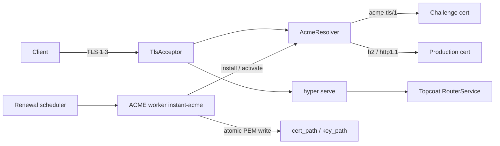

# VCP HTTPS-only: TLS 1.3 + ACME (from Vauban)

## Decision

**In-process** in the `vcp` binary: `AcmeResolver` + renewal scheduler + ACME worker share memory. No Vauban supervisor, Unix IPC, Capsicum, or dual-process split.

**No cleartext HTTP listener** in any environment (dev and prod). ACME uses **TLS-ALPN-01** on the same HTTPS port (no port 80), matching Vauban.

## Architecture



## Sources to port (adapt, do not copy privsep)

| Vauban source | VCP target |
|---|---|
| [`vauban-web/src/acme/resolver.rs`](../Vauban/vauban-web/src/acme/resolver.rs) | [`src/tls/resolver.rs`](src/tls/resolver.rs) |
| [`vauban-web/src/tasks/acme.rs`](../Vauban/vauban-web/src/tasks/acme.rs) (scheduler + cert expiry parse) | [`src/acme/scheduler.rs`](src/acme/scheduler.rs) |
| [`vauban-supervisor/src/acme.rs`](../Vauban/vauban-supervisor/src/acme.rs) (workflow, challenge cert, atomic write) | [`src/acme/worker.rs`](src/acme/worker.rs) — callbacks direct to `AcmeResolver` |
| `load_tls_config` in [`vauban-web/src/main.rs`](../Vauban/vauban-web/src/main.rs) | [`src/tls/mod.rs`](src/tls/mod.rs) |
| `TlsConfig` / `AcmeConfig` in Vauban `config.rs` | extend [`src/config.rs`](src/config.rs) |

## Dependencies

Add (aligned with Vauban pins): `rustls` 0.23, `rustls-pki-types`, `tokio-rustls` (aws-lc-rs), `rcgen`, `instant-acme`, `sha2`, `webpki-roots` as needed, `x509-parser` or keep Vauban’s lightweight ASN.1 expiry parse if self-contained.

Install `aws_lc_rs` crypto provider at process start (same as Vauban).

## Config TOML

Extend [`config/default.toml`](config/default.toml), [`config/development.toml`](config/development.toml), [`config/testing.toml`](config/testing.toml), [`config/vcp.conf`](config/vcp.conf):

```toml
[server]
host = "127.0.0.1"
port = 8443
public_origins = ["https://127.0.0.1:8443", "https://localhost:8443"]

[server.tls]
cert_path = "certs/dev-server.crt"
key_path = "certs/dev-server.key"
# ca_chain_path = "..."

[server.tls.acme]
enabled = false
email = ""
domains = []
renew_before_hours = 24
account_key_path = "certs/acme-account.json"
staging = true
directory_url = "https://acme-v02.api.letsencrypt.org/directory"
staging_directory_url = "https://acme-staging-v02.api.letsencrypt.org/directory"
```

Prod [`config/vcp.conf`](config/vcp.conf): `port = 443`, absolute paths under `/usr/local/etc/vcp/`, ACME `enabled = true` (or ready-to-enable with clear CHANGE-ME), `public_origins` HTTPS only, `session.dangerous_disable_origin_verification = false`.

Validation rules:
- Fail boot if any `public_origins` entry is `http://`
- Fail production if ACME enabled with empty email/domains
- Fail production if `dangerous_disable_origin_verification`

Gitignore `certs/*.crt`, `certs/*.key`, account JSON; keep `certs/.gitkeep` + README note for mkcert/self-signed.

## Serve path (replace cleartext `topcoat::serve`)

Today [`src/main.rs`](src/main.rs) binds TCP and calls `topcoat::serve`. Topcoat’s accept loop ([`internal_serve`](file:///Users/mnemonic/.cargo/registry/src/index.crates.io-1949cf8c6b5b557f/topcoat-router-0.4.0/src/serve.rs)) speaks **plain HTTP** on the stream.

Implement [`src/tls/serve.rs`](src/tls/serve.rs) `serve_https(listener, rustls::ServerConfig, RouterService)`:
1. Accept TCP
2. `tokio_rustls::TlsAcceptor::accept`
3. Serve with the same hyper `auto::Builder` pattern as Topcoat `internal_serve` (graceful shutdown / Ctrl+C)
4. Keep `topcoat::dev::notify_ready`

`ServerConfig`: TLS 1.3 only (`builder_with_protocol_versions(&[&TLS13])`), ALPN `h2`, `http/1.1`, and `acme-tls/1` when ACME is enabled; `with_cert_resolver(AcmeResolver)`.

## Boot flow

1. `Config::load()`
2. Install rustls aws-lc provider
3. Load or bootstrap certs:
   - Files present → PEM load into `AcmeResolver`
   - ACME on + missing files → temporary self-signed bootstrap (Vauban pattern) then scheduler obtains real cert
   - ACME off + missing files (dev) → generate self-signed once via `rcgen` to `cert_path`/`key_path`
4. Build Topcoat router
5. If ACME enabled → spawn renewal scheduler (timer to `notAfter - renew_before_hours`, immediate renew for self-signed)
6. `serve_https` — never fall back to cleartext

## ACME worker (in-process)

Port `acme_workflow` from supervisor:
- account create/load (`instant-acme`)
- order + TLS-ALPN-01 challenges
- `rcgen` challenge cert with OID `1.3.6.1.5.5.7.1.31`
- `resolver.install_challenge` / `remove_challenge` (direct calls)
- finalize, download chain, `atomic_write_pem`, `activate_production_cert` + wake scheduler

## App / docs hygiene

- Update [`README.md`](README.md), [`Justfile`](Justfile) (`just run` → HTTPS URL), [`.cursor/rules/tls-post-quantum.mdc`](.cursor/rules/tls-post-quantum.mdc) checklist items that become true
- HSTS response header on pages (Topcoat layer or shell) for production
- Cookie `Secure` already required by Topcoat `__Host-session` — aligns with HTTPS-only
- Unit tests: TLS config validation (reject `http://` origins), resolver challenge vs production ALPN selection (port Vauban’s resolver tests where practical)
- Smoke: `curl -k https://127.0.0.1:8443/login` with self-signed

## Explicitly out of scope

- Supervisor / Capsicum / Landlock / Unix IPC
- HTTP-01 / port 80 redirector
- TLS hybrid PQ groups (track rustls readiness per existing rule; no fake hybrid knobs)
- OpenSSL
